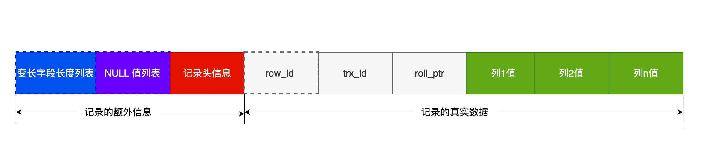

# 基础篇

### **<font color='red'>执行一条 select 语句，期间发生了什么？</font>**

第一步：通过IP和端口先连接Mysql服务，先TCP连接再验证用户名密码

第二步：解析器对 SQL 查询语句进行**词法分析、语法分析**，然后构建**语法树**，方便读取表名、字段、语句类型

第三步：

**预处理器**

- 检查 SQL 查询语句中的表或者字段是否存在；
- 将 `select *` 中的 `*` 符号，扩展为表上的所有列；

**优化器**：优化器主要负责将 SQL 查询语句的执行方案确定下来

**执行器**

- 主键索引查询：通过主键索引快速定位特定行的查询方式

- 全表扫描：遍历整个表来查找匹配行的低效方式

### **<font color='red'>什么叫三大范式？</font>**

每一列都不可再分

每一表都只讲一件事情

每一列数据都与主键直接相关

### **<font color='red'>MySQL 的 NULL 值会占用空间吗？</font>**

不会，每一行格式中有NULL值列表，可以节省空间

### **<font color='red'>MySQL 怎么知道 varchar(n) 实际占用数据的大小？</font>**

可变长列表和NULL一样，最大可以两字节，表示有65535个字节的数据

### **<font color='red'>MySQL 的数据存放在哪个文件？</font>**

**<font color='blue'>在数据库层面，Innodb每创建一个数据库就会产生三个文件：</font>**

==db.opt：==用来存储当前数据库的默认字符集和字符校验规则

==t_order.frm ：==t_order 的**表结构**会保存在这个文件

==t_order.ibd：==t_order 的**表数据**会保存在这个文件

**<font color='blue'>在表层面，分为行、页、区、段</font>**

==行：==每行记录根据不同的行格式，有不同的存储结构

==页：==读一条记录的时候，并不是将这个行记录从磁盘读出来，而是以页为单位，将其整体读入内存，默认16KB（磁盘I/O好像也是16kB)；数据页、undo 日志页、溢出页

==区：==在表中数据量大的时候，为某个索引分配空间的时候就不再按照页为单位分配了，而是按照区（extent）为单位分配。每个区的大小为 1MB，对于 16KB 的页来说，连续的 64 个页会被划为一个区，这样就使得链表中相邻的页的物理位置也相邻，就能使用**顺序 I/O** 了

==段：==

索引段：存放 B + 树的非叶子节点的区的集合

数据段：存放 B + 树的叶子节点的区的集合

回滚段：存放的是回滚数据的区的集合

### **<font color='red'>COMPACT 行格式长什么样？</font>**

记录的额外信息+记录的真实数据

**<font color='red'>每个数据库表的行格式都有「变长字段字节数列表」和NULL列表吗？</font>**

没有变长字段和NULL就不需要

**<font color='red'>记录头信息</font>**

==delete_mask ：==标识此条数据是否被删除，我们执行 detele 删除记录的时候，并不会真正的删除记录，只是将这个记录的 delete_mask 标记为 1

==next_record：==下一条记录的位置，向左读就是记录头信息，向右读就是真实数据

==record_type：==表示当前记录的类型，表示当前记录的类型，0表示普通记录，1表示B+树非叶子节点记录，2表示最小记录，3表示最大记录

**<font color='red'>记录的真实数据</font>**

==row_id：==如果我们建表的时候指定了主键或者唯一约束列，那么就没有 row_id 隐藏字段了。如果既没有指定主键，又没有唯一约束，那么 InnoDB 就会为记录添加 row_id 隐藏字段

==trx_id：==事务id，表示这个数据是由哪个事务生成的，**6字节**

==roll_pointer：==这条记录上一个版本的指针。roll_pointer 是必需的，占用 7 个字节

### **<font color='red'>varchar(n) 中 n 最大取值为多少？</font>**

==第一：==在数据库表只有一个 varchar(n) 字段且字符集是 ascii 的情况下，varchar(n) 中 n 最大值 = 65535 - 2 - 1 = 65532

==第二：==在 UTF-8 字符集下，一个字符最多需要三个字节，varchar(n) 的 n 最大取值就是 65532/3 = 21844

==多字段==：如果有多个字段的话，要保证所有字段的长度 + 变长字段字节数列表所占用的字节数 + NULL值列表所占用的字节数 <= 65535

### **<font color='red'>行溢出后，MySQL 是怎么处理的？</font>**

==第一：==MySQL 中磁盘和内存交互的基本单位是页，一个页的大小一般是 `16KB`，也就是 `16384字节`，而一个 varchar(n) 类型的列最多可以存储 `65532字节`

==第二：==当发生行溢出时，在记录的真实数据处只会保存该列的一部分数据，而把剩余的数据放在「溢出页」中，然后真实数据处用 20 字节存储指向溢出页的地址，从而可以找到剩余数据所在的页。

### **<font color='red'>Myisam 和InnoDB引擎区别</font>**

==Myisam：==全文索引提高搜索效率，表级锁定读取性能更高且避免死锁

==InnoDB：==MVCC、聚簇索引、事务、外键

### **<font color='red'>MySQL怎么调优？</font>**

第一：是否能使用「覆盖索引」，减少「回表」所消耗的时间

第二：是否组建「联合索引」，最左匹配原则

第三：对索引进行函数操作或者表达式计算会导致索引失效

第四：一般互联网公司都选择读已提交作为主要的隔离级别，避免因为「间隙锁」导致的死锁问题

### **<font color='red'>mysql支持哪些数据类型</font>**

整数类型：5个int，1、2、3、4、8字节

浮点数：3个浮点数，4、8、m字节

字符串类型：char（0，255）、varchar（0，65535）、tinytext（2的8次方-1字节）、text（2的16次-1字节）

日期和时间类型：五种类型

NULL

### **<font color='red'>mysql延迟</font>**

**查询复杂度**：复杂的 SQL 查询（例如包含多个表连接、子查询、聚合函数等）会增加延迟。

**索引**：缺乏适当的索引会导致全表扫描，增加查询延迟。反之，适当的索引可以显著降低延迟。

**锁竞争**：高并发下的锁竞争会导致等待时间增加，从而增加延迟。

**硬件资源**：CPU、内存和磁盘 I/O 性能都会影响 MySQL 的响应时间。

**网络延迟**：客户端和 MySQL 服务器之间的网络延迟会直接影响查询响应时间。

### **<font color='red'>redis延迟</font>**

**数据结构**：不同的数据结构（如字符串、列表、集合、有序集合和哈希表）的操作复杂度不同，延迟也不同。

**内存使用**：由于 Redis 数据存储在内存中，如果内存不足并且需要频繁地进行数据交换（swapping），延迟会显著增加。

**持久化配置**：Redis 支持 RDB 和 AOF 两种持久化方式。持久化配置和频率会影响写操作的延迟。

**网络延迟**：与 MySQL 类似，客户端和 Redis 服务器之间的网络延迟会影响操作的响应时间。

**服务器负载**：高并发请求下，服务器负载增加也会导致延迟增加。

# 索引篇

### **<font color='red'>什么是索引？</font>**

索引是以==空间换时间==的设计思想

目的是加快查询速度，尽量减少查找过程中磁盘I/O的存取次数，==MySQL 索引底层==是B+树、哈希表、倒排索引等数据结构

### **<font color='red'>mysql 索引好处与坏处？索引存在哪里?</font>**

**索引的好处**：主要是提高查询速度、加速排序操作、加速连接查询

**索引的坏处**：包括增加存储空间的开销、降低插入/更新/删除操作的性能

**索引存储位置**：根据存储引擎的不同，索引数据存储在不同的位置。对于 InnoDB 存储引擎，索引数据通常存储在 `.ibd` 文件中；并通过 B+ 树结构进行组织。**聚簇索引**存储数据行和索引在同一个结构中，而**二级索引**则将索引列和主键指针存储在一起。

### **<font color='red'>索引的分类？</font>**

按「数据结构」分类：**B+tree索引、Hash索引、Full-text索引**

按「物理存储」分类：**聚簇索引（主键索引）、二级索引（辅助索引）**

按「字段特性」分类：**主键索引、唯一索引、普通索引、前缀索引**

按「字段个数」分类：**单列索引、联合索引**

==唯一索引：==索引列的值必须唯一、允许有空值

==主键索引：==一张表最多只有一个、不允许有空值

==不遵循「最左匹配原则」，联合索引会失效==

==全文索引：==在数据库和搜索引擎中，全文索引允许对文本数据进行快速和高效的查询，而不仅仅是简单的字符串匹配。

**<font color='red'>什么叫唯一索引？</font>**

1、唯一索引与普通索引的最大区别在于：**唯一索引不允许两条记录的索引键值相同**

2、在多列上创建唯一索引时，只有当所有列的组合值完全相同时，才会被视为重复

**<font color='red'>唯一索引与主键的区别</font>**

**唯一索引**允许列值为 `NULL`，而**主键**不允许任何列为 `NULL`。

每个表可以有多个唯一索引，但只能有一个**主键**。

**主键**是表中唯一标识每一行的列，通常用于关系型数据库的外键关联，而**唯一索引**只保证列的唯一性，不一定是主键。

**<font color='red'>什么叫全文索引？</font>**

**全文索引**是一种专门为文本数据设计的索引类型，适合处理大段文本和模糊搜索场景

**全文索引**通过对文本进行分词，并建立倒排索引，快速定位包含特定词语的文档。

**倒排索引**是全文索引的核心，存储了词语和文档之间的对应关系。

**查询时**通过查找倒排索引，加上相关性计算，返回匹配的文档并按相关性排序。

**相关性算法**（如 TF-IDF）用来计算文档和查询词之间的匹配度，优化搜索结果的准确性。

**优化手段**包括增量更新、忽略停用词和词干提取等，以减少存储开销和提升性能。

**<font color='red'>b+树，b树，hash索引</font>**

| 特性           | **B树**                      | **B+树**                                 | **哈希索引**               |
| -------------- | ---------------------------- | ---------------------------------------- | -------------------------- |
| **数据存储**   | 内部节点和叶子节点均存储数据 | 仅叶子节点存储数据，内部节点只存储键值   | 哈希桶存储数据             |
| **查找效率**   | O(log N)                     | O(log N)                                 | O(1)                       |
| **范围查询**   | 支持范围查询，但效率较低     | 支持高效范围查询，叶子节点通过链表连接   | 不支持范围查询             |
| **空间利用率** | 较低，因为节点存储数据和指针 | 高，内部节点只存储键值和指向子节点的指针 | 高，桶存储指向数据块的指针 |

**<font color='red'>索引，其实现原理</font>**

InnoDB 存储引擎使用 B+ 树作为其主要索引结构，分为**主键索引**（聚簇索引）和**二级索引**（非聚簇索引）。

**聚簇索引（主键索引）**

- 每张表只能有一个聚簇索引，数据存储在 B+ 树的叶子节点上。
- 叶子节点存储完整的行数据，主键按顺序排列，形成紧凑的存储。
- 通过主键查找时只需访问聚簇索引。

**二级索引（非聚簇索引）**

- 叶子节点存储主键值而非完整数据（称为“主键引用”）。
- 当通过二级索引查找数据时，MySQL 首先通过二级索引查找到主键，然后回表到聚簇索引取出完整数据，称为“回表”操作。
- 回表带来了额外的 I/O 开销，因此在设计索引时要尽量避免回表操作。

B+ 树索引的查询过程

- **精确匹配查询**：从根节点出发，顺序比较，定位到叶子节点。例如，通过 `WHERE id = 10` 查询主键，则直接在聚簇索引上找到对应行。
- **范围查询**：B+ 树的叶子节点形成链表，通过双向链接在叶子节点上进行范围查询，可以快速地进行 `WHERE id BETWEEN 5 AND 10` 的查询。

**<font color='red'>B+树场景下怎么进行的查表过程</font>**

假设我们在 B+ 树中查找一个键 `K`，过程如下：

**从根节点开始查找**：查找总是从 B+ 树的根节点开始；在根节点的键值中查找范围，确定键 `K` 位于哪个区间；根据查找的区间，进入相应的子节点。

**在内部节点中查找**：B+ 树的内部节点不存储实际数据，只包含键值和子节点的指针；在内部节点中重复在根节点中进行的查找操作，确定键 `K` 所在的区间，并按照子节点指针进入更深的层级；这个过程会一直向下递归，直至抵达叶子节点。

**在叶子节点中查找**：当抵达叶子节点时，会在该节点中存储的键值中查找键 `K`；叶子节点包含指向实际数据的指针，若找到键 `K`，则通过指针可以直接访问或返回数据；若没有找到键 `K`，则说明数据不存在于 B+ 树中。

**顺序查找和范围查找**（可选）：若进行范围查询或顺序查找，可以利用叶子节点的链表结构；叶子节点在 B+ 树中是相邻连接的，可以在找到第一个符合范围的叶子节点后，顺序访问相邻叶子节点，以查找所有符合条件的键。

**<font color='red'>假设我们对一个text字段做了索引，那么这个时候它的查找速度会不会快？如果快或者不快的话，它是一个怎么寻址的过程？比如说他在寻址过程中要二分，他是根据什么去做的？二分怎么做的排序？</font>**

**B+ 树索引**适合较短的字符串字段或前缀索引。它会按字典序存储字符串的前缀，并基于 B+ 树的二分查找机制快速定位记录。

**全文索引**（倒排索引）适合长文本字段的关键词查询。它会将长文本分词并记录词项与记录的关系。

**<font color='red'>一张表中对性别见了索引，它的缺点是什么样子，数据呈现是什么样子，为什么他快不了？</font>**

==缺点==

**低选择性**：字段中不同值的数量与总记录数的比例

**全表扫描：**数据库引擎可能仍然会扫描大量的记录

**额外的存储开销：**

==数据呈现==

对性别字段建立索引后，索引呈现在数据库中是一个以 `gender` 值为关键字的 **B+ 树**。然而，由于 `gender` 字段的取值范围有限且重复度高，索引中每个值会对应大量数据行，导致低选择性和较低的查询效率。查询时，数据库需要根据索引返回的大量主键进行回表操作，这会增加 I/O 和计算负担，从而在大多数情况下无法显著提升查询速度。

```sql
B+ 树索引结构:
[ Female ] -> [ 指向主键1, 主键3, 主键7, 主键9, ... ]
[ Male ]   -> [ 指向主键2, 主键4, 主键5, 主键6, ... ]
```

==为什么==

1、对于选择性低的字段，使用索引查找会返回大量匹配行的指针，数据库引擎需要从磁盘中读取这些数据行（回表操作）。这种情况下，数据库引擎可能会认为全表扫描更高效，从而忽略索引。

2、回表：即使索引查找到匹配的键值，数据库仍然需要根据索引找到的行指针访问实际数据页，以获取其他列的数据

### **<font color='red'>索引是怎么创建的？</font>**

==第一：==有主键就主键

==第二：==无主键就选不包含 NULL 值的唯一列

==第三：==自动生成隐式自增 id

### **<font color='red'>什么时候适用索引？</font>**

1、==字段唯一性限制：==对于需要保证唯一性的字段（如用户名、邮箱等）

2、 ==考虑索引的维护成本==

3、==使用合适的索引类型：==全文索引、唯一索引、多列索引、单列索引

4、==查询需求：==order by、group by，因为B树已经排序了，不需要我们再排序了；where查询，如果不止一个字段就联合索引

5、==有外键一定创建索引==

### **<font color='red'>什么时候不适用索引？</font>**

第一：where、order by、group by用不到

第二：大量重复数据，男女

第三：经常更新

### **<font color='red'>最左匹配原则，给你一个联合索引（a,b,c）</font>**

1、当查询条件是 `WHERE b = ? AND c = ?` 时，联合索引 `(a, b, c)` **仍然会使用索引，但并不会利用到最优的索引查找**。这是因为 MySQL 的联合索引是基于索引列的顺序来优化的。

2、**`WHERE b = ? AND c = ?`**：会使用联合索引 `(a, b, c)`，但性能可能较差，因为 `a` 列未被使用。最优查询应包含最左侧的索引列 `a`。

3、为了提高查询性能，建议将 `WHERE` 子句中包括最左侧的索引列，或者单独创建一个针对 `b` 和 `c` 的索引（如 `(b, c)`），以提高这类查询的性能

### **<font color='red'>什么时候索引会失效？</font>**

第一：左右模糊匹配和左匹配：like%xx% like%xx

第二：对索引列使用函数、计算

第三：联合使用要遵循最左匹配原则

第四： WHERE 子句中，OR 前的条件列是索引列，OR 后的条件列不是索引列

第五：使用不等于操作（如 `!=` 或 `<>`）会导致索引失效

**<font color='red'>为什么索引失效会影响性能？</font>**

**数据库不得不执行全表扫描**来获取查询结果，而非使用索引进行快速定位

资源、内存、并发性能都收到影响

### **<font color='red'>SQL怎么进行优化和调优</font>**

**<font color='purple'>索引优化</font>**

- 使用适当的索引，引出问题，==什么时候适合索引==，==什么时候不适合索引==

- 使用复合索引（多列索引）来覆盖多列查询，「商品ID、名称、价格」作为一个联合索引、避免回表
- 避免索引失效

**<font color='purple'>查询优化</font>**

- 优化select：只查询必要的列，避免使用`SELECT *`；使用合适的WHERE条件，避免全表扫描
- 优化join：使用小表驱动大表，即在JOIN操作中，将小表放在前面；确保JOIN列上有索引
- 优化子查询：尽量使用JOIN替代子查询，如果必须使用子查询，确保子查询返回的记录集尽量小

- 拆分复杂查询，使用多次简单查询替代

**<font color='purple'>表结构优化</font>**

- 通过拆分表来消除冗余数据和减少数据量
- 第三范式（3NF）可以消除大多数冗余

**<font color='purple'>数据库配置优化</font>**

- 增大数据库的缓存大小可以提高查询的速度；调整参数如MySQL的`innodb_buffer_pool_size`

- 合理配置数据库连接池的大小，避免过多或过少的连接

- 使用SSD替代传统硬盘，提高I/O性能

**<font color='purple'>监控和分析</font>**

- 使用`EXPLAIN`命令来查看查询的执行计划，识别瓶颈和优化点
- 启用慢查询日志，分析运行时间长的查询，找出性能瓶颈

### **<font color='red'>走对了索引，线上查询还是慢？</font>**

第一：备份后删数据，不建议

第二：redis需要考虑缓存一致性

第三：多维度表

### **<font color='red'>除了读之外，写性能同样有瓶颈，怎么办？</font>**

第一：单库考虑主从分离、已经主从架构就考虑分库分表

### **<font color='red'>以什么来作为分库键的？</font>**

分库分表的键值进行哈希或取模运算，一般是按照userId的

### **<font color='red'>分布式ID是什么</font>**

唯一的标识来标识数据：==全局唯一、单调递增、高可用、高性能==

==UUID==

原理：UUID 通常是128位长的标识符，它的生成算法结合了时间戳、节点地址（MAC地址）等信息，确保在不同

节点上生成的 UUID 是唯一的。

场景：适用于对ID的顺序和大小没有严格要求的场景，比如文件名、交易号等

==数据库自增==

原理：通过数据库中的自增主键字段来生成唯一ID，如MySQL的 `AUTO_INCREMENT`，保证每次插入一条记录时，ID是唯一且递增的

场景：适用于对性能要求不高的系统，或小规模的分布式系统

==雪花算法==

原理：Snowflake 将64位的二进制数分成多个部分来表示一个ID：

- 1位符号位：始终为0，表示正数。
- 41位时间戳：表示自某个起始时间的毫秒数，能够保证大约69年的唯一性。
- 10位机器ID：用于区分不同的节点或机器。
- 12位序列号：表示同一毫秒内生成的ID序列，支持每毫秒生成4096个唯一ID。

场景：大规模分布式系统，如订单号、事务ID等需要有序且高并发场景

==Zookeeper：==强一致性保证，ID递增，但性能较低，适合强一致性场景。

==Redis：==高并发但依赖单点，可用于简单的高并发场景。

### **<font color='red'>在多台机器处理请求时，确保用户请求均匀分布到不同的机器上</font>**

==如何均匀分布用户请求：==哈希分配、读写分离

==负载均衡器：==nginx

==客户端写请求：==

如果选择让客户端实现负载均衡，客户端代码需要实现：

- **域名解析与选择**：客户端根据不同的请求类型或者策略选择合适的域名/机器。例如，写请求使用 `write.example.com`，读请求使用 `read.example.com`。
- **请求重试与失败处理**：在请求失败的情况下，客户端需要能够处理重试，可能需要使用备用的域名或IP地址。

### **<font color='red'>慢查询优化</font>**

慢查询主要通过以下几个方式进行优化：

- **索引优化**：确保查询条件中的字段适配合适的索引，减少全表扫描的发生。可以使用 `EXPLAIN` 查看查询计划和表的访问类型，分析索引的使用情况。
- **SQL 语句优化**：避免使用 `SELECT *`，尽量指定所需的列，减少查询的数据量；优化 `JOIN` 语句，避免不必要的复杂查询。
- **分页优化**：对于大数据量分页查询，优化 `LIMIT`，比如使用索引来避免偏移量大的查询（`LIMIT N, M`）带来的全表扫描。
- **缓存**：通过 `Query Cache` 或使用 Redis 等缓存方案，减少频繁查询的数据库压力。

### **<font color='red'>explain哪些字段可以调优</font>**

==select_type==

- **解释**：表示查询的类型，如 `SIMPLE`（简单查询）、`PRIMARY`（主查询）、`UNION`（联合查询）、`SUBQUERY`（子查询）等。
- **调优**：尝试将复杂查询分解为简单查询。避免嵌套子查询，多用 `JOIN`。

==type==

- **解释**：表示表的访问类型，如 `ALL`（全表扫描）、`index`（索引扫描）、`range`（索引范围扫描）、`ref`（索引查找）、`const`（常数）等。
- 调优：
  - 避免 `ALL` 类型（全表扫描），尽量使用索引。
  - 优化为 `ref` 或 `range` 类型。

==key==

确保查询使用到合适的索引，而不是 `NULL`

### **<font color='red'>explain当中发现不是没用索引导致的慢SQL怎么办</font>**

1、数据表大

2、查询优化：

**重写查询**：简化复杂查询，避免嵌套子查询或复杂的 `JOIN` 组合。

**分批查询**：对于大数据量的操作，使用 `LIMIT` 和分页查询，将大查询拆分为多次小查询。

**使用缓存**：在应用程序层面缓存频繁查询的数据，以减少数据库负载

3、并发事务锁争用可能导致查询慢，即使索引被使用

### **<font color='red'>MySQL 单表不要超过 2000W 行，靠谱吗？</font>**

单表数量限制：主键的大小可以限制表的上限，如果主键声明 `int` 类型，也就是 32 位，那么支持 2^32-1 ~~21 亿；

超过了这个值可能会导致 B + 树层级更高，影响查询性能

**<font color='red'>MySQL中，对A和B两个字段建立联合索引，查询A = 1and B=1的时候会出现什么情况？</font>**

查询 `A = 1 AND B = 1` 时，MySQL 会使用 `(A, B)` 联合索引，先通过 `A` 定位，再通过 `B` 过滤。

使用联合索引可以显著提高查询效率，并减少数据扫描量。

如果查询仅涉及索引中的字段，则会触发索引覆盖，进一步优化查询性能。

**<font color='red'>如果是B > 3 and A = 1呢 ？</font>**

**`B > 3 AND A = 1`**：MySQL 可以利用 `A = 1` 的索引查找，然后在此范围内对 `B > 3` 进行过滤。

**`3 < A < 5 AND B > 3`**：MySQL 只能在 `A` 列上做范围扫描，`B > 3` 无法使用索引，只能在找到 `A` 的范围记录后进一步过滤。

联合索引 `(A, B)` 的使用限制是，一旦对某一列使用了范围条件，后续的列将无法继续利用索引。因此，构建联合索引时应优先选择在查询中作为精确条件的列放在前面。

**<font color='red'>如果是 3 < A < 5 and B >3 呢？</font>**

### **<font color='red'>为什么索引的底层数据结构是B+树？</font>**

第一：多路搜索树检索速度更快

第二：B+树比B树更矮、非叶子节点的存储能存储更多的索引

第三：叶子节点是双向链表、方便遍历

第四：B+树比B树更容易修改树的结构

- 数据仅在叶子节点上存储，内部节点仅存储索引
- 叶子节点有序连接，便于插入、删除和顺序访问
- 叶子节点的操作不会显著影响树的整体结构

### **<font color='red'>什么叫做回表</font>**

当前索引无法检索出完整的内容、需要通过主键二次查询

### **<font color='red'>什么叫覆盖索引？</font>**

在二级索引的 B+Tree 就能查询到结果的过程就叫作「覆盖索引」

### **<font color='red'>聚集索引和非聚集索引的区别？</font>**

- **聚集索引**：叶子节点存放的是**实际数据**。
- **非聚集索引**：叶子节点存放的是**对应记录的主键值**。
- **回表**：当使用**非聚集索引**查询，且查询的目标不是主键值时，需要通过非聚集索引获取主键值，再去**聚集索引**查找实际数据。
- **覆盖索引**：当查询的数据正好被**非聚集索引**包含（比如查询的是索引列），则可以直接从非聚集索引获取结果，**无需回表**查询聚集索引中的数据。

### **<font color='red'>哪种 count 性能最好？</font>**

count(*) =count(1)>count(主键字段)>count(字段)

count(1)、 count(*)、 count(主键字段)在执行的时候，如果表里存在二级索引，优化器就会选择二级索引进行扫描

### **<font color='red'>分库分表的理解和一些常见手段？</font>**

分库分表是一种在数据库水平方向上扩展的策略，旨在解决单一数据库的性能瓶颈问题，分割成多个较小的数据库实例和表格

==垂直分割（列分割）：将经常使用的热数据和不经常使用的冷数据分割到不同的表中==

==水平分割（行分割）：某个时间范围、用户ID 的哈希值==

分库分表：分库分表通常结合垂直分割和水平分割

数据库中间件和一主多从

### **<font color='red'>慢查询怎么优化？</font>**

1、通过explain查看sql是否走索引，考虑是否增加索引

2、建立联合索引实现覆盖索引优化，注意要符合最左匹配原则

3、避免索引失效

**<font color='red'>mysql左右连接查询</font>**

**LEFT JOIN**：返回左表所有的行，右表没有匹配的行则返回 `NULL`。

**RIGHT JOIN**：返回右表所有的行，左表没有匹配的行则返回 `NULL`。

### **<font color='red'>联合索引和单列索引的选择</font>**

**联合索引的设计**：联合索引是在多个列上创建索引，当查询涉及多个列时，联合索引可以一次性解决，而不需要分别使用多个单列索引。这能提高查询效率，尤其是在有多个筛选条件时。

**单列索引的局限性**：单列索引只能优化单个列的查询条件，而当查询条件涉及多个列时，如果单列索引没有按照特定顺序排列（即没有覆盖查询条件的顺序），则可能无法有效利用。

**为何选择联合索引**：如果查询的条件包含多个列，且这些列的顺序与联合索引中的列顺序匹配，联合索引可以大大减少查询时的查找次数和回表操作，从而提高效率。

**主键索引与联合索引的比较**：如果 `identity` 是主键并且查询条件包含主键列，它将直接命中主键索引，而 `user_name` 如果没有出现在查询条件中，则可以省略。因此，在这种情况下，`user_name` 的存在不一定能提升查询效率。

# 事务篇

### **<font color='red'>什么叫事务？</font>**

事务可以使「一组操作」要么全部成功，要么全部失败

==原子性：==一个事务中的所有操作，要么全部完成，要么全部不完成 

==一致性：==是指事务操作前和操作后，数据满足完整性约束，数据库保持一致性状态。

==隔离性：==数据库允许多个并发事务同时对其数据进行读写和修改的能力

==持久性：==事务处理结束后，对数据的修改就是永久的

### **<font color='red'>InnoDB 引擎通过什么技术来保证事务的这四个特性的呢？</font>**

持久性是通过 redo log （重做日志）来保证的；

原子性是通过 undo log（回滚日志） 来保证的；

隔离性是通过 MVCC（多版本并发控制） 或锁机制来保证的；

一致性则是通过持久性+原子性+隔离性来保证；

### **<font color='red'>并行事务会发生什么问题？</font>**

==脏读：==**如果一个事务「读到」了另一个「未提交事务修改过的数据」**

==不可重复读：==**在一个事务内多次读取同一个数据，如果出现前后两次读到的数据不一样的情况**

==幻读：==**在一个事务内多次查询某个符合查询条件的「记录数量」，如果出现前后两次查询到的记录数量不一样的情况**

### **<font color='red'>事务的隔离级别有哪些？</font>**

**读未提交**：指一个事务还没提交时，它做的变更就能被其他事务看到

**读提交**：指一个事务提交之后，它做的变更才能被其他事务看到

**可重复读**：指一个事务执行过程中看到的数据，一直跟这个事务启动时看到的数据是一致的，**MySQL InnoDB 引擎的默认隔离级别**

**串行化**：会对记录加上读写锁，在多个事务对这条记录进行读写操作时，如果发生了读写冲突的时候，后访问的事务必须等前一个事务执行完成，才能继续执行

### **<font color='red'>幻读怎么解决的？</font>**

第一：InnoDB引擎下的的可重复复读隔离级别解决了幻读的问题（因为它是读历史版本的数据）

第二：当前读（指的是 select * from table for update），则需要配合==间隙锁==来解决幻读的问题

**<font color='blue'>尽量在开启事务之后，马上执行 select ... for update 这类当前读的语句，因为它会对记录加 next-key lock，从而避免其他事务插入一条新记录</font>**

### **<font color='red'>MVCC怎么做的？</font>**

==读已提交：==语句级快照，读取的时候生成一个”版本号”，其他事务commit了之后，才会读取最新已commit的”版本号”数据

==可重复读：==事务级别快照，每次读取的都是「当前事务的版本」

### **<font color='red'>MVCC原理？</font>**

**<font color='purple'>每次都获取一个新的read view 或者每次事务只获取一个read view</font>**

第一：回滚日志undo log

第二：版本信息 read view

==四个：==尚未提交版本号的事务ID最小值，尚未提交commit的事务版本号集合，下一次要生成的事务ID值，当前的事务版本号

==每行数据有两列隐藏的字段：==记录着当前ID，上一个版本数据在undo log 里的位置指针

### **<font color='red'>什么叫约束？有哪些约束？</font>**

==主键约束==

一个表只能有一个主键。

主键列上的值必须是唯一的，且不能为 NULL。

主键通常自动生成唯一索引，用于快速检索数据。

==唯一约束==

表中的每个唯一约束列上的值必须唯一，但允许有一个 NULL 值。

可以为一个表创建多个唯一约束。

==外键约束==

外键约束用于在两个表之间建立关联关系，确保外键列的值必须在关联表的主键或唯一键中存在

### **<font color='red'>`JOIN` 查询</font>**

`JOIN` 查询用于在 SQL 中组合来自多个表的数据

**`INNER JOIN`** 只返回匹配的记录

```sql
SELECT 表1.列名, 表2.列名, ...
FROM 表1
INNER JOIN 表2 ON 表1.共同字段 = 表2.共同字段;
```

**`LEFT JOIN`** 返回左表的所有记录和匹配的右表记录

```sql
SELECT 表1.列名, 表2.列名, ...
FROM 表1
LEFT JOIN 表2 ON 表1.共同字段 = 表2.共同字段;
```

**`RIGHT JOIN`** 返回右表的所有记录和匹配的左表记录

```sql
SELECT 表1.列名, 表2.列名, ...
FROM 表1
RIGHT JOIN 表2 ON 表1.共同字段 = 表2.共同字段;
```

**`FULL JOIN`** 返回两个表的所有记录（MySQL 可以用 `UNION` 实现）

```sql
SELECT students.id, students.name, courses.course
FROM students
LEFT JOIN courses ON students.id = courses.student_id
UNION
SELECT students.id, students.name, courses.course
FROM students
RIGHT JOIN courses ON students.id = courses.student_id;
```

**<font color='red'>使用 `JOIN` 可以优化查询性能？</font>**

1、相比于通过子查询或单表扫描来查找数据，`JOIN` 可以让数据库使用索引来快速定位匹配的行

2、相比于多个单独查询并在应用程序中手动合并结果，数据库引擎在 `JOIN` 时可以在执行计划中进行优化

3、使用 `JOIN` 可以让数据库在服务器端完成数据的合并和筛选，减少数据从服务器传输到客户端的量


# 锁篇

### **<font color='red'>锁的分类</font>**

==全局锁==

==表级锁：==表锁、元数据锁、意向锁、AUTO-INC 锁

==行级锁：==记录锁、间隙锁、临键锁、插入意向锁

### **<font color='red'>update 没加索引会锁全表？</font>**

当我们要执行 update 语句的时候，确保 where 条件中带上了索引列，并且在测试机确认该语句是否走的是索引扫描，防止因为扫描全表，而对表中的所有记录加上锁

如果发现即使在 where 条件中带上了列索引列，优化器走的还是全标扫描，这时我们就要使用 `force index([index_name])` 可以告诉优化器使用哪个索引

### **<font color='red'>MySQL 记录锁+间隙锁可以防止删除操作而导致的幻读吗？</font>**

在 MySQL 的可重复读隔离级别下，针对当前读的语句会对**索引**加记录锁+间隙锁，这样可以避免其他事务执行增、删、改时导致幻读的问题。

有一点要注意的是，在执行 update、delete、select ... for update 等具有加锁性质的语句，一定要检查语句是否走了索引，如果是全表扫描的话，会对每一个索引加 next-key 锁，相当于把整个表锁住了，这是挺严重的问题。

### **<font color='red'>如何避免死锁？</font>**

==数据库层面==：

**设置事务等待锁的超时时间**

**开启主动死锁检测**

### **<font color='red'>加什么锁导致死锁？</font>**

**间隙锁导致死锁的底层原因**主要源于多个事务在并发访问相同数据范围时的**锁定顺序不同**、**锁争用** 和 **锁等待链复杂化**。

1、==间隙锁和记录锁的交互==

**记录锁（Record Lock）**：直接锁住某一行数据。

**间隙锁（Gap Lock）**：锁住行之间的空隙，防止其他事务插入数据。

**Next-Key Lock**：是间隙锁和记录锁的组合，同时锁住记录和相邻的间隙。

2、==锁定范围的冲突==

3、==锁的获取顺序不一致==

4、 ==插入意向锁的参与==

满足了死锁的四个条件：**互斥、占有且等待、不可强占用、循环等待**，因此发生了死锁

==示例：两个事务互相持有间隙锁并等待对方释放锁==

1. **事务1**：在查询范围 `10 <= x < 20` 的记录时，MySQL 为 `10` 和 `20` 之间的间隙加锁。
2. **事务2**：在查询范围 `20 <= x < 30` 的记录时，MySQL 为 `20` 和 `30` 之间的间隙加锁。
3. 然后，**事务1** 需要访问 `20` 到 `30` 之间的数据，而 **事务2** 需要访问 `10` 到 `20` 之间的数据。
4. 由于间隙锁的存在，**事务1** 和 **事务2** 都被阻塞，互相等待对方释放锁，最终产生死锁。

# 日志篇

### **<font color='red'>undo log（回滚日志）</font>**

第一：增、删、改一条记录都会触发回滚日志

第二：会产生 trx_id 事务id和roll_pointer 指针 **<font color='blue'>版本链</font>**

第三：实现了事务中的原子性、MVCC

### **<font color='red'>redo log（重做日志）</font>**

第一：先更新内存、redo log 、后台持久化

第二：Buffer Pool 是基于内存的，不可靠

第三：实现了事务中的持久性

**<font color='red'>redo log 要写到磁盘，数据也要写磁盘，为什么要多此一举？</font>**

第一：实现事务的持久性，让 MySQL 有 crash-safe 的能力

第二：将写操作从「随机写」变成了「顺序写」

### **<font color='red'>binlog （归档日志）</font>**

第一：Server 层生成的日志，为了数据备份和主从复制

**<font color='red'>如果不小心整个数据库的数据被删除了，能使用 redo log 文件恢复数据吗？</font>**

不可以使用 redo log 文件恢复，只能使用 binlog 文件恢复

### **<font color='red'>为什么需要两阶段提交？</font>**

prepare 阶段：将 redo log 对应的事务状态设置为 prepare，然后将 redo log 刷新到硬盘；

commit 阶段：将 binlog 刷新到磁盘，接着调用引擎的提交事务接口，将 redo log 状态设置为 commit

### **<font color='red'>redolog和binlog的区别？</font>**

==对象不同：==

binlog是server层实现的日志，所有的存储引擎都可以用

redolog是innodb存储引擎实现的日志

==写入方式不同：==

binlog是追加写，写满了就会创建新文件写

redolog是循环写，写满了从头开始

==用途不同：==

binlog用于备份恢复，主从复制

redolog用于掉电等故障恢复

# 内存篇

### **<font color='red'>Buffer Pool作用？</font>**

第一：默认128MB、可以调大到内存的60%

第二：在缓存池读写、后台线程写入磁盘

第三：索引页、数据页、undo 页、每一个缓存页都创建了一个控制块

第四：先申请连续的内存空间、16KB的页、刚开始无缺页中断

### **<font color='red'>如何管理 Buffer Pool？</font>**

==三种链表：==Free List 空闲页链表、Flush List 脏页链表、LRU List   管理脏页+干净页

==控制块链表和头结点：==头、尾节点地址+链表节点数量、一个一个控制块

**<font color='red'>MySQL用的是什么内存淘汰策略</font>**

==LRU 的改进算法==

1、LRU 列表分为两个部分：**young（前段）** 和 **old（后段）**。新读取的数据页并不是插入到 LRU 列表的最前面，而是插入到列表的中间位置。

2、只有那些频繁访问的数据页才会逐渐移动到列表的前面，即 young 部分。

3、列表的尾部则是 old 部分，包含较少使用或最近未使用的数据。

4、默认情况下，old 部分占整个 LRU 列表的 3/8（即 37.5%）。这个比例可以通过配置参数 

`innodb_old_blocks_pct` 进行调整。

### **<font color='red'>预读失效？</font>**

预读的页就只需要加入到 old 区域的头部，当页被真正访问的时候，才将页插入 young 区域的头部

### **<font color='red'>缓存污染？</font>**

只有同时满足「被访问」与「在 old 区域停留时间超过 1 秒」两个条件，才会被插入到 young 区域头部

### **<font color='red'>脏页什么时候会被刷入磁盘？</font>**

redo log 日志满了：先写日志，再写入磁盘，通过 redo log 日志让 MySQL 拥有了崩溃恢复能力

Buffer Pool 空间不足

MySQL 认为空闲时、正常关闭时

### **<font color='red'>超大分页怎么处理？</font>**

1、核心思想就是减少从磁盘中装载数据，优化SQL语句

select * from table where age >20 limit 1000000,10这样的查询会导致非常低效的执行，因为它需要扫描并跳过前1000000条记录，然后再获取接下来的10条记录。对于大数据量的表，这种查询方式性能会非常差。

```sql
SELECT * FROM table 
WHERE age > 20 AND id > (
    SELECT id FROM table WHERE age > 20 ORDER BY id LIMIT 1000000, 1
)
ORDER BY id
LIMIT 10;
```

先找到第1000000条记录的 `id`，然后在主查询中从这个 `id` 开始获取接下来的10条记录。这样避免了跳过大量记录导致的性能问题。

2、从需求层面：不允许跳到几百万行后的一行，这样数据库就可以缓存

## 手撕SQL

**<font color='red'>手撕sql查询，在一个(学生、课程、分数中)查询所有平均分不及格的学生id和平均分</font>**

```sql
SELECT student_id, AVG(score) AS average_score
FROM scores
GROUP BY student_id
HAVING AVG(score) < 60;
```

**<font color='red'>如果有一个学生表student，有四个字段，student，score，age，class，求每个班age大于18的人数sql语句怎么写？</font>**

```sql
SELECT class, COUNT(*) AS count
FROM student
WHERE age > 18
GROUP BY class;
```

**<font color='red'>对于SQL语句 `SELECT * FROM table WHERE a = 1 AND b > 2 AND c = 3`</font>**

如果表上有复合索引 `(a, b, c)`，MySQL 查询优化器可能会选择这个复合索引，依次匹配字段 `a`、`b` 和 `c`。但是索引匹配规则是从最左匹配开始，因此查询时的索引使用大致如下：

1. 索引匹配顺序：
   - `a = 1` 是等值查询，匹配索引的第一列。
   - `b > 2` 是范围查询，匹配索引的第二列。
   - `c = 3` 由于 `b > 2` 是范围查询，后面的字段 `c` 不会被用于索引匹配。
2. 是否回表查询：
   - 如果索引中包含的字段足以满足查询条件（即查询的字段和索引中的字段相同），那么不需要回表，可以**直接从索引中返回结果**。
   - 如果查询涉及到索引之外的字段（例如 `SELECT *` 查询所有列），则需要通过主键进行回表查询，获取完整数据。

**<font color='red'>为什么要遵循最左匹配原则</font>**