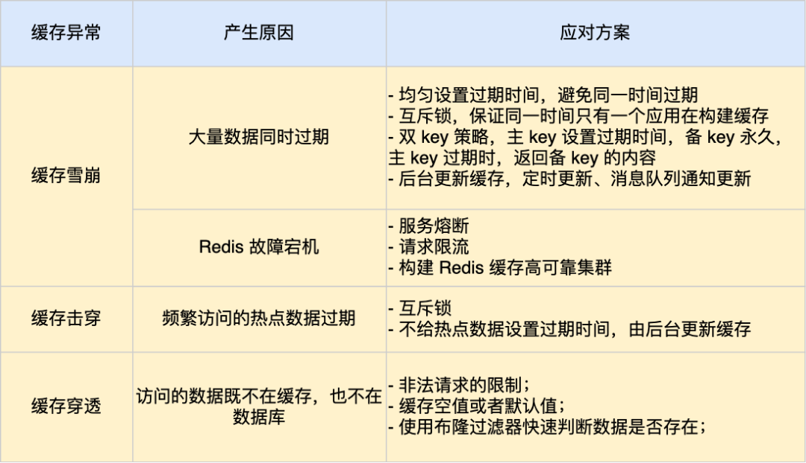

# 数据类型篇

### **String**

- **基础数据结构**：用于存储简单数据，底层实现为 `int` 和 `SDS`（简单动态字符串）。
- 应用场景：
  - **缓存对象**：序列化对象为 JSON 格式缓存。
  - **常规计数**：如文章阅读量、访问计数。
  - **分布式锁**：通过 `SET lock_key unique_value NX PX 10000` 实现锁。
  - **共享 Session 信息**：解决分布式系统中的 Session 存储问题。

### **List**

- **底层实现**：双向链表或压缩列表。
- 应用场景：
  - **消息队列**：按顺序存储消息。
  - **缺点**：不支持多个消费者消费同一消息。

### **Hash**

- **用途**：存储对象属性。
- 应用场景：
  - **缓存对象**：适用于频繁变化的复杂对象。
  - **购物车**：存储商品信息和数量。

### **Set**

- **特点**：无序、不重复元素。
- **区别**：List 可以重复，Set 不允许重复。
- 应用场景：
  - **点赞**：文章 ID 作为 Key，用户 ID 作为 Value。
  - **共同关注**：利用交集计算共同关注。
  - **抽奖活动**：保证用户不重复中奖。

### **Zset (Sorted Set)**

- **底层实现**：压缩列表或跳表，通过分数排序元素。
- 应用场景：
  - **排行榜**：根据分数排序元素。
  - **电话、姓名排序**：按时间戳或其他指标排序。

### **BitMap**

- **特点**：高效存储二进制数据，时间复杂度 O(1)。
- 应用场景：
  - **签到统计**：记录用户签到情况。
  - **用户登录态**：标记用户是否登录。
  - **连续签到**：统计连续签到用户数。

### **HyperLogLog**

- **用途**：估算基数，适用于大规模数据统计。
- 应用场景：
  - **百万级网页 UV 计数**：统计独立用户访问量。

### **GEO**

- **用途**：存储地理位置信息，进行地理位置计算。
- 应用场景：
  - **滴滴叫车**：查询附近的出租车。

### **Stream**

- **特点**：支持持久化、顺序消费和消费组，适用于高效消息队列。
- 应用场景：
  - **消息队列**：通过 `XGROUP` 创建消费组，保证消息的唯一消费。

#### Redis Stream 与专业消息队列的差异

1. **消息不丢失**：Redis 生产者和消费者在处理时能确保消息不丢失。但消息中间件（Redis）本身可能会丢失消息，特别是在主从复制是异步时。
2. **消息堆积**：消息堆积会导致 Redis 内存持续增长。因此，Redis 适用于消息量相对较小或对数据丢失不敏感的场景。

针对 Redis 是否适合做消息队列，关键看你的业务场景：

- 如果你的业务场景足够简单，对于数据丢失不敏感，而且消息积压概率比较小的情况下，把 Redis 当作队列是完全可以的。
- 如果你的业务有海量消息，消息积压的概率比较大，并且不能接受数据丢失，那么还是用专业的消息队列中间件吧。

#### Redis 发布/订阅机制的局限性

- **没有持久化**：发布/订阅机制的数据不会写入 RDB 和 AOF，当 Redis 宕机时会丢失。
- **离线消息丢失**：如果订阅者离线，无法消费历史消息。
- **消息积压处理**：当消息积压严重时，消费端会被强制断开。默认的配置限制为 32MB 内存或 60s 超过 8MB 的积压消息。

**<font color='red'>这些键值对是如何保存在 Redis 中的呢？</font>**

Redis 是使用了一个「哈希表」保存所有键值对，哈希表其实就是一个数组，数组中的元素叫做哈希桶

Redis 的哈希桶是怎么保存键值对数据的呢？

# 持久化篇

### **<font color='red'> AOF基本概念</font>**

第一：只会记录写操作命令，读操作命令是不会被记录的、默认不开启

第二：Redis 是先执行写操作命令后，才将该命令记录到 AOF 日志里的

### **<font color='red'>为什么要先写命令</font>**

1、避免额外的检查开销

2、不会阻塞当前写操作命令的执行

3、Redis 在还没来得及将命令写入到硬盘时，服务器发生宕机了，这个数据就会有**丢失的风险**

4、写操作命令执行成功后才记录到 AOF 日志，不会阻塞当前写操作命令的执行，可能会给「下一个」命令带来阻塞风险

### **<font color='red'>三种写回策略</font>**

这是从==内核中写到硬盘==

同步写回：每次执行 fsync() 函数

每秒写回：异步每秒执行fsync() 函数

操作系统写回：永不执行fsync() 函数

### **<font color='red'>AOF 重写机制</font>**

==目的：==尽管某个键值对被多条写命令反复修改，最终也只需要根据这个「键值对」当前的最新状态，然后用一条命令去记录键值对

==怎么做的：==多进程父子进程只读、写时复制

==写时复制：==触发写保护中断、只复制修改的内存

子进程完成后信号异步通知父进程执行函数、将 AOF 重写缓冲区中的所有内容追加到新的 AOF 的文件中，然后把AOF改名

### **<font color='red'>什么情况下阻塞主进程？</font>**

第一：父进程的页表太大、复制慢

第二：写时复制拷贝物理内存、慢

第三：信号处理函数执行时

### **<font color='red'>为什么不用多线程？</font>**

加锁影响性能

### **<font color='red'>为什么重写 AOF 的时候，不直接复用现有的 AOF 文件</font>**

 AOF 重写过程，先重写到新的 AOF 文件，重写失败的话，就直接删除这个文件就好，不会对现有的 AOF 文件造

成影响

### **<font color='red'>如果主进程修改了已经存在 key-value，此时这个 key-value 数据在子进程的内存数据就跟主进程的内存数据不一致了，这时要怎么办呢？</font>**

AOF 重写缓冲区：在 后台子进程执行 AOF 重写期间，主进程需要执行以下三个工作:

执行客户端发来的命令

将执行后的写命令追加到 「AOF 缓冲区」

将执行后的写命令追加到 「AOF 重写缓冲区」

### **<font color='red'>RDB 基本概念</font>**

1、每隔一段时间自动执行一次 bgsave 命令(子进程)

2、RDB 快照是全量快照、不能太频繁

### **<font color='red'>执行快照时，数据能被修改吗？</font>**

1、写时复制技术

2、极端情况下：所有的共享内存都被修改，则此时的内存占用是原先的 2 倍

### **<font color='red'>混合持久化</font>**

前半部分是 RDB 格式的全量数据：加载的时候速度会很快

后半部分是 AOF 格式的增量数据：数据更少的丢失

### **<font color='red'>Redis 大 Key 对持久化有什么影响？</font>**

分别说说这三种策略，在持久化大 Key 的时候，会影响什么？

当使用 Always 策略的时候，如果写入是一个大 Key，主线程在执行 fsync() 函数的时候，阻塞的时间会比较久，

因为当写入的数据量很大的时候，数据同步到硬盘这个过程是很耗时的

### **<font color='red'>大 Key 对 AOF 重写和 RDB 的影响</font>**？

==第一：==当 AOF 日志写入了很多的大 Key，AOF 日志文件的大小会很大，那么很快就会触发 AOF 重写机制

在通过 `fork()` 函数创建子进程的时候，虽然不会复制父进程的物理内存，但是内核会把父进程的页表复制一份给子进程，如果页表很大，那么这个复制过程是会很耗时的，那么在执行 fork 函数的时候就会发生阻塞现象

==第二：==父进程对共享内存中的大 Key 进行了修改，那么内核就会发生写时复制，会把物理内存复制一份，由于大 Key 占用的物理内存是比较大的，那么在复制物理内存这一过程中，也是比较耗时的，于是父进程（主线程）就会发生阻塞

### **<font color='red'>大 key 对redis的影响？</font>**

客户端超时阻塞。由于 Redis 执行命令是单线程处理，然后在操作大 key 时会比较耗时，那么就会阻塞 Redis，从客户端这一视角看，就是很久很久都没有响应

引发网络阻塞。每次获取大 key 产生的网络流量较大，如果一个 key 的大小是 1 MB，每秒访问量为 1000，那么每秒会产生 1000MB 的流量，这对于普通千兆网卡的服务器来说是灾难性的

阻塞工作线程。如果使用 del 删除大 key 时，会阻塞工作线程，这样就没办法处理后续的命令

- 客户端超时阻塞
- 引发网络阻塞
- 阻塞工作线程

### **<font color='red'>Redis 持久化时，对过期键会如何处理的？</font>**

RDB 持久化不会保存过期键

即使过期键在数据库中被删除了，与之相关的过期键的过期信息仍然会被记录在 AOF 文件中。当 Redis 重新加载 AOF 文件时，这些过期键的过期信息也会被重新加载，从而保持数据库的一致性

### **<font color='red'>大key和热key如何解决</font>**

==大key对持久化、重写、客户端的影响==

解决办法：

**拆分大Key**：将大Key拆分为多个小Key。例如，一个包含大量元素的列表可以拆分为多个较小的列表

**分页存储**：对大数据集合进行分页存储，每次只存储和操作部分数据

**压缩数据**：使用数据压缩技术将大Key的值进行压缩存储，但要注意压缩和解压缩的开销

**合理的过期策略**：设置合理的过期时间，避免大Key长期存在于内存中占用大量资源

解决办法：

**请求分摊**：使用负载均衡策略，将对热Key的访问分散到多个实例

**缓存层次化**：在Redis前增加一层本地缓存（如`memcached`或`本地进程缓存`）来缓存热Key，减少对Redis直接访问

**读写分离**：可以使用主从复制，将读请求分发到从节点，减轻主节点的压力

**限流和降级**：实现限流策略，对频繁访问的热Key进行请求限制，防止流量过载

### **<font color='red'>AOF和RDB的区别</font>**

==AOF==

- 每次写操作都会被记录到追加文件中；可以选择不同的同步策略（每秒、每写、不同步）

##### 优点

- 可以确保每次写操作都被持久化到磁盘。
- 日志可恢复：AOF文件可以重放所有写操作来恢复数据。

##### 缺点

- 文件体积大：AOF文件比RDB文件要大很多。
- 写性能较低：频繁的写磁盘操作会影响性能。

==快照（RDB）==

- 在指定的时间间隔内，Redis 将数据集的快照保存到磁盘上；可以手动或自动触发快照操作

##### 优点

- 恢复速度快：可以快速恢复到某个时间点的数据状态。
- 磁盘I/O效率高：适合大规模数据的快速加载。

##### 缺点

- 数据一致性较差：在两次快照之间发生的写操作可能会丢失。
- 资源消耗大：快照操作可能会消耗大量的CPU和I/O资源。

# 功能篇

### **<font color='red'>如何设置过期时间？</font>**

先说一下对 key 设置过期时间的命令。 设置 key 过期时间的命令一共有 4 个：

- `expire <key> <n>`：设置 key 在 n 秒后过期
- `pexpire <key> <n>`：设置 key 在 n 毫秒后过期
- `expireat <key> <n>`：设置 key 在某个时间戳（精确到秒）之后过期
- `pexpireat <key> <n>`：设置 key 在某个时间戳（精确到毫秒）之后过期

当然，在设置字符串时，也可以同时对 key 设置过期时间，共有 3 种命令：

- `set <key> <value> ex <n>` ：设置键值对的时候，同时指定过期时间（精确到秒）
- `set <key> <value> px <n>` ：设置键值对的时候，同时指定过期时间（精确到毫秒）
- `setex <key> <n> <valule>` ：设置键值对的时候，同时指定过期时间（精确到秒）

如果你想查看某个 key 剩余的存活时间，可以使用 `TTL <key>` 命令

如果突然反悔，取消 key 的过期时间，则可以使用 `PERSIST <key>` 命令

###  **<font color='red'>如何判定 key 已过期了？</font>**

每当我们对一个 key 设置了过期时间时，Redis 会把该 key 带上过期时间存储到一个**过期字典**

过期字典数据结构结构如下：

- 其中键是 Redis 数据库中的键，值是对应的键的 **过期时间戳**（long long 类型的整数）。
- **主字典（data dictionary）**：存储的是键值对（key-value），也就是实际的数据；**过期字典（expires dictionary）**：存储的是键及其对应的过期时间。

**字典实际上是哈希表，哈希表的最大好处就是让我们可以用 O(1) 的时间复杂度来快速查找。**

当我们查询一个 key 时，Redis 首先检查该 key 是否存在于过期字典中：

- 如果不在，则正常读取键值；
- 如果存在，则会获取该 key 的过期时间，然后与当前系统时间进行比对，如果比系统时间大，那就没有过期，否则判定该 key 已过期。

### **<font color='red'>过期删除策略有哪些？</font>**

对CPU和内存是否友好

==定时删除==

==惰性删除==

==定期删除：==每隔一段时间「随机」从数据库中取出一定数量的 key 进行检查，并删除其中的过期key

### **<font color='red'>Redis 过期删除策略是什么？</font>**

**Redis 选择「惰性删除+定期删除」这两种策略配和使用**，以求在合理使用 CPU 时间和避免内存浪费之间取得平衡

Redis 在访问或者修改 key 之前，都会调用 expireIfNeeded 函数对其进行检查，检查 key 是否过期：

- 如果过期，则删除该 key，至于选择异步删除，还是选择同步删除，根据 `lazyfree_lazy_expire` 参数配置决定（Redis 4.0版本开始提供参数），然后返回 null 客户端；
- 如果没有过期，不做任何处理，然后返回正常的键值对给客户端；

详细说说 Redis 的定期删除的流程：

1. 从过期字典中随机抽取 20 个 key，默认每秒进行 10 次过期检查一次数据库；
2. 检查这 20 个 key 是否过期，并删除已过期的 key；
3. 如果本轮检查的已过期 key 的数量，超过 5 个（20/4），也就是「已过期 key 的数量」占比「随机抽取 key 的数量」大于 25%，则继续重复步骤 1；如果已过期的 key 比例小于 25%，则停止继续删除过期 key，然后等待下一轮再检查。

**<font color='red'>redis定时删除如何实现？</font>**

```cpp
void activeExpireCycle() {
    while (时间片未耗尽) {
        选择一个随机的数据库;
        从过期字典中随机抽取若干个键;
        遍历这些键:
            如果当前时间 > 键的过期时间:
                删除这个键;
        如果检查的键中超过25%过期:
            重复检查过程;
    }
}
```

**<font color='red'>redis主线程删除还是后台线程删除</font>**

Redis 的大多数删除操作都是在 **主线程** 中同步完成的，包括显式的 `DEL` 操作和隐式的过期键删除操作。

对于删除大数据量的键，使用 `DEL` 可能会导致 Redis 主线程阻塞，因此可以使用 **`UNLINK`** 命令来异步释放内存，

从而减少阻塞时间。虽然 Redis 是单线程的，但它使用后台线程来处理某些耗时的任务，例如 `UNLINK` 的异步内存释放和持久化操作。

**<font color='red'>定时任务的时间如何设置？</font>**

**调整 `hz` 值**：如果你的系统对过期键的处理要求较高，或者需要更多的周期性维护任务，比如定期删除大量的过期键，可以考虑适当调高 `hz` 值（如从默认的 10 调整到 50 或 100）。这会增加 Redis 进行周期性任务的频率。

**调整 `active-expire-effort`**：如果你的系统设置了大量的过期键，并且需要更高的过期键清理效率，可以增加 `active-expire-effort` 的值。这会让 Redis 在每次事件循环中花更多的时间和精力去清理过期键。

###  **<font color='red'>如何设置 Redis 最大运行内存？</font>**

在配置文件 redis.conf 中，可以通过参数 `maxmemory <bytes>` 来设定最大运行内存

64位无上限，直至系统崩溃

32位3GB

### **<font color='red'>Redis 内存淘汰策略有哪些？</font>**

==不进行数据淘汰：==Redis3.0之后，默认的内存淘汰策略，如果有新的数据写入，会报错通知禁止写入,应用层处理

==进行数据淘汰==

- 在设置了过期时间的数据中进行淘汰
  - ==random：==随机淘汰设置了过期时间的任意键值
  - ==TTL：==优先淘汰更早过期的键值
  - ==LRU：==淘汰所有设置了过期时间的键值中，最久未使用的键值
  - ==LFU：==淘汰所有设置了过期时间的键值中，最少使用的键值
- 在所有数据范围内进行淘汰
  - ==random:==随机淘汰任意键值
  - ==LRU:==淘汰整个键值中最久未使用的键值==LRU==
  - ==LFU:==淘汰整个键值中最少使用的键值

### **<font color='red'>如何修改 Redis 内存淘汰策略？</font>**

==在启动 Redis 服务器时：==可以通过命令行参数指定内存淘汰策略

==修改 Redis 配置文件：==必须重启 Redis 服务，设置才能生效

==运行时候修改：==可以使用 Redis CLI（命令行界面）来动态修改内存淘汰策略

###  **<font color='red'>LRU 算法和 LFU 算法有什么区别？</font>**

==FIFO：==先进先出，部分记录虽然是最早添加但也最常被访问

==淘汰依据：==**LRU**：基于数据最近的使用时间，**LFU**：基于数据的使用频率

==适用场景：==**LRU**：适用于访问时间局部性较强的场景，**LFU**：适用于访问频率局部性较强的场景

==实现复杂度：==**LRU**：实现相对简单，常用链表和哈希表，**LFU**：实现相对复杂，需要维护频率计数和优先队列

==性能和开销：==**LRU**：每次访问需要更新访问顺序，开销较小，**LFU**：每次访问需要更新频率计数和可能的重排序，

开销较大

Redis 并没有使用这样的方式实现 LRU 算法，因为传统的 LRU 算法存在两个问题：

- 需要用链表管理所有的缓存数据，这会带来额外的空间开销；
- 当有数据被访问时，需要在链表上把该数据移动到头端，如果有大量数据被访问，就会带来很多链表移动操作，会很耗时，进而会降低 Redis 缓存性能。

### **<font color='red'>Redis 是如何实现 LRU 算法的？</font>**

==使用随机采样和时间戳；==

在 Redis 的对象结构体中添加一个额外的字段，用于记录此数据的最后一次访问时间

当 Redis 进行内存淘汰时，会使用**随机采样的方式来淘汰数据**，它是随机取 5 个值（此值可配置），然后**淘汰最久没有使用的那个**。

Redis 实现的 LRU 算法的优点：

- 不用为所有的数据维护一个大链表，节省了空间占用；
- 不用在每次数据访问时都移动链表项，提升了缓存的性能；

**<font color='red'>什么时候执行LRU算法？</font>**

Redis 的 LRU 并不是定时执行的，而是在 Redis 达到内存上限时按需触发。

采样淘汰的频率与内存使用情况有关，只有当 Redis 需要腾出空间时，才会进行 LRU 淘汰操作。

配置 `maxmemory-samples` 和 `maxmemory-policy` 可以影响 LRU 执行的频率和淘汰的准确性。

==缺点就是缓存污染==

### **<font color='red'>Redis怎么实现 LFU 算法？</font>**

==Redis 使用频率计数器和衰减机制==

Redis 的 LFU 策略结合了 **计数器增长和衰减**，以避免频繁访问某个键导致其永远不会被淘汰。它通过以下方式实现：

1. **计数器增长**：每次访问某个键时，Redis 会随机增加该键的计数器值。访问频率越高的键，计数器增长的概率越大。
2. **计数器衰减**：Redis 使用 **全局时钟** 对计数器值进行衰减，时间越久未访问的键，计数器值会逐渐变小。
3. **采样淘汰**：当需要淘汰键时，Redis 同样采取采样策略，选择一批键后比较它们的计数器值，淘汰计数器最小的键。

# 高可用篇

### **<font color='red'>什么是redis的主从复制，怎么实现的？</font>**

==概念：==主服务器可以进行读写操作，当发生写操作时自动将写操作同步给从服务器，而从服务器一般是只读，并接受主服务器同步过来写操作命令，然后执行这条命令

==第一阶段：==

建立链接：FULLRESYNC runID offset、psync ？ -1

发送RDB：异步RDB和清除当前RDB

追加RDB：从缓冲区中找生成、发送、加载RDB

==第二阶段：==

基于TCP长连接的命令传播

==第三阶段：==

增量复制：repl_backlog_size 小就会导致全量复制

### **<font color='red'>分摊主服务器的压力</font>**

```text
replicaof <目标服务器的IP> 6379
```

此时如果目标服务器本身也是「从服务器」，那么该目标服务器就会成为「经理」的角色，不仅可以接受主服务器同步的数据，也会把数据同步给自己旗下的从服务器，从而减轻主服务器的负担

**<font color='red'>Redis主从节点是长连接还是短连接？</font>**

长连接

**<font color='red'>怎么判断 Redis 某个节点是否正常工作？</font>**

Redis 主节点默认==每隔 10 秒对从节点发送 ping 命令==，判断从节点的存活性和连接状态，可通过参数repl-ping-slave-period控制发送频率

Redis 从节点==每隔 1 秒发送 replconf ack{offset} 命令==，给主节点上报自身当前的复制偏移量，目的是为了：

实时监测主从节点网络状态

上报自身复制偏移量， 检查复制数据是否丢失， 如果从节点数据丢失， 再从主节点的复制缓冲区中拉取丢失数据

**<font color='red'>redis主从复制、如果从服务器挂了，又启动了，怎么和主进行同步</font>**

当 Redis 从服务器挂掉并重新启动后，它会自动与主服务器重新建立连接并尝试同步。根据主从之前的同步状态，有两种可能的同步方式：

- **增量复制**：如果主服务器有足够的历史命令，直接将丢失的变更发送给从服务器。
- **全量复制**：如果增量复制条件不满足，则重新发送整个数据集。

**增量复制的条件**：主从服务器的复制偏移量必须匹配，且主服务器必须有足够的历史命令（即 `repl-backlog` 中的数据）可以用于同步丢失的数据。

**全量复制的条件**：如果增量复制条件不满足（例如从服务器的数据过期太久，主服务器无法提供增量数据），则从服务器将进行全量复制。

**<font color='red'>某个程序很慢，如何定位到哪个线程，哪段代码</font>**

1、`perf` 是 Linux 下强大的性能分析工具，可以分析 CPU 使用率、函数调用栈以及线程信息

2、**Valgrind**：可以通过 `callgrind` 模块分析程序的函数调用路径和每个函数的执行时间

### **<font color='red'>主从复制架构中，过期key如何处理？</font>**

主节点处理了一个key或者通过淘汰算法淘汰了一个key，这个时间主节点模拟一条del命令发送给从节点，从节点收到该命令后，就进行删除key的操作

### **<font color='red'>Redis 是同步复制还是异步复制？</font>**

Redis 主节点每次收到写命令之后，先写到内部的缓冲区，然后异步发送给从节点

### **<font color='red'>主从复制中两个 Buffer(replication buffer 、repl backlog buffer)有什么区别？</font>**

==出现的阶段不一样：==

repl backlog buffer 是在增量复制阶段出现，**一个主节点只分配一个 repl backlog buffer**；

replication buffer 是在全量复制阶段和增量复制阶段都会出现，**主节点会给每个新连接的从节点，分配一个 replication buffer**；

这两个 Buffer 都有大小限制的，当缓冲区满了之后，==发生的事情不一样：==

当 repl backlog buffer 满了，因为是环形结构，会直接**覆盖起始位置数据**;

当 replication buffer 满了，会导致连接断开，删除缓存，从节点重新连接，**重新开始全量复制**。

==复制缓冲区：==主节点用来暂时存储发送给从节点的复制数据的缓冲区

==复制后备缓冲区：==从节点用来存储复制数据的缓冲区

### **<font color='red'>如何应对主从数据不一致？</font>**

因为主从节点间的命令复制是异步进行的，所以无法实现强一致性保证（主从数据时时刻刻保持一致）

- 尽量保证主从节点间的网络连接状况良好，避免主从节点在不同的机房

- 可以开发一个外部程序来监控主从节点间的复制进度

### **<font color='red'>主从切换如何减少数据丢失？</font>**

==异步复制同步丢失 :== 如果此时主节点还没来得及同步给从节点时发生了断电，那么主节点内存中的数据会丢失

解决办法：所有的从节点数据复制和同步的延迟都超过了阈值会拒绝接收任何请求

==集群产生脑裂数据丢失 :== 旧主节点降级为从节点，再与新主节点进行同步复制的时候，由于会从节点会清空自己的缓冲区，所以导致之前客户端写入的数据丢失了

解决办法：主节点禁止写入操作（从节点下线的数量太多、网络延迟太大）

### **<font color='red'>主从如何做到故障自动切换？</font>**

Redis 哨兵机制就登场了，哨兵在发现主节点出现故障时，由哨兵自动完成故障发现和故障转移，并通知给应用方，从而实现高可用性

### **<font color='red'>为什么要有哨兵？</font>**

**哨兵（Sentinel）机制**：它的作用是实现**主从节点故障转移**，==监控、选主、通知==

- 根据什么规则选择一个从节点切换为主节点？
- 怎么把新主节点的相关信息通知给从节点和客户端呢？

### **<font color='red'>如何判断主节点真的故障了？</font>**

**主观下线**：哨兵会每隔 1 秒给所有主从节点发送 PING 命令，当主从节点收到 PING 命令后，会发送一个响应命令给哨兵，这样就可以判断它们是否在正常运行

**客观下线：**客观下线只适用于主节点，多个节点部署成哨兵集群（最少需要三台机器来部署哨兵集群），通过多个哨兵节点一起判断，就可以就可以避免单个哨兵因为自身网络状况不好，而误判主节点下线的情况

### **<font color='red'>由哪个哨兵进行主从故障转移？</font>**

和raft算法很类似

候选者：哪个哨兵节点判断主节点为「客观下线」，这个哨兵节点就是候选者

### **<font color='red'>候选者如何选举成为 Leader？</font>**

那么在投票过程中，任何一个「候选者」，要满足两个条件：

- 第一，拿到半数以上的赞成票
- 第二，拿到的票数同时还需要大于等于哨兵配置文件中的 quorum 值(哨兵配置文件)

### **<font color='red'>怎么选主</font>**

第一：剔除网络不好的

三轮考察：优先级最高、复制进度靠前、ID最小

### **<font color='red'>怎么通知</font>**

第一：哨兵让从节点指向新节点

第二：发布订阅通知客户端

### **<font color='red'>哨兵集群是如何组成的？</font>**

在我第一次搭建哨兵集群的时候，当时觉得很诧异。因为在配置哨兵的信息时，竟然只需要填下面这几个参数，设置主节点名字、主节点的 IP 地址和端口号以及 quorum 值。

```
sentinel monitor <master-name> <ip> <redis-port> <quorum> 
```

==哨兵节点之间是通过 Redis 的发布者/订阅者机制来相互发现的==

### **<font color='red'>哨兵集群会对「从节点」的运行状态进行监控，那哨兵集群如何知道「从节点」的信息？</font>**

主节点知道所有「从节点」的信息，所以哨兵会每 10 秒一次的频率向主节点发送 INFO 命令来获取所有「从节点」的信息

正是通过 Redis 的发布者/订阅者机制，哨兵之间可以相互感知，然后组成集群，同时，哨兵又通过 INFO 命令，在主节点里获得了所有从节点连接信息，于是就能和从节点建立连接，并进行监控了

### **<font color='red'>怎么判断 Redis 某个节点是否正常工作？</font>**

Redis 主节点默认==每隔 10 秒对从节点发送 ping 命令==，判断从节点的存活性和连接状态，可通过参数repl-ping-

slave-period控制发送频率

Redis 从节点==每隔 1 秒发送 replconf ack{offset} 命令==，给主节点上报自身当前的复制偏移量，目的是为了：

实时监测主从节点网络状态

### **<font color='red'>主从复制中两个 Buffer？</font>**

当 repl backlog buffer 满了，因为是环形结构，会直接**覆盖起始位置数据**;

当 replication buffer 满了，会导致连接断开，删除缓存，从节点重新连接，**重新开始全量复制**。

==复制缓冲区：==主节点用来暂时存储发送给从节点的复制数据的缓冲区

==复制后备缓冲区：==从节点用来存储复制数据的缓冲区

### **<font color='red'>集群脑裂导致数据丢失怎么办？</font>**

### **<font color='red'>切片集群模式</font>**

### **<font color='red'>Redis 持久化时，对过期键会如何处理的？</font>**

### **<font color='red'>Redis 主从模式中，对过期键会如何处理？</font>**

过期键的处理由主节点决定，但从节点也可以通过设置来自动删除过期键

# 缓存篇

### **<font color='red'>什么是缓存雪崩、击穿、穿透？</font>**




### **<font color='red'>为什么 Redis 里的数据设置过期时间？</font>**

避免redis中数据和数据库长期保持不一致

### **<font color='red'>什么叫后台更新缓存？</font>**

==概念：==业务线程不再负责更新缓存，缓存也不设置有效期，而是让缓存“永久有效”，并将更新缓存的工作交由后台线程定时更新

第一种方式：后台线程不仅负责定时更新缓存，而且也负责==频繁地检测缓存是否有效==

第二种方式：在业务线程发现缓存数据失效后（缓存数据被淘汰），通过==消息队列==发送一条消息通知后台线程更新缓存

- **避免大量请求同时触发缓存更新**，从而降低对后端数据库的并发访问。
- 用户请求到来时，数据通常已经被缓存刷新，不会直接访问数据库。

**示例场景：**

假设一个电商网站的商品详情页使用 Redis 缓存商品数据，并且设置了缓存过期时间为 10 分钟。如果所有商品缓存同时失效，大量用户请求商品详情，导致所有请求都打到数据库上，可能引发数据库崩溃。

为了避免这种情况，后台可以每隔 9 分钟定时刷新 Redis 缓存。这样，当用户请求时，缓存中的数据仍然有效，避免大量请求直接命中数据库。

### **<font color='red'>什么叫缓存预热？</font>**

在业务刚上线的时候，我们最好提前把数据缓起来，而不是等待用户访问才来触发缓存构建

### **<font color='red'>什么情况下会发生缓存穿透？</font>**

业务误操作，缓存中的数据和数据库中的数据都被误删除了，所以导致缓存和数据库中都没有数据；

黑客恶意攻击，故意大量访问某些读取不存在数据的业务；

### **<font color='red'>应对缓存穿透的方案？</font>**

第一种方案，非法请求的限制，在 API 入口处我们要判断求请求参数是否合理

第二种方案，缓存空值或者默认值，内存撑爆？

第三种方案，使用布隆过滤器快速判断数据是否存在，怎么删除一个数据，布隆饱和

### **<font color='red'>布隆过滤器会通过 3 个操作完成标记</font>**

第一步，使用 N 个哈希函数分别对数据做哈希计算，得到 N 个哈希值；

第二步，将第一步得到的 N 个哈希值对位图数组的长度取模，得到每个哈希值在位图数组的对应位置。

第三步，将每个哈希值在位图数组的对应位置的值设置为 1；

**<font color='red'>误判率和哪些因素有关系</font>**

**哈希函数的数量**（`k`）：哈希函数数量需要根据==位数组大小和元素数量==进行调优，以减少冲突

**位数组的大小**（`m`）：位数组越大，误判率越低，位数组的大小需要与元素数量匹配

**插入的元素数量**（`n`）：插入的元素越多，误判率越高，应避免超过预期的元素数量

**哈希函数的质量**：哈希函数需要均匀分布以减少冲突

**负载因子**（`α`）：位数组中被设置为 `1` 的比例越高，误判率越高

### **<font color='red'>说说常见的缓存更新策略？</font>**

==旁路缓存策略：==不更新缓存，而是删除缓存中的数据。然后，到读取数据时，发现缓存中没了数据之后，再从数据

库中读取数据，更新到缓存中

**写策略的步骤：**

- 更新数据库中的数据；
- 删除缓存中的数据。

**读策略的步骤：**

- 如果读取的数据命中了缓存，则直接返回数据；
- 如果读取的数据没有命中缓存，则从数据库中读取数据，然后将数据写入到缓存，并且返回给用户

==Read/Write Through（读穿 / 写穿）策略==

==Write Back（写回）策略==

### **<font color='red'>数据库和缓存如何保证一致性？</font>**

**<font color='red'>先更新数据库，还是先更新缓存？</font>**

多线程并发都会出现缓存和数据库中的数据不一致

**<font color='red'>先删除缓存，再更新数据库</font>**

在「读 + 写」并发请求而造成缓存不一致的解决办法是「**延迟双删**」

**<font color='red'>先更新数据库 + 再删除缓存</font>**

==因为缓存的写入通常要远远快于数据库的写入==，所以在实际中很难出现请求 B 已经更新了数据库并且删除了缓存，请求 A 才更新完缓存的情况。

「先更新数据库，再删除缓存」的方案虽然保证了数据库与缓存的数据一致性，但是每次更新数据的时候，缓存的数据都会被删除，这样会对==缓存的命中率==带来影响

**<font color='red'>如何保证「先更新数据库 ，再删除缓存」这两个操作能执行成功？</font>**

==重试机制：==我们可以引入消息队列，将第二个操作（删除缓存）要操作的数据加入到消息队列，由消费者来操作

步骤：更新数据库、去消息队列删除缓存、删除缓存失败、读取缓存、再次删除

==订阅 MySQL binlog，再操作缓存==

更新数据库成功，就会产生一条变更日志，记录在 binlog 里

于是我们就可以通过订阅 binlog 日志，拿到具体要操作的数据，然后再执行缓存删除，阿里巴巴开源的 Canal 中间件就是基于这个实现的

**<font color='red'>为什么是删除缓存，而不是更新缓存呢？</font>**

那些加载代价大的操作，删除缓存而不是更新缓存，就是懒加载思想的一个应用

**<font color='red'>如何提高缓存命中率？</font>**

==更新数据库 + 更新缓存==

第一：在更新缓存前先加个**分布式锁**，保证同一时间只运行一个请求更新缓存，就会不会产生并发问题了，当然引入了锁后，对于写入的性能就会带来影响

第二：在更新完缓存时，给缓存加上较短的**过期时间**，这样即时出现缓存不一致的情况，缓存的数据也会很快过期，对业务还是能接受的

# 面试问题

### **<font color='red'>redis的九大数据结构？应用场景？内部实现？</font>**

内存存储，需要持久化（RDB、AOF）

高效率、用于高速缓冲

发布订阅系统

地图信息分析

计时器、计数器(eg：浏览量)

**<font color='red'>用zset实现排行榜的功能，具体实际操作一下</font>**

**<font color='red'>Zset底层实现</font>**

压缩列表，元素个数小于128，值小于64字节；

反之跳表

**<font color='red'>数据库和缓存一致性怎么保证</font>**

读数据：旁路缓存（需要再加载）

写数据：更新DB，删除缓存

第一：针对缓存异常的情况，对key设置过期时间

第二：删除缓存失败的情况，都是==异步操作缓存==

消息队列：将要删除的数据加入到消息队列，由消费者删除数据，如果删除失败，那么就可以从消息队列中重新读取再次删除，如果删除成功，就从消息队列中删除消息

订阅binlog：数据库更新后会产生binlog，我们可以订阅binlog日志，拿到要操作的数据再执行缓存删除

### **<font color='red'>为什么用 Redis 作为 MySQL 的缓存？</font>**

高性能：内存中

高并发：QPS 能轻松破 10w

### **<font color='red'>Redis 和 Memcached 有什么区别？</font>**

相同点：基于内存、过期策略、性能都非常高

不同点：数据类型更丰富、数据的持久化、支持集群模式

### **<font color='red'>什么是redis？</font>**

内存中的非关系型数据库：缓存、消息队列、分布式锁

单线程、持久化、集群

Redis默认有16个数据库：DB 0~DB 15，可以使用`select n`切换到DB n，`dbsize`可以查看当前数据库的大小，与key数量相关

### **<font color='red'>redis为什么这么快？</font>**

在内存中完成、避免多线程之间的竞争、IO 多路复用机制、数据结构被优化

**<font color='red'>为什么使用单线程？</font>**

CPU 并不是制约 Redis 性能表现的瓶颈所在

并发读写的一系列问题

**<font color='red'>为什么引入多线程？</font>**

一个主线程

六个多线程：异步处理关闭文件、AOF刷盘、释放内存、三个 I/O 线程

**<font color='red'>讲讲redis的单线程模式？</font>**

和webserver一样

### **<font color='red'>Redis 如何实现延迟队列？</font>**

有序集合

列表

### **<font color='red'>Redis 管道有什么用？</font>**

将多个命令打包发送到服务器并在一次通信中执行的机制

### **<font color='red'>如何用 Redis 实现分布式锁的？</font>**

分布式锁的加锁操作通常涉及以下几个步骤：

1. **生成锁标识**：
   - 每次尝试加锁时，生成一个唯一的标识符（通常是一个随机字符串），用作锁的唯一标识。
2. **尝试获取锁**：
   - 使用 Redis 的原子命令 `SET` 或 `SETNX` 来尝试设置一个键值对，键为锁的名称，值为上面生成的锁标识符。
   - `SETNX` 命令是“Set if Not eXists”，只有当键不存在时才会设置键值对，因此可以保证锁的原子性。
   - 如果 `SETNX` 成功返回 `1`，表示锁获取成功；如果返回 `0`，表示锁已经被其他客户端获取。
3. **设置过期时间**：
   - 为了避免死锁的情况（即持有锁的客户端崩溃或长时间未响应），通常会给锁设置一个过期时间。
   - 使用 `EXPIRE` 或 `PEXPIRE` 命令为锁键设置一个过期时间。

解锁操作需要确保只有锁的持有者才能解锁，以防止其他客户端非法解锁。为此，可以采用以下方法：

1. **验证锁持有者**：
   - 在解锁之前，先检查锁的持有者是否是当前客户端。
   - 通过获取锁的值并与当前客户端持有的锁标识符进行比较。
2. **删除锁键**：
   - 如果当前客户端确实是锁的持有者，则可以安全地删除锁键。
   - 使用 `EVAL` 命令来执行 Lua 脚本，确保整个过程是原子的。

### **<font color='red'>基于 Redis 实现分布式锁有什么优缺点？</font>**

优点：性能高效、实现方便、避免单点故障

缺点：超时时间不好设置、主从复制是异步复制

Redis 如何解决集群情况下分布式锁的可靠性？

Lua脚本、Redlock算法、Sentinel或Cluster模式

### **<font color='red'>Redis 事务支持回滚吗？</font>**

1、Redis的单条命令是保证原子性的，但是redis事务不能保证原子性

2、Redis事务：一组命令的集合，执行过程中按顺序执行，不允许其他命令进行干扰，==一次性、顺序性、排他性==

3、redis事务没有隔离级别

3、操作过程：开启事务(`multi`) >> 命令入队 >> 执行事务(`exec`)

- 代码语法错误（编译时异常）所有的命令都不执行
- 代码逻辑错误 (运行时异常) **其他命令可以正常执行 **>> 不保证事务原子性

4、WATCH：监视一个或多个键，如果在事务执行之前这些键被修改了，事务将被打断

==不支持事务运行时错误的事务回滚==

### redis发布订阅？

原理：每个 Redis 服务器进程都维持着一个表示服务器状态的 redis.h/redisServer 结构， 结构的 pubsub_channels 属性是一个字典， 这个字典就用于保存订阅频道的信息，其中，字典的键为正在被订阅的频道， 而字典的值则是一个链表， 链表中保存了所有订阅这个频道的客户端。


客户端订阅，就被链接到对应频道的链表的尾部，退订则就是将客户端节点从链表中移除。

1，如果一个客户端订阅了频道，但自己读取消息的速度却不够快的话，那么不断积压的消息会使redis输出缓冲区的体积变得越来越大，这可能使得redis本身的速度变慢，甚至直接崩溃。
2，这和数据传输可靠性有关，如果在订阅方断线，那么他将会丢失所有在短线期间发布者发布的消息。

1. 消息订阅：公众号订阅，微博关注等等（起始更多是使用消息队列来进行实现）
2. 多人在线聊天室

**<font color='red'>怎么实现一个分布式锁？</font>**

```go
package main

import (
    "fmt"
    "github.com/gomodule/redigo/redis"
    "time"
)

var pool *redis.Pool

// newPool 创建一个Redis连接池
func newPool(addr string) *redis.Pool {
    return &redis.Pool{
        MaxIdle:     3,                      // 最大空闲连接数
        IdleTimeout: 240 * time.Second,      // 空闲连接超时时间
        Dial: func() (redis.Conn, error) {   // 建立连接的函数
            c, err := redis.Dial("tcp", addr)
            if err != nil {
                return nil, err
            }
            return c, err
        },
        TestOnBorrow: func(c redis.Conn, t time.Time) error { // 验证连接可用性的函数
            if time.Since(t) < time.Minute {
                return nil
            }
            _, err := c.Do("PING")
            return err
        },
    }
}

// acquireLock 尝试获取分布式锁
func acquireLock(conn redis.Conn, lockName string, acquireTimeout time.Duration, lockTimeout int) (string, error) {
    identifier := fmt.Sprintf("%d", time.Now().UnixNano()) // 生成唯一标识符
    end := time.Now().Add(acquireTimeout)                  // 获取锁的超时时间点

    for time.Now().Before(end) {                           // 在超时时间内不断尝试获取锁
        reply, err := redis.String(conn.Do("SET", lockName, identifier, "NX", "EX", lockTimeout))
        if err == nil && reply == "OK" {                   // 获取锁成功
            return identifier, nil
        }
        time.Sleep(10 * time.Millisecond)                  // 短暂休眠后重试
    }
    return "", fmt.Errorf("could not acquire lock")        // 获取锁失败
}

// releaseLock 释放分布式锁
func releaseLock(conn redis.Conn, lockName, identifier string) (bool, error) {
    script := `
    if redis.call("GET", KEYS[1]) == ARGV[1] then
        return redis.call("DEL", KEYS[1])
    else
        return 0
    end
    ` // Lua脚本：只有在标识符匹配时删除锁
    res, err := redis.Int(conn.Do("EVAL", script, 1, lockName, identifier))
    if err != nil {
        return false, err
    }
    return res == 1, nil // 如果返回值为1，则表示成功删除锁
}

func main() {
    pool = newPool("localhost:6379") // 初始化连接池
    conn := pool.Get()               // 从连接池中获取一个连接
    defer conn.Close()               // 函数结束时关闭连接

    lockName := "my_lock"                             // 锁的名称
    identifier, err := acquireLock(conn, lockName, 10*time.Second, 5) // 尝试获取锁
    if err != nil {
        fmt.Println("Could not acquire lock:", err)
        return
    }

    fmt.Println("Lock acquired, identifier:", identifier)

    // 临界区代码，可以在这里执行需要加锁的操作
    time.Sleep(2 * time.Second) // 模拟操作

    released, err := releaseLock(conn, lockName, identifier) // 尝试释放锁
    if err != nil {
        fmt.Println("Could not release lock:", err)
        return
    }

    if released {
        fmt.Println("Lock released") // 成功释放锁
    } else {
        fmt.Println("Lock was not released") // 释放锁失败
    }
}
```

### **<font color='red'>如何解决redis的并发竞争key问题</font>**

1、分布式锁：Zookeeper、redis

2、串行化：消息队列

### **<font color='red'>分布式锁的原理和实现</font>**

分布式锁的核心原理是在多个节点之间进行协调，确保在同一时间只有一个节点可以持有锁，并在持有锁时独占访

问资源：唯一性、互斥性、死锁检测和避免、高可用性、自动过期

==基于 Redis 的分布式锁==

**获取锁**

生成唯一标识符：每次获取锁时，客户端生成一个唯一的标识符，这个标识符可以是 UUID 或其他保证唯一性的值。

尝试获取锁：客户端执行 `SETNX` 命令尝试获取锁。`SETNX` 命令会在指定键不存在时设置键的值，并返回 1 表示获取锁成功；如果键已存在，则返回 0 表示获取锁失败。

设置过期时间：如果 `SETNX` 命令获取锁成功，立即使用 `EXPIRE` 命令为锁设置过期时间，防止死锁。

轮询重试：如果获取锁失败，客户端可以等待一段时间后重试，直到获取锁成功或达到重试次数上限。

**释放锁**

验证锁持有者：在释放锁之前，客户端需要验证自己是锁的持有者，即检查锁的值是否等于自己的唯一标识符。

原子性释放：通过 Redis 事务或 Lua 脚本，确保在验证锁持有者和删除锁之间的操作具有原子性，防止并发条件下的误删除。

==基于 ZooKeeper 的分布式锁==

**获取锁**：

1. 在 `/locks` 节点下创建一个有序临时节点。
2. 获取 `/locks` 下所有子节点，并判断自己是否是序号最小的节点。
3. 如果是最小节点，获取锁成功；否则，监听比自己序号小的节点的删除事件。

**释放锁**：

1. 删除自己创建的临时节点，释放锁。

==基于 Etcd 的分布式锁==

Etcd 是一个强一致性的分布式键值存储，提供了==租约机制==来实现分布式锁：

**获取锁**：

1. 创建一个租约（Lease），设置超时时间。
2. 使用租约关联一个键值对（key-value），表示获取锁成功。
3. 定期续租，保持锁不过期。

**释放锁**：

1. 删除关联的键值对，释放锁。
2. 不再续租，租约到期自动释放锁。

**<font color='red'>了解哪些分布式项目</font>**

分布式数据存储和数据库：MongoDB、Hadoop HDFS、Apache Cassandra、HBase、CockroachDB

分布式消息队列：Apache Kafka、RabbitMQ、RocketMQ

分布式计算：Apache Spark、Apache Flink、Apache Storm

分布式协调和配置：Apache ZooKeeper、Etcd

分布式服务框架：Apache Dubbo、Spring Cloud、gRPC

分布式缓存：Redis、Memcached

**<font color='red'>mysql和redis如何保证一致性</font>**

乐观锁与悲观锁

- **原理**：乐观锁假设数据不会发生冲突，每次更新数据时都带上版本号，只有当版本号匹配时才允许更新。
- **实现**：在 MySQL 中，可以通过添加版本号字段来实现乐观锁。在 Redis 中，可以使用 CAS（Compare and Swap）机制。
- **适用场景**：适用于并发写入较少的场景。

- **原理**：悲观锁假设数据会发生冲突，因此在更新数据前就锁定数据，直到更新完成。
- **实现**：在 MySQL 中，可以使用行级锁（例如 SELECT ... FOR UPDATE）来实现悲观锁。Redis 中可以使用 SETNX 或者 Lua 脚本来实现悲观锁。
- **适用场景**：适用于并发写入较多的场景。

通过消息队列（如 RabbitMQ、Kafka 等）来实现最终一致性，即通过异步消息传递来确保数据最终达到一致状态。

- **实现**：当 MySQL 更新数据后，将更新信息发送到消息队列，Redis 监听消息队列，并根据消息更新自身的数据。
- **适用场景**：适用于对实时性要求不高，但需要高可用性和高并发的场景。

使用 Redis 的分布式锁机制（如 Redlock 算法）来确保在更新 MySQL 数据前锁定 Redis 中的相关数据，防止并发冲突。

- **实现**：在更新 MySQL 数据前，先尝试获取 Redis 中的锁，只有获取锁成功后才进行更新操作。
- **适用场景**：适用于并发写入较多的场景，但需要考虑锁的超时机制。

通过事件驱动的方式，将 MySQL 的变更事件（如 binlog）同步到 Redis 中，确保数据的一致性。

- **实现**：使用 MySQL 的 binlog 日志，通过工具如 Canal、Debezium 等捕获 MySQL 的变更事件，并将其同步到 Redis 中。
- **适用场景**：适用于需要实时同步数据的场景。

==Redis zset的底层结构，为什么用跳表而不是红黑树==

**简单性**：跳表比红黑树更简单，尤其在实现和维护上更容易。对于Redis的开发者来说，实现和调试一个跳表比红黑树更简单，这有助于减少代码复杂性和潜在的bug。

**高效范围查询**：跳表特别适合范围查询操作。在Redis中，zset需要频繁进行范围查询操作（如zrange、zrangebyscore），跳表的结构能高效支持这些操作。

**插入和删除的局部性**：跳表在插入和删除元素时，只需要调整相邻节点和少量索引层，局部性好，避免了红黑树的全局性调整，能更高效地执行这些操作。

**内存效率**：在大多数情况下，跳表的内存使用效率比红黑树更好。跳表通过随机化层级来维持平衡，而红黑树需要额外的指针和颜色标记，这可能导致更高的内存开销。

**<font color='red'>Lua和redis配合有什么作用</font>**

Lua 脚本能确保多个 Redis 命令作为一个整体来执行，从而避免并发问题。具体来说：

**加锁场景：** 当客户端想要加锁时，我们需要执行两步操作：

- `SETNX` (设置键值，如果键不存在的话)
- `EXPIRE` (给这个键设置过期时间，避免死锁)

如果这两步不是原子操作，可能会出现问题。例如，客户端执行了 `SETNX`，但在执行 `EXPIRE` 之前，崩溃了，那么锁就永远不会过期，从而导致死锁。

通过 Lua 脚本，我们可以将这两步操作打包在一个脚本里：

**解锁场景：** 解锁时，我们需要确保解锁的客户端就是加锁的客户端。这就需要首先检查当前持有锁的客户端 ID，然后再决定是否删除这个锁：

- `GET` 锁的持有者
- `DEL` 锁（如果当前客户端是持有者）

这两个步骤不能分开操作，否则会有可能在两个命令之间出现锁被其他客户端误删除的问题。
