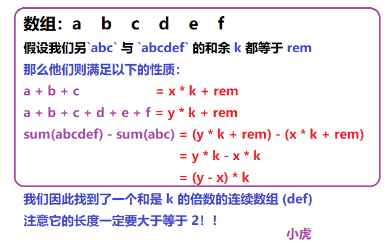

## 哈希表

### 两数之和

**<font color='red'>输入数组</font>**

==空间换时间==，map，set等，这样就可以少遍历一次

```cpp
if(mymap.find(target-nums[i])!=mymap.end())return {mymap[target-nums[i]],i};
```

**<font color='red'>有序数组</font>**

对于有序数组，可以==二分查找==

```cpp
if((numbers[fast]+numbers[slow])>target)fast--;
else if((numbers[fast]+numbers[slow])<target)slow++;
else return {slow+1,fast+1};
```

**<font color='red'>二叉搜索树</font>**

想写==递归==，但是没想出来怎么写

```cpp
class Solution {
public:
    unordered_set<int>myset;
    bool findTarget(TreeNode* root, int k) {
        if(root==nullptr)return false;
        if(myset.find(k-root->val)!=myset.end())return true;
        myset.insert(root->val);
        return findTarget(root->left,k)||findTarget(root->right,k);
    }
};
```

二叉树：==递归、队列迭代、栈迭代==

```cpp
class Solution {
public:
    vector<int> vec;
    void inorderTraversal(TreeNode *node) {
        if (node == nullptr) {
            return;
        }
        inorderTraversal(node->left);
        vec.push_back(node->val);
        inorderTraversal(node->right);
    }
    bool findTarget(TreeNode *root, int k) {
        inorderTraversal(root);
        int left = 0, right = vec.size() - 1;
        while (left < right) {
            if (vec[left] + vec[right] == k) {
                return true;
            }
            if (vec[left] + vec[right] < k) {
                left++;
            } else {
                right--;
            }
        }
        return false;
    }
};
```

**<font color='red'>和为k的子数组</font>**：**<font color='blue'>非常重要，但是还是不会写</font>**

暴力做法超时，==使用前缀和来做==

又是==map，set==之类：数据结构和算法相辅相成

```cpp
int subarraySum(vector<int>& nums, int k) {
    //不能再排序
    int result = 0;
    unordered_map<int,int>map;
    int sum = 0;
    map[0] = 1;
    for(auto num:nums){
        sum+=num;
        result+=map[sum-k];
        ++map[sum];
    }
    return result;
}
```

**<font color='red'>三数之和</font>**：也不会写了

==结合了两数之和有序数组的二分查找==

```cpp
vector<vector<int>> threeSum(vector<int>& nums) {
    vector<vector<int>>result;
    sort(nums.begin(),nums.end());
    for(int i = 0;i<nums.size();i++){
        if(i>0&&nums[i]==nums[i-1])continue;
        int left = i+1;
        int right = nums.size()-1;
        while(left<right){
            if(nums[left]+nums[right]+nums[i]==0){
                result.push_back(vector<int>{nums[i],nums[left],nums[right]});
                left++;
                right--;
                while(left<right&&nums[left]==nums[left-1])++left;
                while(left<right&&nums[right]==nums[right+1])--right;
            }
            else if(nums[left]+nums[right]+nums[i]>0){
                right--;
            }
            else left++;
        }
    }
    return result;
}
```

**<font color='red'>最接近的三数之和</font>**：没写出来

```cpp
int threeSumClosest(vector<int>& nums, int target) {
    int n = nums.size();
    int res = nums[0]+nums[1]+nums[2];
    sort(nums.begin(),nums.end());
    for(int i = 0;i<n-2;++i){
        int l = i+1,r = n-1;
        while(l<r){
            int sum = nums[i]+nums[l]+nums[r];
            if(abs(res-target)>abs(sum-target))res = sum;
            sum<target?l++:r--;
        }
    }
    return res;
}
```

**<font color='red'>四数之和</font>**：debug了很久

1、i<nums.size()和i<nums.size()-3我分不清，int right = nums.size()-1;好像是这里来限制越界

2、j忘了去重

```cpp
vector<vector<int>> fourSum(vector<int>& nums, int target) {
    sort(nums.begin(),nums.end());
    vector<vector<int>>result;
    for(int i =0;i<nums.size();++i){
        if(i>0&&nums[i]==nums[i-1])continue;
        for(int j = i+1;j<nums.size();++j){
            if(j>i+1&&nums[j]==nums[j-1])continue;
            int left = j+1;
            int right = nums.size()-1;
            while(left<right){
                if((long long) nums[i]+nums[j]+nums[left]+nums[right]>target){
                    right--;
                }
                else if((long long) nums[i]+nums[j]+nums[left]+nums[right]<target){
                    left++;
                }
                else{
                    result.push_back(vector<int>{nums[i],nums[j],nums[left],nums[right]});
                    while(left<right&&nums[left]==nums[left+1])left++;
                    while(left<right&&nums[right]==nums[right-1])right--;
                    left++;
                    right--;
                }
            }
        }
    }
    return result;
}
```

### **<font color='red'>字母异位词分组</font>**

这怎么还不太会写了

不管思路有多丑陋，先写出来再说

### **<font color='red'>最长连续子序列</font>**

我这样写时间复杂度过不了

```cpp
int longestConsecutive(vector<int>& nums) {
    unordered_set<int>st;
    int max = INT_MIN;
    int min = INT_MAX;
    for(auto a:nums){
        st.insert(a);
        max = max>a?max:a;
        min = min<a?min:a;
    }
    int result = 0;
    int temp = 0;
    for(int i = min;i<=max;++i){
        while(st.find(i)!=st.end()){
            temp++;
            i++;
        }
        result = result>temp?result:temp;
        temp = 0;
    }
    return result; 
}
```

应该这样写

```cpp
for (const int& num : num_set) {
    if (!num_set.count(num - 1)) {
        //找不到比num小的，那么num就是起点
        int currentNum = num;
        int currentStreak = 1;//目前序列

        while (num_set.count(currentNum + 1)) {
            //如果有比num大的数，那就++
            currentNum += 1;
            currentStreak += 1;
        }

        longestStreak = max(longestStreak, currentStreak);
    }
}
```


## 双指针

### **<font color='red'>移动零</font>**

很简单

**<font color='red'>移除元素</font>**

如果你用==双指针==的话，你其实还是没有删除元素

==每删除一次，后面的元素都会向前移动一次==

```cpp
int removeElement(vector<int>& nums, int val) {
    auto it = nums.begin();
    while (it != nums.end()) {
        if (*it == val) {
            it = nums.erase(it);
        } else {
            ++it;
        }
    }
    return nums.size();
}
```

### **<font color='red'>盛最多水的容器</font>**

控制变量法，轻松拿捏

### **<font color='red'>接雨水</font>**

没写出来，一定要默写下来

理解了半天：

1、栈里面只会维持递减序列，否则他会一步步把其他的元素都弹出（height[st.top()]<height[i]）

2、当递增的时候才能够构成凹槽，接雨水

```cpp
int trap(vector<int>& height) {
    int result = 0;
    stack<int>st;
    for(int i = 0;i<height.size();++i){
        while(!st.empty()&&height[st.top()]<height[i]){
            int cur = st.top();
            st.pop();
            if(st.empty())break;
            int left = st.top();
            int right = i;
            int high = min(height[right],height[left])-height[cur];
            result+=(right-left-1)*high;
        }
        st.push(i);
    }
    return result;
}
```

**<font color='red'>除自身以外数组的乘积</font>**

居然自己写出来了，只不过没有优化

## 滑动窗口

### **<font color='red'>无重复的最长子串</font>**

没写出来

```cpp
for(int i = 0;i<s.size();++i){
    if(myset.find(s[i])==myset.end())myset.insert(s[i]);
    else{
        result = max(result,i-left);
        while(myset.find(s[i])!=myset.end()){
            myset.erase(s[left]);
            left++;
        }
        myset.insert(s[i]);
    }
}
```

### **<font color='red'>字符串中所有的字母异位词</font>**

差点没写出来

```cpp
for(int i = 0;i<s.size();++i){
    if(pvec[s[i]-'a']>0)--pvec[s[i]-'a'];
    else{
        while(pvec[s[i]-'a']<=0){
            ++pvec[s[left]-'a'];
            ++left;
        }
        --pvec[s[i]-'a'];
    }
    if(i-left==p.size()-1){
        result.push_back(left);
    }
}
```

**<font color='red'>字符串的排列</font>**

字符串中的字母异位词一样

## 子串

### 这种子串的点组成了大题的每一个难点，只有把这些小店掌握了，难题才能得心应手

### **<font color='red'>和为k的子数组</font>**

前缀和

```cpp
for(auto num:nums){
    sum+=num;
    result+=map[sum-k];
    map[sum]++;
}
```

**<font color='red'>连续的子数组和</font>**

给你一个整数数组 `nums` 和一个整数 `k` ，编写一个函数来判断该数组是否含有同时满足下述条件的连续子数组：

- 子数组大小 **至少为 2** ，且
- 子数组元素总和为 `k` 的倍数



==不会做==

```cpp
bool checkSubarraySum(vector<int>& nums, int k) {
    unordered_map<int,int>mymap{{0,-1}};//当前前缀和的余数 对应的index
    int sum = 0;
    for(int i = 0;i<nums.size();++i){
        sum = (sum+nums[i])%k;//对sum取余应该不影响最终的值吧
        if(mymap.count(sum)){
            int pos = mymap[sum];
            if((i-pos)>=2){
                return true;
            }
        }
        else mymap[sum] = i;//不满足条件，插入当前的前缀和和index
    }
    return false;
}
```

**<font color='red'>乘积小于k的子数组</font>**

1、滑动窗口维护乘积

2、以窗口右边界为结束点的区间，其满足乘积小于k所能维持的==最大窗口==

3、最终的答案便是窗口在每个位置的最大长度的累计和

```cpp
int numSubarrayProductLessThanK(vector<int>& nums, int k) {
    int n = nums.size(),left = 0,right = 0,ans = 0,prefix = 1;
    while(right!=n){
        prefix*=nums[right];
        while(prefix>=k&&left<=right){
            prefix/=nums[left];//这个除号没有想到
            ++left;
        }
        ++right;
        ans+=right-left;//为什么要累加，因为每次新加入的子数组都含有右边界，含有右边界的个数位right-left
    }
    return ans;
}
```

**<font color='red'>长度最小的子数组</font>**

维护一个==最小窗口==

```cpp
while(sum>=target){
    result = min(result,i-left+1);
    sum-=nums[left];
    left++;
}
```

**<font color='red'>寻找数组的中心下标</font>**

左子数组之和等于右子数组之和

1、还是滑动窗口去找

2、算法太巧妙了

```cpp
int pivotIndex(vector<int>& nums) {
    int sumLeft = 0,sumRight = accumulate(nums.begin(),nums.end(),0);
    for(int i = 0;i<nums.size();++i){
        sumRight-=nums[i];
        if(sumLeft==sumRight)return i;
        sumLeft+=nums[i];
    }
    return -1;
}
```

**<font color='red'>和可被k整除的子数组</font>**

1、如果之前有某个前缀和与当前前缀和的模值相同，说明这两个前缀和之间的元素之和可以被 k 整除，因此这两

个前缀和之间的子数组也符合条件，将其数量累加到 `result` 中

2、更新哈希表中当前模值 `cur` 对应的出现次数

为什么要转正数：因为-5/3 = 1， -5/3 = -2，对-1和2应用余数会出现不一样的结果

```cpp
int subarraysDivByK(vector<int>& nums, int k) {
    unordered_map<int,int>mymap;
    mymap[0] = 1;
    int sum = 0;
    int result = 0;
    for(int i = 0;i<nums.size();++i){
        sum+=nums[i];
        // 注意 C++ 取模的特殊性，当被除数为负数时取模结果为负数，需要纠正
        int cur = (sum%k+k)%k;
        if(mymap.count(cur))result+=mymap[cur];
        mymap[cur]++;
    }
    return result;
}
```

### 滑动窗口最大值

自己写了一下，写得磕磕盼盼

熟悉了队列和双端队列的基本操作

代码的基本功太重要了，要去多写

**<font color='red'>最小栈</font>**

要求常数找到最小值，那么就得用哈希表

怎么维护最小值呢：我之所以写不出来，因为我没有注意到栈是有序插入的，和上一题滑动窗口是一样的，都是维护了一个最小栈

```cpp
stack<int>st;
stack<int>min_st;
```

### 最小覆盖子串

加油，我一定要自己写出来

写不出来

==还是得多看，这道题非常经典==

1、用(mymap.find(c)!=mymap.end()&&mymap[c]== window[c]和formed==mymap.size()去找到子串

2、用窗口去缩小子串

**<font color='red'>串联所有单词的子串</font>**

==字符串中所有的异形词升级版==

这题一开始我是暴力做的，依次枚举每一个可能的下标，然后取子串，但是会卡在最后两个测试用例过不了。

==你修改了很久，才发现是formed没有刷新==

其实一开始我是想用滑动窗口的，但是我又一想每个单词长度不为1，如果向右滑动一个字符，那么窗口里面的全

部单词都变了，和暴力没区别，后来看了题解才发现可以按照单词来滑动，每次不是滑一个字符而是滑动一个单

词，因为题目保证单词的长度是一致的

```cpp
class Solution {
public:
    //自己写的
    vector<int> findSubstring(string s, vector<string>& words) {
        unordered_map<string,int>mymap,windowmap;
        for(auto s:words)++mymap[s];
        int size = words[0].size();
        vector<int>result{};
        int formed = 0;
        for(int i = 0;i<s.size();++i){
            int left = i;
            windowmap.clear();
            formed = 0;
            while(left<=s.size()-size){
                string str = s.substr(left,size);//万一截取越界怎么办
                left+=size;
                if(mymap.find(str)==mymap.end())break;
                windowmap[str]++;
                if(windowmap[str]==mymap[str])formed++;
                if(windowmap[str]>mymap[str])break;
                if(formed==mymap.size()){
                    result.push_back(i);
                    break;
                }
            }
        }
        return result;
    }
};
//待修改
class Solution {
public:
    //自己写的
    vector<int> findSubstring(string s, vector<string>& words) {
        unordered_map<string,int>mymap;
        for(auto s:words)++mymap[s];

        int size = words[0].size();
        vector<int>result;
        int m = words.size();

        for(int i = 0;i<size;++i){
            int left = i;
            int right = i;
            unordered_map<string,int>windowmap;
            int formed = 0;
            while(right<=s.size()-size){
                string str = s.substr(right,size);//万一截取越界怎么办
                windowmap[str]++;
                right+=size;
                if(mymap.find(str)!=mymap.end()&&windowmap[str]<=mymap[str])formed++;
                if(right-left+1>m*size){
                    string out = s.substr(left, size);
                    left += size;
                    if(mymap.find(out)!=mymap.end()&&windowmap[out]<=mymap[out]){
                        formed--;
                    }
                    windowmap[out]--;
                }
                if(formed==m){
                    result.push_back(left);
                }
            }
        }
        return result;
    }
};
```

**<font color='red'>最长重复子串</font>**：待做

**<font color='red'>找出出现至少三次的最长特殊子字符串</font>**

1、 aaaabbbabb 分成 aaaa+bbb+a+bb 四组；所以字母 a 的长度列表为 [4,1]，字母 b 的长度列表为 [3,2]

2、遍历每个字母对应的长度列表 a，把 a 从大到小排序

3、从最长的子串中取三个均为a[0]-2的元素

从最长和次长的取三个：如果a[0]==a[1]，那么取a[0]-1;如果a[0]>a[1]，那么取三个a[1]；综合成min(a[0]-1,a[1])

取三个a[2]

综上为：min(a[0]-1,min(a[0]-1,a[1]),a[2])

4、在末尾加0

```cpp
func maximumLength(s string) int {
    groups := [26][]int{}
    cnt := 0
    for i := range s{
        cnt++
        if i+1 ==len(s)||s[i]!=s[i+1]{
            groups[s[i]-'a'] = append(groups[s[i]-'a'],cnt)
            cnt = 0
        }
    }
    ans := 0
    for _,a := range groups{
        if len(a)==0{
            continue
        }
        slices.SortFunc(a,func(a,b int)int{return b-a})
        a = append(a,0,0)
        ans = max(ans,a[0]-2,min(a[0]-1,a[1]),a[2]);
    }
    if ans==0{
        return -1
    }
    return ans
}
```

### 螺旋矩阵

模拟题

```cpp
if(++u>d)break;
if(--r<l)break;
if(--d<u)break;
if(++l>r)break;
```


## 普通数组

### 最大子数组和

我第一反应就是用前缀和，但是写不出来，而且也不知道怎么计算最大值

```cpp
int maxSubArray(vector<int>& nums) {
    int ans = INT_MIN;
    int pre_min = 0;
    int pre_sum = 0;
    for(auto& a:nums){
        pre_sum+=a;
        ans = max(ans,pre_sum-pre_min);
        pre_min = min(pre_min,pre_sum);
    }
    return ans;
}
```

动态规划

```cpp
int maxSubArray(vector<int>& nums) {
    int pre = 0;int max_sum = nums[0];
    for(const auto& x:nums){
        pre = max(pre+x,x);
        max_sum = max(max_sum,pre);
    }
    return max_sum;
}
```

**<font color='red'>数组的度</font>**

**<font color='blue'>机笔试的题就藏在这些小题中</font>**

**<font color='blue'>反复看这题</font>**

unordered_map<int,vector<int>>mp;//起点 终点 数量    和模拟题一样

怎么一直在debug

错误一：mp[nums[i]] = {i, i, 1};应该这样初始化，而不是去索引初始化

错误二：判断条件要用==而不是=

错误三：人家要最大子数组，你就得重新排列，或者更新最短index 但是更新又太难写，还是得排序

这个写法得学会

```cpp
for(auto& [_,vec]:mp){
```

**<font color='red'>最长湍流子数组</font>**

1、先维护了一个滑动窗口，窗口内是left和right，满足子数组要求

2、接下来再考虑下一个窗口的位置，右移动或者重新计算

```cpp
if(left==right){
    if(arr[left]==arr[left+1]){
        left++;
    }
    right++;
}
else{
    if(arr[right-1]<arr[right]&&arr[right]>arr[right+1]){
        right++;
    }
    else if(arr[right-1]>arr[right]&&arr[right]<arr[right+1]){
        right++;
    }
    else{
        left = right;
    }
}
```

### 合并区间

1、==又是数组当作栈==

2、知道思路又写不出来代码

```cpp
if(!result.empty()&&result.back()[1]>=intervals[i][0]){
    result.back()[1] = max(intervals[i][1],result.back()[1]);
}
else{
    result.push_back(intervals[i]);
}
```

**<font color='red'>插入区间</font>**

和合并区间很类似

在有序数组中插入一个数，没写出来

```cpp
void insertSorted(std::vector<int>& arr, int num) {
    int left = 0, right = arr.size() - 1;
    while (left <= right) {
        int mid = left + (right - left) / 2;
        if (arr[mid] == num) {
            arr.insert(arr.begin() + mid, num);
            return;
        } else if (arr[mid] < num) {
            left = mid + 1;
        } else {
            right = mid - 1;
        }
    }
    // 插入位置为 left
    arr.insert(arr.begin() + left, num);
}
```

**<font color='red'>提莫攻击</font>**

就是区间问题，用back()来做

```cpp
//一点都不简洁
int findPoisonedDuration(vector<int>& timeSeries, int duration) {
    vector<int>temp{0,0};
    int result = 0;
    for(const int& a:timeSeries){
        if(temp[1]>=a){
            result += max(temp[1],a+duration)-temp[1];
            temp[1] = max(temp[1],a+duration);
        }
        else{
            temp[0] = a;
            temp[1] = a+duration;
            result+=duration;
        }
    }
    return result;
}
```

**<font color='red'>划分字母区间</font>**

用元组做的用vector也能做

**<font color='blue'>还是想不出来</font>**

这贪心有点东西

```cpp
for(int i = 0;i<s.size();++i){
    right = max(right,Uset[s[i]-'a']);
    if(i==right){
        result.push_back(right-left+1);
        left = i+1;
    }
}
```

**<font color='red'>区间列表的交集</font>**

不会做，没思路

思路：

- 一个指针扫描 A 数组，一个指针扫描 B 数组，根据子区间的两端，求出一个交集区间
- 指针移动，直至指针越界，得到由交集区间组成的数组。

怎么求交集区间：交集区间的 start 取的是 A、B 子区间中较大的左界，交集区间的 end 取的是 A、B 子区间中较小的右界

双指针移动的时机：求完一个交集区间后，较早结束的子区间，不可能再和别的子区间重叠，它的指针要移动。
较长的子区间还有可能和别人重叠，它的指针暂时不动

```go
for i<len(firstList)&&j<len(secondList){
    start := max(firstList[i][0],secondList[j][0])
    end := min(firstList[i][1],secondList[j][1])
    if start<=end{
        res = append(res,[]int {start,end})
    }
    if firstList[i][1]<secondList[j][1]{
        i++
    }else{
        j++
    }
}
```

### 轮转数组

使用额外的数组

```c++
class Solution {
public:
    void rotate(vector<int>& nums, int k) {
        int n = nums.size();
        vector<int> newArr(n);
        for (int i = 0; i < n; ++i) {
            newArr[(i + k) % n] = nums[i];
        }
        nums.assign(newArr.begin(), newArr.end());
    }
};
```

原地翻转

```go
func reverse(a []int){
    for i,n:=0,len(a);i<n/2;i++{
        a[i],a[n-i-1] = a[n-1-i],a[i]
    }
}
func rotate(nums []int, k int)  {
    k%=len(nums)
    reverse(nums)
    reverse(nums[:k])
    reverse(nums[k:])
}
```

**<font color='red'>旋转链表</font>**

任何对链表的题都可以考虑数组，同样字符也可考虑字符串

自己写的模拟：思路是修改一下两端链表的节点指向就可以，不需要额外的空间

### 除自身以外数组的乘积

left和right来维护左边和右边数组的乘积

**<font color='red'>找出可整除性得分最大的整数</font>**

暴力搜索就可以，简单排序剪枝

### 缺失的第一个正数

我一看就想起了哈希表，但是还是不会写

==居然是原地交换哈希==

```go
for i:=0;i<len(nums);i++{
    for nums[i] > 0 && nums[i] <= len(nums) && nums[nums[i]-1] != nums[i] {
        nums[nums[i]-1], nums[i] = nums[i], nums[nums[i]-1]
    }
}
```

**<font color='red'>丢失的数字</font>**

用哈希表来把排序的NlogN变成   0(N)和O(N)

```cpp
for(int i =0;i<n;i++){
    set.insert(nums[i]);
}
```

**<font color='red'>寻找重复数</font>**

1、哈希表

2、原地交换哈希

3、环形链表

```cpp
func findDuplicate(nums []int) int {
    slow := 0
    fast := 0
    for {
        slow = nums[slow]
        fast = nums[nums[fast]]
        if slow==fast{
            break
        }
    }
    slow = 0
    for slow != fast{
        slow = nums[slow]
        fast = nums[fast]
    }
    return slow
}
```

**<font color='red'>环形链表Ⅰ</font>**


**<font color='red'>环形链表Ⅱ</font>**


**<font color='red'>找到所有数组中消失的数字</font>**

又来一个原地哈希，把所有的数原地加上n，这样消失的数就不会被加上

```go
func findDisappearedNumbers(nums []int) []int {
    n := len(nums)
    for _,v := range nums{
        v = (v-1)%n
        nums[v] += n
    }
    ans := make([]int,0)
    for i,v := range nums{
        if v<=n{
            ans = append(ans,i+1)
        }
    }
    return ans
}
```

## 矩阵

### 矩阵置零

1、**标记需要置零的行和列**

2、**正确处理第一行和第一列的置零**

**<font color='red'>生命游戏</font>**

在机试里面出现过，所以平时还是多看看力扣吧

==注意深拷贝浅拷贝==

```go
//暴力搜索
func dfs(matrix [][]int,x,y int)int{
    directions := [][]int{
        {0, 1},  // right
        {1, 0},  // down
        {0, -1}, // left
        {-1, 0}, // up
        {-1, 1},
        {-1, -1},
        {1, 1},
        {1, -1},
    }
    time := 0
    for _,directions := range directions{
        newx,newy :=x+directions[0],y+directions[1]
        if newx < 0 || newy < 0 || newx >= len(matrix) || newy >= len(matrix[0]){
            continue;
        }
        if matrix[newx][newy]==1{
            time++
        }
    }
    return time
}
func gameOfLife(board [][]int)  {
    boardtemp := make([][]int,len(board))
    for i := range board {
    boardtemp[i] = make([]int, len(board[i]))
    copy(boardtemp[i], board[i])
    }
    for i:= range boardtemp{
        for j:=range boardtemp[i]{
            time := dfs(boardtemp,i,j)
            if boardtemp[i][j]==1{
                if time<2||time>3{
                    board[i][j]=0
                }
            }else{
                if time==3{
                    board[i][j]=1
                }
            }
        }
    }
}
```

==使用额外的状态，降低空间复杂度==

规则 1：如果活细胞周围八个位置的活细胞数少于两个，则该位置活细胞死亡。这时候，将细胞值改为 -1，代表这个细胞过去是活的现在死了；

规则 2：如果活细胞周围八个位置有两个或三个活细胞，则该位置活细胞仍然存活。这时候不改变细胞的值，仍为 1；

规则 3：如果活细胞周围八个位置有超过三个活细胞，则该位置活细胞死亡。这时候，将细胞的值改为 -1，代表这个细胞过去是活的现在死了。可以看到，因为规则 1 和规则 3 下细胞的起始终止状态是一致的，因此它们的复合状态也一致；

规则 4：如果死细胞周围正好有三个活细胞，则该位置死细胞复活。这时候，将细胞的值改为 2，代表这个细胞过去是死的现在活了。

**<font color='red'>银行中的激光束数量</font>**

简单题

```go
func numberOfBeams(bank []string) int {
    pre := 0
    ans := 0
    for _,row := range bank{
        cnt := strings.Count(row,"1")
        if cnt>0{
            ans += pre*cnt
            pre = cnt
        }
    }
    return ans
}
```

### 螺旋矩阵

left，right,upper,low来控制

**<font color='red'>螺旋矩阵Ⅲ</font>**

1、 around := [][]int {{0,1},{1,0},{0,-1},{-1,0}}和dir控制方向

2、大模拟题

```go
func spiralMatrixIII(rows int, cols int, rStart int, cStart int) [][]int {
    result := make([][]int,0)
    around := [][]int {{0,1},{1,0},{0,-1},{-1,0}}
    x,y,num,dir := rStart,cStart,1,0
    left,right,upper,bottom := cStart-1,cStart+1,rStart-1,rStart+1
    for num<=rows*cols{
        if x>=0&&x<rows&&y>=0&&y<cols{
            result = append(result,[]int{x,y})
            num++
        }
        //调整方向
        if dir==0&&y==right{
            dir++
            right++
        }else if dir==1&&x==bottom{
            dir++
            bottom++
        }else if dir==2&&y==left{
            dir++
            left--
        }else if dir==3&&x==upper{
            dir=0
            upper--
        }
        x += around[dir][0]
        y += around[dir][1]
    }
    return result
}
```

**<font color='red'>螺旋矩阵Ⅳ</font>**

题目：请你生成一个大小为 `m x n` 的螺旋矩阵，矩阵包含链表中的所有整数。链表中的整数从矩阵 **左上角** 开始、**顺时针** 按 **螺旋** 顺序填充。如果还存在剩余的空格，则用 `-1` 填充。

和螺旋矩阵Ⅱ一样

### 旋转矩阵


```cpp
// 旋转操作
for (int i = 0; i < n / 2; ++i) {
    for (int j = 0; j < (n + 1) / 2; ++j) {
        temp = mat[i][j];
        mat[i][j] = mat[n-1-j][i];
        mat[n-1-j][i] = mat[n-1-i][n-1-j];
        mat[n-1-i][n-1-j] = mat[j][n-1-i];
        mat[j][n-1-i] = temp;
    }
}
```

**<font color='red'>判断矩阵经轮转后是否一致</font>**

模拟旋转

```go
func findRotation(mat [][]int, target [][]int) bool {
    n := len(mat)
    cnt_0,cnt_1,cnt_2,cnt_3 := true,true,true,true
    for i:=0;i<n;i++{
        for j:=0;j<n;j++{
            x := target[i][j]
            if x!=mat[i][j]{
                cnt_0 = false
            }
            if x!=mat[n-1-j][i]{
                cnt_1 = false
            }
            if x!=mat[n-1-i][n-1-j]{
                cnt_2 = false
            }
            if x!=mat[j][n-1-i]{
                cnt_3 = false
            }
        }
    }
    return cnt_0||cnt_1||cnt_2||cnt_3
}
```

### 搜索二维矩阵

```go
func searchMatrix(matrix [][]int, target int) bool {
    //必须要往一个方向移动进行二分查找,旋转后就变成了二分搜索树
    m,n := len(matrix),len(matrix[0])
    i,j := m-1,0
    for i>=0&&j<n{
        if target>matrix[i][j]{
            j++
        }else if target<matrix[i][j]{
            i--
        }else{
            return true
        }
    }
    return false
}
```

## 链表

### 相交链表

从尾部往前走，按照短的链表进行一步一步比较

### 反转链表

**<font color='red'>反转链表Ⅱ</font>**

给你头结点，和left和right，要你翻转left到right之间的东西

==自己写得很丑陋==

```go
func reverseBetween(head *ListNode, left int, right int) *ListNode {
    // 创建一个虚拟头节点，以便处理头部反转的情况
    dummy := &ListNode{Next: head}
    pre := dummy

    // 移动 pre 到第 left-1 个节点
    for i := 0; i < left-1; i++ {
        pre = pre.Next
    }

    // 从 pre 开始，反转从 left 到 right 的节点
    current := pre.Next
    var prev *ListNode
    for i := 0; i <= right-left; i++ {
        next := current.Next
        current.Next = prev
        prev = current
        current = next
    }

    // 调整指针连接
    pre.Next.Next = current // 反转后的尾部连接到 right+1 位置的节点
    pre.Next = prev         // 反转前的头部连接到 prev（反转后的头部）

    return dummy.Next
}

```

**<font color='red'>反转偶数长度组的节点</font>**

==思路很简单，代码写出来很困难，就和机试一样==

```go
// reverseEvenLengthGroups 反转链表中的偶数长度组
func reverseEvenLengthGroups(head *ListNode) *ListNode {
    i := 1                // 组编号，从1开始
    cur := head           // 当前节点
    var pre *ListNode     // 前一个组的最后一个节点

    // 遍历链表
    for cur != nil {
        length := 0
        now := cur

        // 计算当前组的长度
        for ; length < i && now != nil; length++ {
            now = now.Next
        }

        // 如果长度为奇数，无需反转，移动指针到下一组的开始
        if length%2 == 1 {
            for j := 0; j < length; j++ {
                pre = cur
                cur = cur.Next
            }
        } else {
            // 如果长度为偶数，需要反转
            newHead := reverse(cur, now)//当前组的头结点和尾节点、pre = 前一个组的尾节点
            if pre != nil {
                pre.Next = newHead
            } else {
                head = newHead
            }
            cur.Next = now
            pre = cur
            cur = now
        }
        i++  // 组编号递增
    }
    return head
}

// reverse 反转[a, b)区间的链表，并返回新的头节点
func reverse(a, b *ListNode) *ListNode {
    var pre *ListNode
    cur := a
    for cur != b {
        nxt := cur.Next
        cur.Next = pre
        pre = cur
        cur = nxt
    }
    return pre
}
```

**<font color='red'>从链表中移除节点</font>**

让链表变成递减

==我居然想让链表再次反转，没想到可以用栈来反转==

==本想用go的，但是go没有栈，我又忘记了数组可以当栈用，好气啊==

```cpp
class Solution {
    public:
    ListNode* removeNodes(ListNode* head) {
        stack<ListNode*>st;
        ListNode* cur = head;
        while(cur!=nullptr){
            while(!st.empty()&&cur->val>st.top()->val){
                st.pop();
            }
            st.push(cur);
            cur = cur->next;
        }
        ListNode dummy(0);
        ListNode* tail = &dummy;
        stack<ListNode*> reversedSt;
        while(!st.empty()){
            reversedSt.push(st.top());
            st.pop();
        }
        while (!reversedSt.empty()) {
            tail->next = reversedSt.top();
            reversedSt.pop();
            tail = tail->next;
        }
        tail->next = nullptr; // Ensure the last node points to null
        return dummy.next;
    }
};
```

**<font color='red'>在链表中插入最大公约数</font>**

Go计算最大公约数

```go
func gcdIterative(a,b int)int{
    for b!=0{
        a,b = b,a%b
    }
    return a
}
func insertGreatestCommonDivisors(head *ListNode) *ListNode {
    cur := head
    for cur!=nil&&cur.Next!=nil{
        nxt := cur.Next
        val := gcdIterative(cur.Val,nxt.Val)
        temp := &ListNode{val,nil}
        cur.Next = temp
        temp.Next = nxt
        cur = nxt
    }
    return head
}
```

### 回文链表

**<font color='red'>验证回文串</font>**

==我是把字符放在一个新空间里面，这是空间复杂度又上去了，尽量避免这样做==

```go
func isPalindrome(s string) bool {
    s = strings.ToLower(s)
    left, right := 0, len(s) - 1
    for left < right {
        for left < right && !isalnum(s[left]) {
            left++
        }
        for left < right && !isalnum(s[right]) {
            right--
        }
        if left < right {
            if s[left] != s[right] {
                return false
            }
            left++
            right--
        }
    }
    return true
}

func isalnum(ch byte) bool {
    return (ch >= 'A' && ch <= 'Z') || (ch >= 'a' && ch <= 'z') || (ch >= '0' && ch <= '9')
}
```

### 环形链表

简单的快慢指针即可

### 环形链表Ⅱ

这类链表题目一般都是使用双指针法解决的，例如寻找距离尾部第 `K` 个节点、寻找环入口、寻找公共尾部入口。

一句话就是，如果快慢指针相遇后，快指针返回原点，快指针和慢指针一起走，必定能在入口相遇。自然也就是知

道入口的位置。

```go
func detectCycle(head *ListNode) *ListNode {
    fast := head
    slow := head
    for fast!=nil&&fast.Next!=nil{
        fast = fast.Next.Next
        slow = slow.Next
        if slow==fast{
            index1 := slow //慢指针 
            index2 := head //快指针
            for index1 != index2{
                index1 = index1.Next
                index2 = index2.Next
            }
            return index2
        }
    }
    return nil
}
```

### 合并两个有序链表

**<font color='red'>排序链表</font>**

十分重要，从底部向上归并排序可以避免额外空间

```go
func sortList(head *ListNode) *ListNode {
    if head == nil {
        return nil
    }
    
    // Calculate the length of the linked list
    length := 0
    for node := head; node != nil; node = node.Next {
        length++
    }
    
    dummyHead := &ListNode{Next: head}
    
    // Bottom-up merge sort
    for sublength := 1; sublength < length; sublength = sublength << 1 {
        prev, cur := dummyHead, dummyHead.Next  //虚拟头结点和真正头结点
        for cur != nil {//目的是为了遍历完整个链表
            head1 := cur
            for i := 1; i < sublength && cur.Next != nil; i++ {
                cur = cur.Next
            }
            
            head2 := cur.Next
            cur.Next = nil
            cur = head2//更新cur为第二段链表的头结点
            
            for i := 1; i < sublength && cur != nil && cur.Next != nil; i++ {
                cur = cur.Next
            }
            
            var next *ListNode
            if cur != nil {
                next = cur.Next
                cur.Next = nil
            }
            
            prev.Next = merge(head1, head2)
            for prev.Next != nil {
                prev = prev.Next//不停的更新虚拟节点
            }
            
            cur = next//开始找下一段链表进行排序
        }
    }
    
    return dummyHead.Next
}

func merge(list1, list2 *ListNode) *ListNode {
    dummy := &ListNode{}
    cur := dummy
    for list1 != nil && list2 != nil {
        if list1.Val < list2.Val {
            cur.Next = list1
            list1 = list1.Next
        } else {
            cur.Next = list2
            list2 = list2.Next
        }
        cur = cur.Next
    }
    if list1 != nil {
        cur.Next = list1
    } else {
        cur.Next = list2
    }
    return dummy.Next
}
```

### 两数相加

没写出来，就是用链表来进行计算

```go
func addTwoNumbers(l1 *ListNode, l2 *ListNode) *ListNode {
    dummy := &ListNode{}
    cur := dummy
    carry := 0
    for l1!=nil||l2!=nil||carry!=0{
        if l1!=nil{
            carry += l1.Val
        }
        if l2 != nil{
            carry += l2.Val
        }
        cur.Next = &ListNode{Val:carry%10}
        carry/=10
        cur = cur.Next
        if l1!=nil{
            l1 = l1.Next
        }
        if l2!=nil{
            l2 = l2.Next
        }
    }
    return dummy.Next
}
```

## 截止

### 删除链表的倒数第N个节点

你没想到万一删除的是头节点怎么办，所以要用虚拟节点

### 两两交换链表中的节点

都需要用虚拟节点

### k个一组翻转链表

==两两交换链表中的节点加强版+翻转链表==

```go
func reverseKGroup(head *ListNode, k int) *ListNode {
    pre := &ListNode{Next:head}
    cur := pre
    tail := pre
    for tail.Next!=nil{
        for i:=0;i<k&&tail!=nil;i++{
            tail = tail.Next
        }
        if tail==nil{
            break
        }
        start := cur.Next
        next := tail.Next
        tail.Next = nil
        cur.Next = reverse(start)
        start.Next = next
        cur = start
        tail = cur
    }
    return pre.Next
}
```

### 随机链表的复制

两次遍历链表+哈希表

第一次遍历：原节点到新节点的映射

第二次遍历：修改next和random的指向

### 排序链表

1、快慢指针找到链表的中间，递归的对链表的左边和右边进行排序

2、排序后再用mergeToLists对左右两边进行排序

### 合并k个有序链表

```cpp
ListNode* mergeKLists(vector<ListNode*>& lists) {
    auto cmp = [](const ListNode* a,const ListNode* b){
        return a->val>b->val;
    };
    priority_queue<ListNode*,vector<ListNode*>,decltype(cmp)>pq;
    for(auto head:lists){
        if(head){
            pq.push(head);
        }
    }
    ListNode* dummy = new ListNode(0);
    ListNode* cur = dummy;
    while(!pq.empty()){
        ListNode* node = pq.top();
        pq.pop();
        if(node->next){
            pq.push(node->next);
        }
        cur->next = node;
        cur = cur->next;
    }
    ListNode* temp = dummy->next;
    delete dummy;
    return temp;
}
```

### LRU缓存

三个辅助函数

```cpp
void addToHead(listNode* node){
    node->pre = dummpy;
    node->next = dummpy->next;
    dummpy->next->pre = node;
    dummpy->next = node;
}
void moveHead(listNode* node){
    //1->2->3
    node->pre->next = node->next;
    node->next->pre = node->pre;
    addToHead(node);
}
listNode* removeTail(){
    listNode* node = tail->pre;
    node->pre->next = node->next;
    node->next->pre = node->pre;
    return node;
}
```

## 二叉树

**二叉树的所有的解法无非就是递归、迭代、层序**

```cpp
//如果递归函数有返回值，如何区分要搜索一条边，还是搜索整个树呢？
if (递归函数(root->left)) return ;//一条边
if (递归函数(root->right)) return ;
//一棵树
left = 递归函数(root->left);  // 左
right = 递归函数(root->right); // 右
left与right的逻辑处理;         // 中 
```

### 二叉树的中序遍历

递归、栈、迭代

### 二叉树的最大深度

自己写的递归秒杀

```cpp
int maxDepth(TreeNode* root) {
    if(root==nullptr)return 0;
    int left = maxDepth(root->left);
    int right = maxDepth(root->right);
    return max(left,right)+1;
}
```

### 翻转二叉树

自己写的

```cpp
TreeNode* invertTree(TreeNode* root) {
    if(root==nullptr)return root;
    swap(root->left,root->right);
    invertTree(root->left);
    invertTree(root->right);
    return root;
}
```

### 对称二叉树

如果直接用层序遍历，那么放在队列中的节点不易比较，因此需要按照比较的顺序将其放进去

### 二叉树的直径

树形DP：我们定义一个递归函数 dfs，递归搜索每个节点max(ans,left+right+1）并设一个全局变量 ans 记录最大值，最后返回 ans-1 即为树的直径。

```cpp
class Solution {
private:
    int ans;
    int dfs(TreeNode* root){
        if(root==nullptr)return 0;
        int left = dfs(root->left);
        int right = dfs(root->right);
        ans = max(ans,left+right+1);
        return max(left,right)+1;
    }
public:
    int diameterOfBinaryTree(TreeNode* root) {
        ans = 0;
        dfs(root);
        return ans-1;
    }
};
```

**二叉树的最大路径和**

```cpp
class Solution {
    int dfs(TreeNode* root, int& val) {
        if (root == nullptr) return 0;
        // 正确地计算左右子树的最大路径和
        int left = dfs(root->left, val);
        int right = dfs(root->right, val);
        // 当前节点加上左右子树的贡献，如果为负则取0
        int lmr = root->val + max(0, left) + max(0, right);
        // 当前节点加上较大的那边的贡献，用于返回给父节点
        int ret = root->val + max(0, max(left, right));
        // 更新全局最大值
        val = max(val, lmr);
        return ret;
    }
public:
    int maxPathSum(TreeNode* root) {
        int val = INT_MIN;
        dfs(root, val);
        return val;
    }
};
```

### 二叉树的层序遍历

队列没啥可说的

### 有序树组变成二叉搜索树

简单递归

**有序链表转化为二叉搜索树**

1、边界条件没有处理好：如果只有一个节点就直接返回

2、没有把中间节点进行截断

3、没有比较中间节点和左节点是否一致

```cpp
class Solution {
public:
    TreeNode* sortedListToBST(ListNode* head) {
        if (head == nullptr) return nullptr;
        if (head->next == nullptr) return new TreeNode(head->val);
        ListNode* slow = head;
        ListNode* fast = head;
        ListNode* prev = nullptr;  
        while (fast != nullptr && fast->next != nullptr) {
            prev = slow;
            slow = slow->next;
            fast = fast->next->next;
        }
        if (prev != nullptr) {
            prev->next = nullptr;
        }
        
        TreeNode* root = new TreeNode(slow->val);
        
        // Recursively construct the left subtree and right subtree
        if (slow != head) {  // Ensure we do not pass same head multiple times
            root->left = sortedListToBST(head);
        }
        root->right = sortedListToBST(slow->next);
        
        return root;
    }
};
```

### 验证二叉搜索树

这题不会写

```cpp
class Solution {
public:
    bool isValidBST(TreeNode* root) {
        return isValidBST(root,nullptr,nullptr);
    }
    bool isValidBST(TreeNode* root, TreeNode* minNode,TreeNode* maxNode) {
        if(root==nullptr)return true;
      //同时判断，先判空再判值的用法非常好用，避免空指针无法访问值
        if((minNode&&root->val<=minNode->val)||(maxNode&&root->val>=maxNode->val))return false;
        return isValidBST(root->left,minNode,root)&&isValidBST(root->right,root,maxNode);
    }
};
```

后序遍历

```cpp
class Solution {
    pair<long, long> dfs(TreeNode* node) {
        // 如果当前节点为空，则返回 {LONG_MAX, LONG_MIN} 表示空子树
        if (node == nullptr) {
            return {LONG_MAX, LONG_MIN};
        }
        // 递归地处理左子树，得到左子树中的最小值和最大值
        auto[l_min, l_max] = dfs(node->left);
        // 递归地处理右子树，得到右子树中的最小值和最大值
        auto[r_min, r_max] = dfs(node->right); 
        // 当前节点的值
        long x = node->val;   
        // 判断当前节点是否满足二叉搜索树的性质，如果不满足则返回 {LONG_MIN, LONG_MAX}
        if (x <= l_max || x >= r_min) {
            return {LONG_MIN, LONG_MAX};
        }
        // 返回以当前节点为根的子树的最小值和最大值
        return {min(l_min, x), max(r_max, x)};
    }
public:
    bool isValidBST(TreeNode* root) {
        // 调用 dfs 函数，并检查其返回值的 second 是否不等于 LONG_MAX，以此判断树是否为 BST
        return dfs(root).second != LONG_MAX;
    }
};
```

### 二叉搜索树中第k小的元素

1、中序遍历

2、返回树组的k-1位置上的数

### 二叉树的右视图

层序遍历秒杀

### 二叉树展开为链表

借助于前序遍历：对于当前节点，如果其左子节点不为空，则在其左子树中找到最右边的节点，作为前驱节点，将当前节点的右子节点赋给前驱节点的右子节点，然后将当前节点的左子节点赋给当前节点的右子节点，并将当前节点的左子节点设为空。对当前节点处理结束后，继续处理链表中的下一个节点，直到所有节点都处理结束。

```cpp
  void flatten(TreeNode* root) {
      TreeNode* cur = root;
      while(cur!=nullptr){
          if(cur->left!=nullptr){
              TreeNode* next = cur->left;
              TreeNode* pre = next;
              while(pre->right!=nullptr){
                  pre = pre->right;
              }
              pre->right = cur->right;
              cur->left = nullptr;
              cur->right = next;
          }
          cur = cur->right;
      }
  }
```

### 从前序和中序遍历构造二叉树

简单的递归就可以找到

### 路径总和三

二叉树上，前缀和相当于从根节点开始的路径元素和，用哈希表统计前缀和的出现次数，当递归到节点node时，设根到node 路径元素和为s，那么就找到了cnt[s-targetnum]个符合要求的路径加入答案

为什么加入0在哈希表中？

举例target=1，root = 1

恢复现场是为了区分左子树和右子树

```cpp
 int pathSum(TreeNode* root, int targetSum) {
      unordered_map<long long,int>prefix{{0,1}};
      return dfs(root,prefix,0,targetSum);
  }
  int dfs(TreeNode* root,unordered_map<long long,int>&prefix,long long cur,int targetSum){
      if(!root)return 0;
      cur += root->val;
      int res = prefix[cur-targetSum];
      prefix[cur]++;
      res += dfs(root->left,prefix,cur,targetSum);
      res += dfs(root->right,prefix,cur,targetSum);
      prefix[cur]--;
      return res;
  } 
```

**和为k的子数组**

```cpp
int subarraySum(vector<int>& nums, int k) {
    int ans = 0, s = 0;
    unordered_map<int, int> cnt{{0, 1}}; // s[0]=0 单独统计
    for (int x : nums) {
        s += x;
        // 注意不要直接 += cnt[s-k]，如果 s-k 不存在，会插入 s-k
        ans += cnt.contains(s - k) ? cnt[s - k] : 0;
        cnt[s]++;
    }
    return ans;
}
```

### 二叉树的最近公共祖先

优雅

```cpp
    TreeNode* lowestCommonAncestor(TreeNode* root, TreeNode* p, TreeNode* q) {
        if(root==p||root==q||root==NULL)return root;
        TreeNode* leftnode = lowestCommonAncestor(root->left,p,q);
        TreeNode* rightnode = lowestCommonAncestor(root->right,p,q);
        if(leftnode==NULL&&rightnode==NULL)return NULL;
        if(leftnode==NULL&&rightnode!=NULL)return rightnode;
        else if(leftnode!=NULL&&rightnode==NULL)return leftnode;
        else return root;
    }
```

### 二叉树中的最大路径和

1、选根节点+max（0，左子树）+max（0，右子树）

2、选根节点+max（左子树，右子树）

3、不选根节点，它是在maxsum = max(maxsum,max(lmr,ret));处完成筛选

```cpp
class Solution {
    int dfs(TreeNode* root,int& maxsum){
        if(root==nullptr)return 0;
        int leftsum = dfs(root->left,maxsum);
        int rightsum = dfs(root->right,maxsum);
        //b+a+c、b+max（a，c）
        int lmr = root->val+max(0,leftsum)+max(0,rightsum);
        int ret = root->val+max(0,max(leftsum,rightsum));
        maxsum = max(maxsum,max(lmr,ret));
        return ret;
    }
public:
    int maxPathSum(TreeNode* root) {
        int result = INT_MIN;
        dfs(root,result);
        return result;
    }
};
```


## 图论

### 岛屿数量

要么修改岛屿中的数字，要么用额外的布尔空间去记录是否被访问

### 腐烂的橘子

1、知道要用BFS，但是没想起来用队列加入所有的腐烂橘子

2、和二叉树的层序遍历很像

```cpp
int orangesRotting(vector<vector<int>>& grid) {
    int row = grid.size();
    int col = grid[0].size();
    int time = 0;
    vector<pair<int, int>> directions = {{1, 0}, {-1, 0}, {0, 1}, {0, -1}};
    queue<tuple<int,int>>que;
    for(int i = 0;i<row;++i){
        for(int j = 0;j<col;++j){
            if(grid[i][j]==2){
                que.push({i,j});
            }
        }
    }
    while(!que.empty()){
        int size = que.size();
        bool changed = false;
        for(int k = 0;k<size;++k){
            auto [i,j] = que.front();
            que.pop();
            for(auto [di,dj]:directions){
                if(i+di>=0&&i+di<row&&j+dj>=0&&j+dj<col&&grid[i+di][j+dj]==1){
                    grid[i+di][j+dj] = 2;
                    que.push({i+di,j+dj});
                    changed = true;
                }
            }
        }
        if(changed)time++;
    }
    for(const auto& r:grid){
        if(find(r.begin(),r.end(),1)!=r.end()){
            return -1;
        }
    }
    return time;
}
```

```cpp
//tuple用法
std::tuple<int, std::string, double> myTuple = {1, "Hello", 3.14};
// 使用 std::get
std::cout << "First: " << std::get<0>(myTuple) 
<< ", Second: " << std::get<1>(myTuple)
<< ", Third: " << std::get<2>(myTuple) << std::endl;
```

### 课程表

拓扑排序

```cpp
bool canFinish(int numCourses, vector<vector<int>>& prerequisites) {
    vector<int>indegree(numCourses,0);
    map<int,vector<int>>mymap;
    //先修课程对 [0, 1] 表示：想要学习课程 0 ，你需要先完成课程 1 。
    for(int i = 0;i<prerequisites.size();++i){
        indegree[prerequisites[i][0]]++;//记录课程0入度
        //把课程1对应的节点记录下来
        mymap[prerequisites[i][1]].push_back(prerequisites[i][0]);
    }
    queue<int>que;
    for(int i = 0;i<indegree.size();i++){
        if(indegree[i]==0)que.push(i);
    }
    while(!que.empty()){
        int node = que.front();que.pop();
        numCourses--;
        for(int i = 0;i<mymap[node].size();++i){
            indegree[mymap[node][i]]--;
            if(indegree[mymap[node][i]]==0){
                que.push(mymap[node][i]);
            }
        }
    }
    return numCourses==0;
}
```

### 前缀树

Trie 的形状和单词的插入或删除顺序无关，也就是说对于任意给定的一组单词，Trie 的形状都是唯一的。

查找或插入一个长度为 L 的单词，访问 next 数组的次数最多为 L+1，和 Trie 中包含多少个单词无关。

Trie 的每个结点中都保留着一个字母表，这是很耗费空间的。如果 Trie 的高度为 n，字母表的大小为 m，最坏的情况是 Trie 中还不存在前缀相同的单词，那空间复杂度就为 O(m的n次方)

```cpp
class Trie {
private:
  bool isEnd;
  Trie* next[26];
public:
Trie() {
    isEnd = false;
    memset(next,0,sizeof(next));
}

void insert(string word) {
    Trie* node = this;
    for(char& c:word){
        if(node->next[c-'a']==nullptr){
            node->next[c-'a'] = new Trie();
        }
        node = node->next[c-'a'];
    }
    node->isEnd = true;
}

bool search(string word) {
    Trie* node = this;
    for(char& c:word){
        node = node->next[c-'a'];
        if(node==nullptr){
            return false;
        }
    }
    return node->isEnd;
}

bool startsWith(string prefix) {
    Trie* node = this;
    for(char& c:prefix){
        node = node->next[c-'a'];
        if(node==nullptr){
            return false;
        }
    }
    return true;
}
};
```

## 回溯

1、有push_back就得有pop_back

2、注意start

### 全排列

简单的回溯，但是用到了辅助树组来记录是否被访问

### 子集

标准回溯模板

```cpp
void backtracking(vector<int>&nums,int start){
    result.push_back(path);
    for(int i = start;i<nums.size();i++){
        path.push_back(nums[i]);
        backtracking(nums,i+1);
        path.pop_back();
    }
}
```

### 电话号码的字母组合

忘了怎么做了

```cpp
class Solution {
    string map[10] = {"","","abc","def","ghi","jkl","mno","pqrs","tuv","wxyz"};
public:
    vector<string> letterCombinations(string digits) {
        int n = digits.size();
        if(n==0)return {};
        vector<string>ans;
        string path(n,0);
        function<void(int)>dfs = [&](int i){
            if(i==n){
                ans.emplace_back(path);
                return;
            }
            for(char c:map[digits[i]-'0']){
                path[i] = c;
                dfs(i+1);
            }
        };
        dfs(0);
        return ans;
    }
};
```


### 组合总和

没看清题意，我还在那里思考半天怎么去重，题目中明确告诉没有重复的

解法：回溯模板

### 括号生成

debug了半天

```cpp
class Solution {
    vector<string>result;
    string path;
    void backtracking(int n,int left,int right){
        if(left<right||left>n||right>n){
            return;
        }
        if(n*2==path.size()){
            result.push_back(path);
            return;
        }
        for(int i = 0;i<2;i++){
            if(i==0){
                path += '(';
                backtracking(n,left+1,right);
                path.pop_back();
            }else{
                path += ')';
                backtracking(n,left,right+1);
                path.pop_back();
            }
        }
    }
public:
    vector<string> generateParenthesis(int n) {
        backtracking(n,0,0);
        return result;
    }
};
```


### 单词搜索

腾讯实习真题

```cpp
class Solution {
public:
    bool exist(vector<vector<char>>& board, string word) {
        for(int i = 0;i<board.size();i++){
            for(int j = 0;j<board[0].size();j++){
                if(backtracking(board,word,i,j,0))return true;
            }
        }
        return false;
    }
    bool backtracking(vector<vector<char>>& board,string& word,int i,int j,int start){
        if(i<0||j<0||i>=board.size()||j>=board[0].size()||board[i][j]!=word[start])return false;
        if(start==word.size()-1)return true;
        board[i][j] = '1';
        bool res = backtracking(board,word,i+1,j,start+1)||backtracking(board,word,i-1,j,start+1)||backtracking(board,word,i,j+1,start+1)||backtracking(board,word,i,j-1,start+1);
        board[i][j]=word[start];
        return res;
    }
};
```

### 分割回文串

没想到还是暴力枚举

```cpp
class Solution {
    bool issame(string& s,int left,int right){
        while(left<right){
            if(s[left]!=s[right]){
                return false;
            }
            left++;
            right--;
        }
        return true;
    }
public:
    vector<vector<string>> partition(string s) {
        vector<vector<string>>ans;
        vector<string>path;
        int n = s.length();
        // start 表示当前这段回文子串的开始位置
        function<void(int)> dfs = [&](int i){
            if(i==n){
                ans.emplace_back(path);
                return;
            }
            for(int j = i;j<n;j++){//枚举子串结束位置
                if(issame(s,i,j)){
                    path.push_back(s.substr(i,j-i+1));
                    dfs(j+1);
                    path.pop_back();
                }

            }
        };
        dfs(0);
        return ans;
    }
};
```

### n皇后

1、先构建一个二维字符数组

2、回溯只需传递行，因为不能在同一行防治两个，所以必须跨行

```cpp
class Solution {
    vector<vector<string>> result;

    void backtrack(int row, vector<string>& board) {
        if (row == board.size()) {
            result.push_back(board);
            return;
        }

        for (int col = 0; col < board.size(); col++) {  // col 选择列
            if (isvalid(row, col, board)) {
                board[row][col] = 'Q';
                backtrack(row + 1, board);
                board[row][col] = '.';
            }
        }
    }

    bool isvalid(int row, int col, vector<string>& board) {
        // 检查列
        for (int i = 0; i < row; i++) {
            if (board[i][col] == 'Q') {
                return false;
            }
        }
        // 检查45度对角线
        for (int i = row - 1, j = col - 1; i >= 0 && j >= 0; i--, j--) {
            if (board[i][j] == 'Q') {
                return false;
            }
        }
        // 检查135度对角线
        for (int i = row - 1, j = col + 1; i >= 0 && j < board.size(); i--, j++) {
            if (board[i][j] == 'Q') {
                return false;
            }
        }
        return true;
    }

public:
    vector<vector<string>> solveNQueens(int n) {
        result.clear();
        vector<string> board(n, string(n, '.'));
        backtrack(0, board);
        return result;
    }
};

```


## 二分查找

关键不在于区间里的元素具有什么性质，而是区间外面的元素具有什么性质

### 搜索插入位置

闭区间分情况考虑写代码：

1、都小于返回0

2、都大于返回数组长度

3、在中间返回看left和right如何移动

### 搜索二维矩阵

就是从左下角开始搜索

### 在排序数组中查找元素的第一个和最后一个位置

来源于灵神题解，真棒

```cpp
class Solution {
    // lower_bound 返回最小的满足 nums[i] >= target 的 i
    // 如果数组为空，或者所有数都 < target，则返回 nums.size()
    // 要求 nums 是非递减的，即 nums[i] <= nums[i + 1]
        // 闭区间写法
    int lower_bound(vector<int> &nums, int target) {
        int left = 0, right = (int) nums.size() - 1; // 闭区间 [left, right]
        while (left <= right) { // 区间不为空
            // 循环不变量：
            // nums[left-1] < target
            // nums[right+1] >= target
            int mid = left + (right - left) / 2;
            if (nums[mid] < target) {
                left = mid + 1; // 范围缩小到 [mid+1, right]
            } else {
                right = mid - 1; // 范围缩小到 [left, mid-1]
            }
        }
        return left;
    }

public:
    vector<int> searchRange(vector<int>& nums, int target) {
        int start = lower_bound(nums,target);
        if(start==nums.size()||nums[start]!=target){
            return {-1,-1};
        }
        int end = lower_bound(nums,target+1)-1;
        return {start,end};
    }
};
//nums[i] > target
int lower_bound(vector<char>& letters,char target){
    int left = 0;
    int right = letters.size()-1;
    while(left<=right){
        int mid = left+(right-left)/2;
        if(letters[mid]<=target){
            left = mid+1;
        }else{
            right = mid-1;
        }
    }
    return left;
}
```

### 搜索旋转排序树组

知道思路写不出代码

```cpp
int search(vector<int>& nums, int target) {
    int left = 0;
    int right = nums.size()-1;
    while(left<=right){
        int mid = left+(right-left)/2;
        if(nums[mid]==target)return mid;
        if(nums[left]<=nums[mid]){
            //left到mid是顺序区间
            (target>=nums[left]&&target<nums[mid])?right = mid-1:left = mid+1;
        }else{
            //mid到right是顺序区间
            (target>nums[mid]&&target<=nums[right])?left = mid+1:right = mid-1;
        }
    }
    return -1;
}
```

### 寻找旋转排序数组中的最小值

1、(left<=right)因为最小值可能在left=right处出现，如果小于就会漏掉

2、if(nums[left]<=nums[mid]){因为mid取舍是靠近left的，所以要把等于写上才能再长度为2是访问到索引为1的元素

```cpp
int findMin(vector<int>& nums) {
    if(nums.size()==1)return nums[0];
    int result = INT_MAX;
    int left = 0;
    int right = nums.size()-1;
    while(left<=right){
        int mid = left+(right-left)/2;
        if(nums[left]<=nums[mid]){
            result = min(result,nums[left]);
            left = mid+1;
        }else{
            //54123
            result = min(result,nums[mid]);
            right = mid-1;
        }
    }
    return result;
}
```

### 寻找两个正序数组的中位数

等价于寻找两个有序数组中的第k小的数

```cpp
int getelement(const vector<int>& nums1,const vector<int>& nums2,int k){
    int m = nums1.size();
    int n = nums2.size();
    int index1 = 0, index2 = 0;

    while (true) {
        // 边界情况
        if (index1 == m) {
            return nums2[index2 + k - 1];
        }
        if (index2 == n) {
            return nums1[index1 + k - 1];
        }
        if (k == 1) {
            return min(nums1[index1], nums2[index2]);
        }

        // 正常情况
        int newIndex1 = min(index1 + k / 2 - 1, m - 1);
        int newIndex2 = min(index2 + k / 2 - 1, n - 1);
        int pivot1 = nums1[newIndex1];
        int pivot2 = nums2[newIndex2];
        if (pivot1 <= pivot2) {
            k -= newIndex1 - index1 + 1;
            index1 = newIndex1 + 1;
        }
        else {
            k -= newIndex2 - index2 + 1;
            index2 = newIndex2 + 1;
        }

    }
}
```


## 栈

### 有效的括号

遇到（，就插入），方便弹出的时候进行比较，同时注意栈为空的情况

### 最小栈

一个栈正常使用

一个单调栈保存最小值

### 解码字符串

知道思路写不出来代码

1、数字：num = num*10+s[i]-'0';保存超过10的数

2、大小写字母：直接累加

3、遇见'['栈保存次数和字符串

4、遇见']',两个栈弹出开始计算，同时 res = strs.top();

### 每日温度

维护一个递减栈，栈里面保存原数组的下标索引

二者距离就是下标索引的差值

```cpp
vector<int> dailyTemperatures(vector<int>& temperatures) {
    stack<int>st;
    vector<int>result(temperatures.size());
    for(int i = 0;i<temperatures.size();i++){
        while(!st.empty()&&temperatures[st.top()]<temperatures[i]){
            result[st.top()] = i-st.top();
            st.pop();
        }
        st.push(i);
    }
    return result;
}
```

### 柱状图中最大的矩形

1、维护一个递增栈找左边界，一个递减栈找右边界

2、第三次枚举每个值*（右边界-左边界）

## 堆

### 手写堆

### 数组中的第k个最大元素

改进版快排能做到0(n),如果基于堆，那么平均复杂度就是0(logn)

```cpp
int findKthLargest(vector<int>& nums, int k) {
    return quickSelect(nums,k);
}
int quickSelect(vector<int>& nums,int k){
  //增加算法稳定性 0(n)，0（logn）
    int pivot = nums[rand()%nums.size()];
    vector<int>big,equal,small;
    for(int& num:nums){
        if(num>pivot)big.push_back(num);
        else if(num<pivot)small.push_back(num);
        else equal.push_back(num);
    }
  //下面的if语句，你把num想象成三段就能理解为啥这样书写逻辑了
    if(k<=big.size())return quickSelect(big,k);
    if(nums.size()-small.size()<k)return quickSelect(small,k-nums.size()+small.size());
    return pivot;
}
```

### 前k个高频元素

1、关键点在于写一个最小堆

```cpp
auto compare = [](const pair<int,int>& a,const pair<int,int>&b){
    return a.second>b.second;
};
priority_queue<pair<int,int>,vector<pair<int,int>>,decltype(compare)>minque;
```

### 数据流的中位数

1、小顶堆max存储较大的一半，大顶堆min存储较小的一半

2、如果两个队列相等，就往小顶堆max插入值

```cpp
class MedianFinder {
    priority_queue<int,vector<int>,greater<int>>maxque;
    priority_queue<int,vector<int>,less<int>>minque;
public:
    MedianFinder() {

    }
    
    void addNum(int num) {
        if(maxque.size()!=minque.size()){
            maxque.push(num);
            minque.push(maxque.top());
            maxque.pop();
        }else{
            minque.push(num);
            maxque.push(minque.top());
            minque.pop();
        }
    }
    
    double findMedian() {
        return maxque.size()!=minque.size()?maxque.top():(maxque.top()+minque.top())/2.0;
    }
};
```


## 贪心

### 买卖股票的最佳时机

约等于从一个数组中找出相差最大的值

### 编辑距离

```cpp
#include <iostream>
#include <vector>
#include <string>

using namespace std;

void print_edit_steps(const string& s1, const string& s2) {
    int m = s1.length();
    int n = s2.length();
    
    // Initialize dp table and operations table
    vector<vector<int>> dp(m + 1, vector<int>(n + 1, 0));
    vector<vector<pair<string, char>>> operations(m + 1, vector<pair<string, char>>(n + 1, make_pair("", ' ')));
    
    for (int i = 0; i <= m; ++i) {
        dp[i][0] = i;
        if (i > 0) {
            operations[i][0] = make_pair("delete", s1[i - 1]);
        }
    }
    
    for (int j = 0; j <= n; ++j) {
        dp[0][j] = j;
        if (j > 0) {
            operations[0][j] = make_pair("insert", s2[j - 1]);
        }
    }
    
    // Fill dp table and operations table
    for (int i = 1; i <= m; ++i) {
        for (int j = 1; j <= n; ++j) {
            if (s1[i - 1] == s2[j - 1]) {
                dp[i][j] = dp[i - 1][j - 1];
            } else {
                dp[i][j] = min(dp[i - 1][j], min(dp[i][j - 1], dp[i - 1][j - 1])) + 1;
                if (dp[i][j] == dp[i - 1][j] + 1) {
                    operations[i][j] = make_pair("delete", s1[i - 1]);
                } else if (dp[i][j] == dp[i][j - 1] + 1) {
                    operations[i][j] = make_pair("insert", s2[j - 1]);
                } else {
                    operations[i][j] = make_pair("replace", s1[i - 1]);
                }
            }
        }
    }
    
    // Backtrack to get the edit steps
    vector<string> edit_steps;
    int i = m, j = n;
    while (i > 0 || j > 0) {
        auto op = operations[i][j];
        if (op.first == "replace") {
            edit_steps.push_back("Replace '" + string(1, op.second) + "' at position " + to_string(i - 1) +
                                 " with '" + string(1, s2[j - 1]) + "'");
            --i;
            --j;
        } else if (op.first == "insert") {
            edit_steps.push_back("Insert '" + string(1, s2[j - 1]) + "' at position " + to_string(j));
            --j;
        } else if (op.first == "delete") {
            edit_steps.push_back("Delete '" + string(1, op.second) + "' at position " + to_string(i - 1));
            --i;
        }
    }
    
    // Reverse edit_steps to get steps in order from start to end
    reverse(edit_steps.begin(), edit_steps.end());
    
    // Print edit distance and edit steps
    cout << "Edit distance between '" << s1 << "' and '" << s2 << "' is " << dp[m][n] << endl;
    cout << "Edit steps:" << endl;
    for (const auto& step : edit_steps) {
        cout << step << endl;
    }
}

int main() {
    string s1 = "intention";
    string s2 = "execution";
    
    print_edit_steps(s1, s2);
    
    return 0;
}

```

### 跳跃游戏


## 技巧

### 只出现一次的数字

异或：两个相同数字异或为0

异或满足交换律和结合律，A异或0等于A

```cpp
int singleNumber(vector<int>& nums) {
    int x = 0;
    for(int i = 0;i<nums.size();++i){
        x ^= nums[i];
    }
    return x;
}
```

### 多数元素

哈希表、数组排序、摩尔投票

1、初始化： 票数统计 votes = 0 ， 众数 x。
2、循环： 遍历数组 nums 中的每个数字 num 。
3、当 票数 votes 等于 0 ，则假设当前数字 num 是众数。
4、当 num = x 时，票数 votes 自增 1 ；当 num != x 时，票数 votes 自减 1 。
5、返回值： 返回 x 即可。

```cpp
int majorityElement(vector<int>& nums) {
    int vote = 0;
    int result = 0;
    for(auto& num:nums){
        if(vote==0||num==result){
            result = num;
            vote++;
        }else{
            vote--;
        }
    }
    return result;
}
```

### 颜色分类

**循环不变量** 简单说就是在循环的过程中保持不变的性质，这个性质是人为根据需要解决的任务定义的。

**整体思路**：使用三路快排的思想，将数组分成三部分，小于1的部分、等于1的部分和大于1的部分。

**变量定义**：

- `zero`：用于标记0应该放置的位置。
- `two`：用于标记2应该放置的位置，从数组末尾开始。
- `i`：当前扫描的位置。

**算法流程**：

1. 当 `nums[i] == 0` 时，将其与 `nums[zero]` 交换，并将 `zero` 和 `i` 都加1。
2. 当 `nums[i] == 1` 时，直接跳过，即 `i++`。
3. 当 `nums[i] == 2` 时，将其与 `nums[two-1]` 交换，并将 `two` 减1，但 `i` 不变，以便重新检查新换过来的值。

```cpp
void sortColors(vector<int>& nums) {
    int size = nums.size();
    if(size<2)return;
    int zero = 0;//0结束的位置
    int two = size;//2结束的位置
    int i = 0;
    while(i<two){
        if(nums[i]==0){
            swap(nums[zero],nums[i]);
            zero++;
            i++;
        }else if(nums[i]==1){
            i++;
        }else{
            two--;
            swap(nums[i],nums[two]);
        }
    }
}
```

重复的子字符串

```cpp
bool repeatedSubstringPattern(string s) {
    string t = s+s;
    t.erase(t.begin());
    t.erase(t.end()-1);
    if(t.find(s)!=std::string::npos){
        return true;
    }
    return false;
}
```

