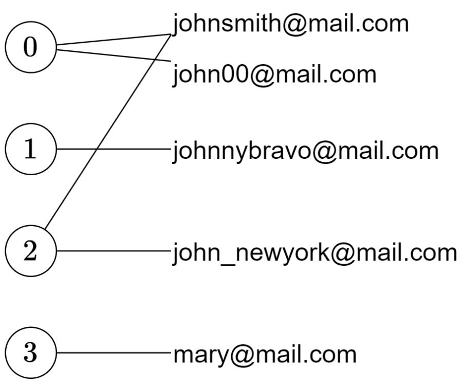
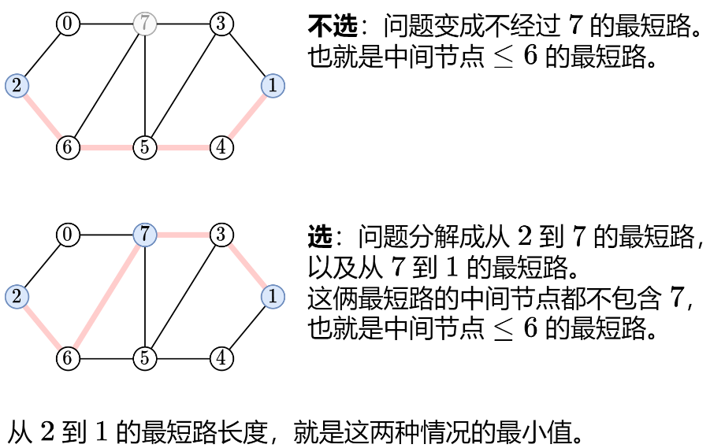
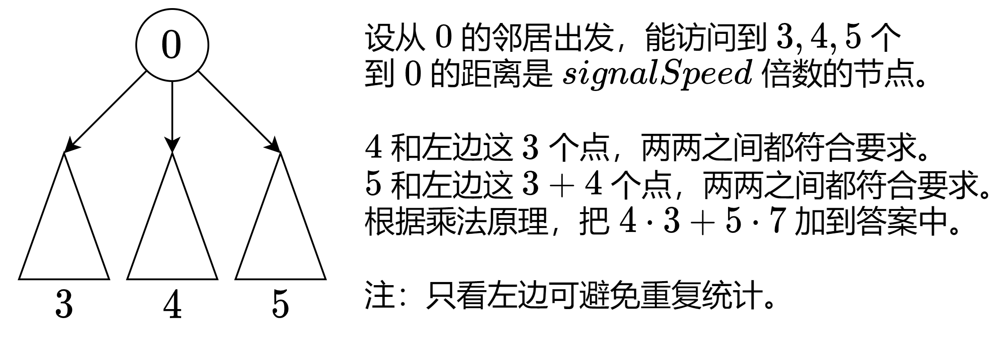

## 基本知识

一般情况，深搜需要二维数组数组结构保存所有路径，需要一维数组保存单一路径，这种保存结果的数组，我们可以定义一个全局变量，避免让我们的函数参数过多

图的构造：

- 邻接矩阵：邻接矩阵是从节点的角度来表示图，有多少节点就申请多大的二维数组

  缺点：遇到稀疏图，会导致申请过大的二维数组造成空间浪费且遍历边的时候需要遍历整个n * n矩阵，造成时间浪费

- 邻接表：邻接表 使用数组 + 链表的方式来表示。 邻接表是从边的数量来表示图，有多少边才会申请对应大小的链表

  ```cpp
   unordered_map<int, vector<int>> adjList; // 邻接表表示图
  ```

**DFS模板**

```cpp
void dfs(参数) {
    if (终止条件) {
        存放结果;
        return;
    }

    for (选择：本节点所连接的其他节点) {
        处理节点;
        dfs(图，选择的节点); // 递归
        回溯，撤销处理结果
    }
}
```

**BFS模板**

```cpp
int orangesRotting(vector<vector<int>>& grid) {
    int row = grid.size();
    int col = grid[0].size();
    int time = 0;
    vector<pair<int, int>> directions = {{1, 0}, {-1, 0}, {0, 1}, {0, -1}};
    queue<tuple<int,int>>que;
    for(int i = 0;i<row;++i){
        for(int j = 0;j<col;++j){
            if(grid[i][j]==2){
                que.push({i,j});
            }
        }
    }
    while(!que.empty()){
        int size = que.size();
        bool changed = false;
        for(int k = 0;k<size;++k){
            auto [i,j] = que.front();
            que.pop();
            for(auto [di,dj]:directions){
                if(i+di>=0&&i+di<row&&j+dj>=0&&j+dj<col&&grid[i+di][j+dj]==1){
                    grid[i+di][j+dj] = 2;
                    que.push({i+di,j+dj});
                    changed = true;
                }
            }
        }
        if(changed)time++;
    }
    for(const auto& r:grid){
        if(find(r.begin(),r.end(),1)!=r.end()){
            return -1;
        }
    }
    return time;
}
```

## 题单

**剑指offer得刷**

### DFS

[133. 克隆图 - 力扣（LeetCode）](https://leetcode.cn/problems/clone-graph/) ：哈希表+递归

[200. 岛屿数量 - 力扣（LeetCode）](https://leetcode.cn/problems/number-of-islands/)

[721. 账户合并](https://leetcode.cn/problems/accounts-merge/) ：连通块+DFS

### BFS

[207. 课程表 - 力扣（LeetCode）](https://leetcode.cn/problems/course-schedule/)

[210. 课程表 II - 力扣（LeetCode）](https://leetcode.cn/problems/course-schedule-ii/description/)

[310. 最小高度树](https://leetcode.cn/problems/minimum-height-trees/)

### 并查集

[547. 省份数量](https://leetcode.cn/problems/number-of-provinces/)

### Floyd 算法

[1334. 阈值距离内邻居最少的城市](https://leetcode.cn/problems/find-the-city-with-the-smallest-number-of-neighbors-at-a-threshold-distance/) ：递归 + 记录返回值 = 记忆化搜索

### Dijkstra算法

[743. 网络延迟时间](https://leetcode.cn/problems/network-delay-time/)

### 网格图

防止访问重复的：改变数值或者visist数组

怎么进行上下左右的访问：一个是dis数组，一个是dfs(i+1,j)这种

[695. 岛屿的最大面积](https://leetcode.cn/problems/max-area-of-island/)

[面试题 16.19. 水域大小](https://leetcode.cn/problems/pond-sizes-lcci/)

[994. 腐烂的橘子](https://leetcode.cn/problems/rotting-oranges/)

## DFS

[133. 克隆图 - 力扣（LeetCode）](https://leetcode.cn/problems/clone-graph/)

使用DFS进行递归调用，这其中关键点就在于用map来记录老节点和新节点之间的关系，第一次dfs的时候就会一条路走到底

可以画个正方形理解一下

```cpp
class Solution {
private:
    unordered_map<Node*,Node*>vis;
public:
    Node* cloneGraph(Node* node) {
        if(node==nullptr)return node;
        if(vis.find(node)!=vis.end()){
            return vis[node];
        }
        Node* root = new Node(node->val);
        vis[node] = root;
        for(int i = 0;i<node->neighbors.size();i++){
            root->neighbors.emplace_back(cloneGraph(node->neighbors[i]));
        }
        return root;
    }
};
```

[200. 岛屿数量 - 力扣（LeetCode）](https://leetcode.cn/problems/number-of-islands/)

修改访问过的数据或者用一个二维数组来记录访问过的数据

[721. 账户合并](https://leetcode.cn/problems/accounts-merge/)



思路：通过每个邮箱对应的账户列表，即可把有关联的一次找完

步骤：1、构建邮箱和账户们的映射；2、在DFS中会记录已经访问过的账户，同时收集该账户对应的邮箱地址

如果用上面的图举例，那么就是先访问0，然后遍历johnsmith@mail.com，接着访问2，然后就一直回退到0的john00@mail.com，结束循环

```cpp
class Solution {
private:
    //key 为邮箱地址，value 为这个邮箱对应的账户下标列表。
    unordered_map<string,vector<int>>email_to_idx;
    // 用于收集 DFS 中访问到的邮箱地址
    unordered_set<string>email_set;
    // 标记访问过的账户下标
    vector<int>vis;
    void dfs(int i,vector<vector<string>>& accounts){
        vis[i] = true;
        for(int k = 1;k<accounts[i].size();k++){
            string email = accounts[i][k];
            if(email_set.count(email)){
                continue;
            }
            email_set.insert(email);
            for(int j:email_to_idx[email]){
                if(!vis[j]){
                    dfs(j,accounts);
                }
            }
        }
    }

public:
    vector<vector<string>> accountsMerge(vector<vector<string>>& accounts) {
        // 构建 email_to_idx 映射
        for(int i = 0;i<accounts.size();i++){
            for(int j = 1;j<accounts[i].size();j++){
                email_to_idx[accounts[i][j]].push_back(i);
            }
        }

        vector<vector<string>>result;
        // 新增的元素将被初始化为 0
        vis.resize(accounts.size());

        // 遍历所有账户
        for(int i = 0;i<vis.size();i++){
            if(vis[i]){
                continue;
            }
            email_set.clear();
            dfs(i,accounts);
            vector<string>res = {accounts[i][0]};
            res.insert(res.end(),email_set.begin(),email_set.end());
            sort(res.begin()+1,res.end());
            result.push_back(res);

        }
        return result;
    }
};
```

## BFS

[207. 课程表 - 力扣（LeetCode）](https://leetcode.cn/problems/course-schedule/)

拓扑排序的板子题

```cpp
vector<int> indegree(numCourses, 0);//入度
vector<vector<int>> adjacencyList(numCourses);//记录后续课程
queue<int> courseQueue;//入度为0压入队列
```

[210. 课程表 II - 力扣（LeetCode）](https://leetcode.cn/problems/course-schedule-ii/description/)

和上一题一样，就是用一个动态数组去保存节点而已

[310. 最小高度树](https://leetcode.cn/problems/minimum-height-trees/)

**<font color='blue'>思路：</font>**树原来是无向图

我的错误思路:我以为要遍历每一个节点然后返回它的BFS最短路径，这样时间复杂度太高了

正确思路：拓扑排序不停的去删掉外围的节点，然后最后只剩下一个或两个节点就是答案，因为如果有三个节点，那么就有一个节点的入度是2，树的高度又要更上一层楼

```cpp
vector<int>ans;
while(!que.empty()){
    ans.clear();
    for(int i = que.size();i>0;--i){
        int a = que.front();
        que.pop();
        ans.push_back(a);
        for(int b : g[a]){
            if(--degree[b]==1){
                que.push(b);
            }
        }
    }
}
```

## 并查集

[547. 省份数量](https://leetcode.cn/problems/number-of-provinces/)

并查集模板

```cpp
class Solution {
public:
    vector<int> father;

    int find(int u) {
        return u == father[u] ? u : find(father[u]);
    }

    void join(int u, int v) {
        u = find(u);
        v = find(v);
        if (u == v) return;
        father[v] = u;
    }

    int findCircleNum(vector<vector<int>>& isConnected) {
        int n = isConnected.size();
        father = vector<int>(n);

        // 初始化 father 数组
        for (int i = 0; i < n; i++) {
            father[i] = i;
        }

        // 遍历 isConnected，进行合并操作
        for (int i = 0; i < n; i++) {
            for (int j = i + 1; j < n; j++) {
                if (isConnected[i][j] == 1) {
                    join(i, j);
                }
            }
        }

        // 计算圈子数量
        int result = 0;
        for (int i = 0; i < n; i++) {
            if (father[i] == i) {
                result++;
            }
        }

        return result;
    }
};
```

## 网格图

[695. 岛屿的最大面积](https://leetcode.cn/problems/max-area-of-island/)

经典板子题

```cpp
ans += dfs(grid,i-1,j);
ans += dfs(grid,i+1,j);
ans += dfs(grid,i,j+1);
ans += dfs(grid,i,j-1);
```

[面试题 16.19. 水域大小](https://leetcode.cn/problems/pond-sizes-lcci/)

```cpp
class Solution {
private:
    vector<vector<bool>>visited;
    int dfs(vector<vector<int>>& land,int i,int j){
        if(i<0||i>=land.size()||j<0||j>=land[0].size()||land[i][j]!=0||visited[i][j])return 0;
        int ans = 1;
        visited[i][j] = true;
        ans += dfs(land,i,j+1);
        ans += dfs(land,i,j-1);
        ans += dfs(land,i+1,j);
        ans += dfs(land,i-1,j);
        ans += dfs(land,i+1,j+1);
        ans += dfs(land,i-1,j-1);
        ans += dfs(land,i-1,j+1);
        ans += dfs(land,i+1,j-1);
        return ans;
    }
public:
    vector<int> pondSizes(vector<vector<int>>& land) {
        int m = land.size();
        int n = land[0].size();
        visited = vector<vector<bool>>(m,vector<bool>(n,false));
        vector<int>result;
        for(int i = 0;i<m;i++){
            for(int j = 0;j<n;j++){
                if(land[i][j]==0){
                    int temp = dfs(land,i,j);
                    if(temp>0)result.push_back(temp);
                }
            }
        }
        sort(result.begin(),result.end());
        return result;
    }
};
```

[994. 腐烂的橘子](https://leetcode.cn/problems/rotting-oranges/)

没有bug一口气写出来还是有点难度的

```cpp
class Solution {
public:
    int orangesRotting(vector<vector<int>>& grid) {
        int row = grid.size();
        int col = grid[0].size();
        int time = 0;
        vector<pair<int, int>> directions = {{1, 0}, {-1, 0}, {0, 1}, {0, -1}};
        queue<tuple<int,int>>que;
        for(int i = 0;i<row;++i){
            for(int j = 0;j<col;++j){
                if(grid[i][j]==2){
                    que.push({i,j});
                }
            }
        }
        while(!que.empty()){
            int size = que.size();
            bool changed = false;
            for(int k = 0;k<size;++k){
                auto [i,j] = que.front();
                que.pop();
                for(auto [di,dj]:directions){
                    if(i+di>=0&&i+di<row&&j+dj>=0&&j+dj<col&&grid[i+di][j+dj]==1){
                        grid[i+di][j+dj] = 2;
                        que.push({i+di,j+dj});
                        changed = true;
                    }
                }
            }
            if(changed)time++;
        }
        for(const auto& r:grid){
            if(find(r.begin(),r.end(),1)!=r.end()){
                return -1;
            }
        }
        return time;
    }
};
```

## Floyd 算法

[1334. 阈值距离内邻居最少的城市](https://leetcode.cn/problems/find-the-city-with-the-smallest-number-of-neighbors-at-a-threshold-distance/) 



定义 dfs(k,i,j) 表示从 i 到 j 的最短路长度，并且这条最短路的中间节点编号都 ≤k。注意中间节点不包含 i 和 j。

```cpp
class Solution {
public:
    int findTheCity(int n, vector<vector<int>>& edges, int distanceThreshold) {
        //递归更新的时候肯定会把对应的无穷大值舍去
        //二位矩阵的值保存i，j之间的距离
        vector<vector<int>>w(n,vector<int>(n,INT_MAX/2));
        for(auto &e:edges){
            int x = e[0],y = e[1],wt = e[2];
            w[x][y] = w[y][x] = wt;
        }
        //记忆化搜索，在本题可初始化为0
        vector<vector<vector<int>>>memo(n,vector<vector<int>>(n,vector<int>(n)));
        function<int(int,int,int)>dfs = [&](int k,int i,int j)->int{
            //k<0意味着，节点之间的值都小于0，说明i，j之间没有节点，k=0说明还有一个0号节点夹在二者中间
            if(k<0){
                return w[i][j];
            }
            //这里的引用只是为了节省代码
            auto& res = memo[k][i][j];
            //记忆化搜索防止重复计算
            if(res){
                return res;
            }
            //返回不选k和选k的最小值
            return res = min(dfs(k-1,i,j),dfs(k-1,i,k)+dfs(k-1,k,j));
        };

        int ans = 0;//保存答案
        int min_cnt = n;//初始化为最大节点
        for(int i = 0;i<n;i++){
            int cnt = 0;
            for(int j = 0;j<n;j++){
                //任何一个节点到其余的节点开始遍历
                if(j!=i&&dfs(n-1,i,j)<=distanceThreshold){
                    cnt++;
                }
            }
            //更新答案
            if(cnt<=min_cnt){
                min_cnt = cnt;
                ans = i;
            }
        }
        //通过递归分解子问题+记忆化搜索大大缩减了复杂度
        return ans;
    }
};
```

## Dijkstra算法

[743. 网络延迟时间](https://leetcode.cn/problems/network-delay-time/)

```cpp
class Solution {
public:
    int networkDelayTime(vector<vector<int>>& times, int n, int k) {
        // 创建一个图，g[i]存储节点i的所有邻居及其对应的权重
        vector<vector<pair<int,int>>> g(n);
        
        // 填充图的数据结构，将输入的times转换为邻接表形式
        for(auto& t : times){
            // t[0]-1表示起点，t[1]-1表示终点，t[2]表示边的权重
            g[t[0] - 1].emplace_back(t[1] - 1, t[2]);
        }
        
        // 初始化距离数组dis，初始值为无穷大（INT_MAX）
        vector<int> dis(n, INT_MAX);
        // 起点k-1到自身的距离为0
        dis[k - 1] = 0;
        
        // 优先队列pq，用于Dijkstra算法，按距离从小到大排序
        priority_queue<pair<int,int>,vector<pair<int,int>>,greater<>> pq;
        // 将起点加入优先队列
        pq.emplace(0, k - 1);
        
        // 开始Dijkstra算法
        while(!pq.empty()){
            // 取出当前距离最小的节点dx和该节点编号x
            auto [dx, x] = pq.top();
            pq.pop();
            
            // 如果当前节点的距离已经大于记录的最短距离，则跳过
            //起点的dx = 0，dis【x】 = 0；
            if(dx > dis[x]){
                continue;
            }
            
            // 遍历当前节点的所有邻居
            for(auto& [y, d] : g[x]){
                // 计算新路径的距离
                int new_dis = dx + d;
                // 如果新路径比已知的最短路径更短，则更新并将新的状态加入优先队列
                if(new_dis < dis[y]){
                    dis[y] = new_dis;
                    pq.emplace(new_dis, y);
                }
            }
        }
        
        // 找到所有节点中最大的距离
        int mx = ranges::max(dis);
        // 如果最大距离仍然是无穷大，说明有节点不可达，返回-1；否则返回最大距离
        return mx < INT_MAX ? mx : -1;
    }
};
```


## 真题

## 基础

无向图，有向图，带权图，连通图

## **<font color='red'>DFS:</font>**

**<font color='red'>所有可能的路径</font>**：给你一个有 `n` 个节点的 **有向无环图（DAG）**，请你找出所有从节点 `0` 到节点 `n-1` 的路径并输出（**不要求按特定顺序**）

**<font color='blue'>ps：</font>**居然没写出来，最基本的深搜模型，==第二次写出来了==

**<font color='red'>在带权树网络中统计可连接服务器对数目</font>**

==枚举DFS和乘法原理==

因为图中没有根节点，所以枚举每一个节点作为根结点



```go
func countPairsOfConnectableServers(edges [][]int, signalSpeed int) []int {
    // 计算节点数目，节点数比边数多1
    n := len(edges) + 1
    
    // 定义边的结构体，包含目标节点和权重
    type edge struct {
        to, wt int
    }
    
    // 初始化图的邻接表表示法
    g := make([][]edge, n)
    
    // 填充图的邻接表
    for _, e := range edges {
        x, y, wt := e[0], e[1], e[2]
        g[x] = append(g[x], edge{y, wt})
        g[y] = append(g[y], edge{x, wt})
    }

    // 初始化答案数组
    ans := make([]int, n)
    
    // 遍历每个节点，计算从该节点出发的可连接服务器对数
    for i, gi := range g {
        var cnt int
        
        // 定义深度优先搜索（DFS）函数
        var dfs func(int, int, int)
        dfs = func(x, fa, sum int) {
            // 如果路径总和能被信号速度整除，计数器加一
            if sum % signalSpeed == 0 {
                cnt++
            }
            // 遍历当前节点的邻居节点
            for _, e := range g[x] {
                if e.to != fa {
                    dfs(e.to, x, sum + e.wt)
                }
            }
            return
        }
        
        // 初始化sum
        sum := 0
        
        // 遍历当前节点的每条边，进行DFS搜索
        for _, e := range gi {
            cnt = 0
            dfs(e.to, i, e.wt)//i等于当前节点
            ans[i] += cnt * sum
            sum += cnt
        }
    }
    
    // 返回答案数组
    return ans
}

```

## **<font color='red'>BFS</font>**

**<font color='red'>单词接龙：</font>**给你两个单词 `beginWord` 和 `endWord` 和一个字典 `wordList` ，返回 *从 `beginWord` 到 `endWord` 的 **最短转换序列** 中的 **单词数目*** 。如果不存在这样的转换序列，返回 `0` 

**<font color='blue'>思路：</font>**我自己的思路是改变`beginWord`的的每个字符(+1,-1)然后去看看字典中有没有存在这个，但是没写出来，因为加一减一不好操作，而且万一是加二减二呢

**<font color='blue'>别人的思路：</font>**

这个就是典型的==BFS==，用队列来保存广度，这样没走一步都是多个方向同时走，找到目标的时候就保证最短

==第一：==set的快速查找和erase

==第二：==不止一次看见别人用队列BFS

==第三：==for(int i = 0;i<26;i++)去改变每个字符

```cpp
int ladderLength(string beginWord, string endWord, vector<string>& wordList) {
    unordered_set<string>words(wordList.begin(),wordList.end());
    if(words.find(endWord)==words.end())return 0;
    queue<string>que;
    que.push(beginWord);
    int result = 1;
    while(!que.empty()){
        int size = que.size();
        while(size--){
            string curWord = que.front();que.pop();
            for(int i = 0;i<curWord.size();i++){
                char oriWord = curWord[i];
                for(int j = 0;j<26;j++){
                    curWord[i] = char('a'+j);
                    if(words.find(curWord)!=words.end()){
                        if(curWord==endWord)return result+1;
                        else{
                            words.erase(curWord);
                            que.push(curWord);
                        }
                    }
                }
                curWord[i] = oriWord;
            }
        }
        result++;
    }
    return 0;
}
```

## 岛屿问题

**<font color='red'>岛屿周长：</font>**

写了半天没写出来，感觉比上面那道题还要难

- 第一：越界边+海洋边（0）返回一
- 第二：访问过（2）的不加
- 第三：岛屿（1），开始递归4个方向
- 关键点在于dfs不再返回void，而是返回int

**<font color='red'>岛屿的最大面积：</font>**

我自己写的，舒服了

- 第一：返回值是int，还是四个方向走
- 第二：只有为1返回值才加一
- 第三：啥都不说，看代码吧

```cpp
int dfs(vector<vector<int>>&grid,int i ,int j){
    if(i<0||j<0||i>=grid.size()||j>=grid[0].size())return 0;
    if(grid[i][j]!=1)return 0;
    grid[i][j] = 2;
    return dfs(grid,i+1,j)
        +dfs(grid,i-1,j)
        +dfs(grid,i,j-1)
        +dfs(grid,i,j+1)+1;
}
```

**<font color='red'>最大人工岛：</font>**

有点难，不会奥，我的思路：还是想着用bool去找那个0变成1的格子，第二就是想着走过的路我给他还原回去了

- 第一：从2开始统计岛屿label和面积用map保存起来

- 第二：去遍历每一个为0的点，因为地图上没有1了

- 第三：只用for循环怎么写出四个方向的偏移

  ```cpp
  vector<vector<int>> D = {{1, 0}, {-1, 0}, {0, 1}, {0, -1}};
  ```


**<font color='red'>飞地的数量</font>**：找出四座全是海的陆地数量

**<font color='blue'>思路：</font>**总是想着用一个==bool值==去控制陆地，如果找到了边界，就把这一堆陆地全消掉，求求你正常点

实际上你把所有从边界出发的1都置为0，==然后再去计算整个矩阵的陆地数量，这时候全是飞地==，注意这用的是一个==dfs==

```cpp
void dfs(vector<vector<int>>&grid,int i,int j){
    if(i<0||j<0||i>=grid.size()||j>=grid[0].size()||grid[i][j]==0)return;
    grid[i][j]=0;
    result++;
    dfs(grid,i+1,j);
    dfs(grid,i-1,j);
    dfs(grid,i,j+1);
    dfs(grid,i,j-1);
}
```

**<font color='red'>被围绕的区域</font>**：把所有不靠边界的陆地填平

**<font color='blue'>思路：</font>**和上一题一样，但是我没有写下去，因为我觉得时间复杂度太高，并且==不会用一个dfs完成目标==

第一关键点：加了一个条件’y'，不然就会无限递归

```cpp
if(i<0||j<0||i>=board.size()||j>=board[0].size()||board[i][j]=='X'||board[i][j]=='y'){return;}
```

第二关键点：人家根本没想走两次dfs，==只需要一次dfs把元素置为‘y’==,第二次就遍历所有的元素，然后换成该换的值

```cpp
for (int i = 0; i < n; i++) {
    for (int j = 0; j < m; j++) {
        if (board[i][j] == 'O') board[i][j] = 'X';
        if (board[i][j] == 'y') board[i][j] = 'O';
    }
}
```

**<font color='red'>太平洋大西洋水流问题：</font>**妈的，题都读不懂，直接开始看解析，翻译过来就是给你一个二维矩阵，找到一个点能递减的到边界

**<font color='blue'>思路：</font>**暴力解法超时，遍历每个点，每个点都去dfs

==优化解法：==从太平洋边上的节点逆流而上，将遍历过的节点都标记上；从大西洋的边上节点逆流而长，将遍历过的节点也标记上

第一点：三个二维矩阵，两个记录路径，一个记录答案

第二点：这四个遍历的边就是矩阵的边，也就是等于从左边走还是右边走

```cpp
for(int i = 0;i<n;i++){
    dfs(heights,left,i,0);
    dfs(heights,right,i,m-1);
}
for(int i = 0;i<m;i++){
    dfs(heights,left,0,i);
    dfs(heights,right,n-1,i);
}
```

第三点：

==visited[i] [j] = 1;==免得出现死循环，一直在转圈，但是具体的我还是不太理解

```cpp
void dfs(vector<vector<int>>&heights,vector<vector<int>>&visited,int i,int j){
    if(visited[i][j])return;
    visited[i][j] = 1;
    if(left[i][j]&&right[i][j])result.push_back({i,j});
    //上下左右深搜
    if(i-1 >= 0 && heights[i-1][j] >= heights[i][j]) dfs(heights, visited, i-1, j);
    if(i+1 < heights.size() && heights[i+1][j] >= heights[i][j]) dfs(heights, visited, i+1, j); 
    if(j-1 >= 0 && heights[i][j-1] >= heights[i][j]) dfs(heights, visited, i, j-1);
    if(j+1 < heights[0].size() && heights[i][j+1] >= heights[i][j]) dfs(heights, visited, i, j+1); 
}
```

**<font color='red'>钥匙和房间</font>**：就是一个有向图，给你一个二维矩阵，矩阵中的值代表你能去的地方，求解你能不能把所有的地方都走到

**<font color='blue'>思路：</font>**==习惯又不看题==，如果进入了某个房间就不要再进了，不然就会变成==死循环==

```cpp
void dfs(vector<vector<int>>&rooms,int start,vector<bool>& vistied){
    vistied[start] = true;
    for(int i = 0;i<rooms[start].size();i++){
        if(!vistied[rooms[start][i]]) dfs(rooms,rooms[start][i],vistied);
    }
}
```

**<font color='red'>甲板上的战舰</font>**

思路：战舰的个数，等于战舰「头部」的个数。如下图，我们只需要统计蓝色 X 的个数，即为战舰的个数。


具体来说，如果位于(i,j) 的格子是战舰的头部，那么左边和上边的相邻格子不能是 X，即：

如果 j>0，那么 (i,j−1) 不能是 X。

如果 i>0，那么 (i−1,j) 不能是 X。

```cpp
class Solution {
public:
    int countBattleships(vector<vector<char>>& board) {
        int result = 0;
        int m = board.size();int n = board[0].size();
        for(int i = 0;i<m;i++){
            for(int j = 0;j<n;j++){
                if(board[i][j]=='X'&&(j==0||board[i][j-1]!='X')&&(i==0||board[i-1][j]!='X')){
                    result++;
                }
            }
        }
        return result;
    }
};
```

## 并查集

并查集：当我们需要判断两个元素是否在同一个集合里的时候，我们就要想到用并查集

==并查集主要有两个功能：==

- 将两个元素添加到一个集合中。
- 判断两个元素在不在同一个集合

**<font color='blue'>三要素：</font>**

==逻辑结构：==元素之间为集合的关系

==基本操作：==

初始化：所有数组元素都置为-1

Find(S[],x)"：查到x的集合

==存储结构：==顺序存储，每个集合组织成一棵树，采用双亲表示法

**<font color='blue'>优化：</font>**

用根节点的绝对值表示一棵树的结点总树

合并树的时候小树并入大树

**<font color='blue'>模板：</font>**

==寻找根节点==，函数：find(int u)，也就是判断这个节点的祖先节点是哪个

==将两个节点接入到同一个集合==，函数：join(int u, int v)，将两个节点连在同一个根节点上

==判断两个节点是否在同一个集合==，函数：isSame(int u, int v)，就是判断两个节点是不是同一个根节点

```cpp
int n = 1005; // n根据题目中节点数量而定，一般比节点数量大一点就好
vector<int> father = vector<int> (n, 0); // C++里的一种数组结构

// 并查集初始化
void init() {
    for (int i = 0; i < n; ++i) {
        father[i] = i;
    }
}
// 并查集里寻根的过程
int find(int u) {
    return u == father[u] ? u : father[u] = find(father[u]); // 路径压缩
}

// 判断 u 和 v是否找到同一个根
bool isSame(int u, int v) {
    u = find(u);
    v = find(v);
    return u == v;
}

// 将v->u 这条边加入并查集
void join(int u, int v) {
    u = find(u); // 寻找u的根
    v = find(v); // 寻找v的根
    if (u == v) return ; // 如果发现根相同，则说明在一个集合，不用两个节点相连直接返回
    father[v] = u;
}
```

**<font color='red'>寻找图中是否存在路径</font>**：给你一个双向图，让你找有没有0能到n-1的路径

**<font color='blue'>思路：</font>**把所有的路径都加入并查集模板，然后直接判断根节点就可以

```cpp
bool validPath(int n, vector<vector<int>>& edges, int source, int destination) {
    init();
    for (int i = 0; i < edges.size(); i++) {
        join(edges[i][0], edges[i][1]);
    }
    return isSame(source, destination);
}
```

**<font color='red'>冗余连接</font>**：题目说是无向图，返回一条可以删去的边，使得结果图是一个有着N个节点的树（即：只有一个根节点）如果有多个答案，则返回二维数组中最后出现的边。那么我们就可以从前向后遍历每一条边（因为优先让前面的边连上），边的两个节点如果不在同一个集合，就加入集合（即：同一个根节点）

==（如果题目中说：如果有多个答案，则返回二维数组中最前出现的边。 那我们就要 从后向前遍历每一条边了）==

**<font color='blue'>思路：</font>**还是没写出来，不过更熟悉了

```cpp
for(int i = 0;i<edges.size();i++){
    if(isSame(edges[i][0],edges[i][1]))return edges[i];
    else join(edges[i][0],edges[i][1]);
}
```

**<font color='red'>冗余连接Ⅱ</font>**：

**<font color='red'>省份数量：</font>**标准的并查集查找，很简单

**<font color='red'>判断二分图：</font>**不会写，不明白并查集怎么做的，**<font color='blue'>待看</font>**

```cpp
class Solution {
public:
    vector<int> father; // 记录节点的父节点，用于并查集
    // 并查集的find操作，寻找节点所在集合的根节点
    int find(int u) {
        return u == father[u] ? u : find(father[u]);
    }
    // 并查集的union操作，将两个节点所在的集合合并
    void join(int u, int v) {
        u = find(u);
        v = find(v);
        if (u == v) return; // 如果两个节点已经在同一个集合中，直接返回
        father[v] = u; // 将v所在集合的根节点设为u
    }
    // 检查两个节点是否在同一个集合中
    bool isSame(int u, int v) {
        return find(u) == find(v);
    }
    // 检查无向图是否为二分图
    bool isBipartite(vector<vector<int>>& graph) {
        father = vector<int>(graph.size());
        // 初始化每个节点的父节点为其自身
        for (int i = 0; i < graph.size(); ++i) father[i] = i;
        // 遍历图中的每个节点
        for (int i = 0; i < graph.size(); i++) {
            // 遍历当前节点的邻居节点
            for (int j = 0; j < graph[i].size(); ++j) {
                // 如果当前节点与其邻居节点在同一个集合中，说明无法构成二分图，返回false
                if (isSame(graph[i][j], i)) return false;
                // 将当前节点与邻居节点所在集合合并
                join(graph[i][j], graph[i][0]);
            }
        }
        // 如果能够遍历完所有节点并且满足二分图的条件，则返回true
        return true;
    }
};

#include <vector>

using namespace std;

class Solution {
public:
    bool dfs(const vector<vector<int>>& graph, vector<int>& cols, int i, int col) {
        // 给当前节点涂上颜色
        cols[i] = col;
        // 遍历当前节点的所有相邻节点
        for (auto j : graph[i]) {
            // 如果相邻节点的颜色与当前节点相同，则说明不是二分图，返回 false
            if (cols[j] == cols[i]) return false;
            // 如果相邻节点还未染色，则进行递归调用
            if (cols[j] == 0 && !dfs(graph, cols, j, -col)) return false;
        }
        return true;
    }
    bool isBipartite(vector<vector<int>>& graph) {
        int N = graph.size();
        vector<int> cols(N, 0); // 初始化节点颜色，0 表示未染色
        // 对图中的每个节点调用 dfs 函数进行深度优先搜索，判断是否存在相邻节点颜色相同的情况
        for (int i = 0; i < N; ++i) {
            // 如果当前节点未染色，则进行深度优先搜索
            if (cols[i] == 0 && !dfs(graph, cols, i, 1)) {
                return false; // 发现相邻节点颜色相同，不是二分图，返回 false
            }
        }
        return true; // 所有节点遍历完成，没有发现相邻节点颜色相同，是二分图，返回 true
    }
};
```


## 拓扑排序

**<font color='red'>最小高度树：</font>**

**<font color='blue'>思路：</font>**树原来是无向图

第一：当结点只有一个或两个，答案即为本身

第二：结点超过两个，叶子结点肯定不是最多的结点，==删掉所有的外层结点，知道只剩一个或两个==

```cpp
vector<int> findMinHeightTrees(int n, vector<vector<int>>& edges) {
    // 拓扑排序
    if(n==1)return {0};// 只有一个节点
    vector<int> ans;
    vector<vector<int>> g(n);//邻接图
    vector<int> d(n);// 每个节点 的度数
    for(auto e:edges){
        g[e[0]].emplace_back(e[1]);
        g[e[1]].emplace_back(e[0]);
        d[e[0]]++;d[e[1]]++;
    }queue<int> q;//拓扑排序的队列
    for(int i=0;i<n;i++){// 先将所有度为1 的进队
        if(d[i]==1)q.push(i);
    }
    int num=n;
    while(num>2){// 开始拓扑排序
        num-=q.size();//num-最外层 度为1的个数
        for(int i=q.size();i>0;i--){//当前最外层
            int x=q.front();q.pop();
            for(int y:g[x]){
                if(--d[y]==1)
                    q.push(y);// 度为1 则入队
            }
        }
    }while(!q.empty()){//队列中剩余即为答案
        ans.emplace_back(q.front());
        q.pop();
    }return ans;
}
#include <iostream>
#include <vector>
#include <unordered_map>
#include <deque>

using namespace std;

int main() {
    int N;
    cin >> N; // 输入节点个数

    // 存储每个节点的入度和邻接节点
    vector<int> indegree(N + 1, 0); // 入度数组
    unordered_map<int, vector<int>> nxs; // 邻接表

    // 输入每个节点的邻接节点，并更新入度数组
    for (int i = 1; i <= N; ++i) {
        int num;
        cin >> num; // 当前节点的邻接节点个数
        if (num == 0) continue;
        nxs[i] = vector<int>(num);
        for (int j = 0; j < num; ++j) {
            cin >> nxs[i][j]; // 输入当前节点的邻接节点
            indegree[nxs[i][j]]++; // 更新邻接节点的入度
        }
    }

    // 初始化拓扑排序所需的队列
    deque<int> q;
    for (int i = 1; i <= N; ++i) {
        if (indegree[i] == 0) {
            q.push_back(i); // 将入度为0的节点加入队列
        }
    }

    // 计算拓扑排序的长度
    int cnt1 = 0, cnt2 = 0; // cnt1用于记录拓扑排序的长度，cnt2用于记录处理过的节点数
    while (!q.empty()) {
        int size = q.size();
        cnt1++; // 拓扑排序长度加1
        for (int i = 0; i < size; ++i) {
            int node = q.front();
            q.pop_front();
            cnt2++; // 处理过的节点数加1
            for (int nx : nxs[node]) {
                indegree[nx]--; // 更新邻接节点的入度
                if (indegree[nx] == 0) {
                    q.push_back(nx); // 入度为0的邻接节点加入队列
                }
            }
        }
    }

    // 判断是否完成了拓扑排序
    if (cnt2 == N) {
        cout << cnt1 << endl; // 输出拓扑排序的长度
    }
    else {
        cout << -1 << endl; // 输出-1表示无法完成拓扑排序
    }

    return 0;
}
```

第二题：==双向链表+哈希表模拟==

```cpp
#include <iostream>
#include <unordered_map>

using namespace std;

// 定义节点类
class Node {
public:
    int val; // 节点值
    Node* pre; // 前驱指针
    Node* next; // 后继指针

    // 构造函数
    Node(int value, Node* prev = nullptr, Node* nxt = nullptr) : val(value), pre(prev), next(nxt) {}
};

int main() {
    int s, e;
    cin >> s >> e; // 输入起始值和结束值

    // 创建节点字典和索引字典
    unordered_map<int, Node*> dic;
    unordered_map<int, int> mapIndex;

    // 创建虚拟头节点、尾节点和前驱节点
    Node* pre = new Node(-1);
    Node* tail = new Node(-1);
    Node* dummy = pre;
    int cnt = 0;

    // 初始化节点并构建链表
    for (int i = s; i <= e; ++i) {
        Node* cur = new Node(i);
        cnt++;
        dic[i] = cur;

        cur->pre = pre;
        pre->next = cur;
        pre = cur;
        if (i == e) tail->next = cur;
    }

    int n;
    cin >> n; // 输入操作次数

    // 执行操作
    for (int i = 0; i < n; ++i) {
        int a, b;
        cin >> a >> b; // 输入操作类型和值
        if (a == 1) {
            if (cnt <= b) continue;
            cnt -= b;
            Node* head = dummy->next;
            for (int j = 0; j < b; ++j) {
                dic.erase(head->val);
                dummy->next = head->next;
                delete head;
                head = dummy->next;
                head->pre = nullptr;
            }
        }
        else if (a == 2) {
            Node* node = dic[b];
            node->pre->next = node->next;
            dic.erase(b);
            delete node;
            cnt--;
        }
        else {
            tail->next->next = new Node(b);
            tail->next = tail->next->next;
            dic[b] = tail->next;
            cnt++;
        }
    }

    cout << dummy->next->val << endl; // 输出结果

    // 释放内存
    Node* cur = dummy->next;
    while (cur != nullptr) {
        Node* temp = cur;
        cur = cur->next;
        delete temp;
    }

    return 0;
}

```

