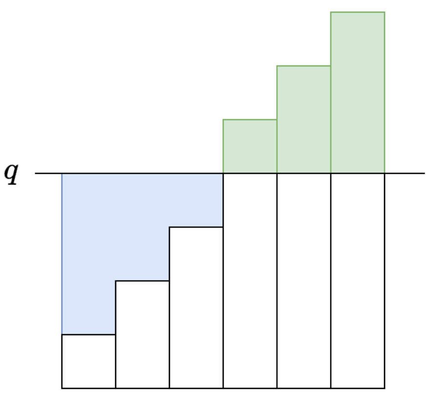

## 题单

灵神题单：[分享丨【题单】常用数据结构（前缀和/差分/栈/队列/堆/字典树/并查集/树状数组/线段树） - 力扣（LeetCode）](https://leetcode.cn/circle/discuss/mOr1u6/)

### 哈希表

常用技巧

- 对于双变量问题，可以枚举左边的，使用哈希表维护，然后变成单变量问题

[面试题 16.25. LRU 缓存](https://leetcode.cn/problems/lru-cache-lcci/) ：双向链表+哈希表

[460. LFU 缓存](https://leetcode.cn/problems/lfu-cache/)

[1512. 好数对的数目](https://leetcode.cn/problems/number-of-good-pairs/) ：哈希表

[2815. 数组中的最大数对和](https://leetcode.cn/problems/max-pair-sum-in-an-array/) ：桶

### 前缀和

[303. 区域和检索 - 数组不可变](https://leetcode.cn/problems/range-sum-query-immutable/) ：前缀和基础

[2602. 使数组元素全部相等的最少操作次数](https://leetcode.cn/problems/minimum-operations-to-make-all-array-elements-equal/) ：排序＋前缀和

 [560. 和为 K 的子数组](https://leetcode.cn/problems/subarray-sum-equals-k/) ：前缀和＋哈希表

 [304. 二维区域和检索 - 矩阵不可变](https://leetcode.cn/problems/range-sum-query-2d-immutable/) ：二维前缀和基础

[307. 区域和检索 - 数组可修改](https://leetcode.cn/problems/range-sum-query-mutable/) ：前缀和可修改

[53. 最大子数组和](https://leetcode.cn/problems/maximum-subarray/) ：

### 字符串

[28. 找出字符串中第一个匹配项的下标](https://leetcode.cn/problems/find-the-index-of-the-first-occurrence-in-a-string/) KMP

### 差分数组

## 哈希表

[面试题 16.25. LRU 缓存](https://leetcode.cn/problems/lru-cache-lcci/)

```cpp
class Node{
public:
    int key,value;
    Node* pre,*next;
    Node(int k ,int v):key(k),value(v){}
    Node():key(0),value(0){}
};
class LRUCache {
private:
    int capacity_;
    Node* dummy;
    unordered_map<int,Node*>key_to_node;
    void remove(Node* node){
        node->pre->next = node->next;
        node->next->pre = node->pre;
    }
    void push_front(Node* node){
        node->pre = dummy;
        node->next = dummy->next;
        dummy->next = node;
        node->next->pre = node;
    }
    Node* get_node(int key){
        auto it = key_to_node.find(key);
        if(it==key_to_node.end()){
            return nullptr;
        }
        auto node = it->second;
        remove(node);
        push_front(node);
        return node;
    }
public:
    LRUCache(int capacity):capacity_(capacity),dummy(new Node()) {
        dummy->pre = dummy;
        dummy->next = dummy;
    }
    
    int get(int key) {
        Node* node = get_node(key);
        return node?node->value:-1;
    }
    
    void put(int key, int value) {
        auto node = get_node(key);
        if(node){
            node->value = value;
            return;
        }
        node = new Node(key,value);
        key_to_node[key] = node;
        push_front(node);
        if(key_to_node.size()>capacity_){
            auto back_node = dummy->pre;
            key_to_node.erase(back_node->key);
            remove(back_node);
            delete back_node;
        }
    }
};

/**
 * Your LRUCache object will be instantiated and called as such:
 * LRUCache* obj = new LRUCache(capacity);
 * int param_1 = obj->get(key);
 * obj->put(key,value);
 */
```

[460. LFU 缓存](https://leetcode.cn/problems/lfu-cache/)

手写还是有点难度的

[1512. 好数对的数目](https://leetcode.cn/problems/number-of-good-pairs/)

哈希表使得On的平方变成On

[2815. 数组中的最大数对和](https://leetcode.cn/problems/max-pair-sum-in-an-array/)

两个数数位上最大的数字相等怎么判断？

1、max_val数组的元素下标就是0~9, 而max_val[i]就代表一个数中最大数位是i，并且是遍历的数组中最高数位为i的最大的数

2、max_d变量，这个变量用于获取当前遍历的这个数的最高数位，比如当前遍历的这个数是89,那么max_d就是9

```cpp
class Solution {
public:
    int maxSum(vector<int>& nums) {
        int ans = -1;
        vector<int>max_val(10,INT_MIN);
        for(int v:nums){
            int max_d = 0;
            for(int i = v;i>0;i/=10){
                max_d = max(max_d,i%10);
            }
            ans = max(ans,v+max_val[max_d]);
            max_val[max_d] = max(max_val[max_d],v);
        }
        return ans;
    }
};
```

## 前缀和

#### 前缀和

前缀和，我们可以把**连续子数组的元素和转换成两个前缀和的差**

[303. 区域和检索 - 数组不可变](https://leetcode.cn/problems/range-sum-query-immutable/)

prefix[0] = 0的好处：不需要特判left = 0的情况

```cpp
class NumArray {
    vector<int>prefix;
public:
    NumArray(vector<int>& nums) {
        prefix = vector<int>(nums.size()+1,0);
        for(int i = 0;i<nums.size();i++){
            prefix[i+1] = prefix[i]+nums[i];
        }
    }
    
    int sumRange(int left, int right) {
        return prefix[right+1]-prefix[left];
    }
};
```

#### 距离和

[2602. 使数组元素全部相等的最少操作次数](https://leetcode.cn/problems/minimum-operations-to-make-all-array-elements-equal/)

计算数组元素到某个数的**距离之和**



从这个图就能直观的看出前缀和代表着是矩阵的面积

```cpp
class Solution {
public:
    vector<long long> minOperations(vector<int>& nums, vector<int>& queries) {
        sort(nums.begin(),nums.end());
        int n = nums.size();
        vector<long long>prefix(n+1);
        for(int i = 0;i<n;i++){
            prefix[i+1] = prefix[i]+nums[i];
        }
        int m = queries.size();
        vector<long long>ans(m);
        for(int i = 0;i<m;i++){
            int q = queries[i];
            //有序范围内查找第一个大于等于给定值的元素的位置
            long long j = ranges::lower_bound(nums,q)-nums.begin();
            long long left = q*j-prefix[j]; //蓝色面积
            long long right = prefix[n]-prefix[j]-q*(n-j); //绿色面积
            ans[i] = left+right;
        }
        return ans;
    }
};
```

#### 前缀和和哈希表

 [560. 和为 K 的子数组](https://leetcode.cn/problems/subarray-sum-equals-k/) 

```cpp
class Solution {
public:
    int subarraySum(vector<int>& nums, int k) {
        unordered_map<long long,int>prefix{{0,1}};
        int ans = 0;
        long long sum = 0;
        for(auto a:nums){
            sum += a;
            if(prefix.find(sum-k)!=prefix.end()){
                ans += prefix[sum-k];
            }
            prefix[sum]++;
        }
        return ans;
    }
};
```

#### 二维前缀和

 [304. 二维区域和检索 - 矩阵不可变](https://leetcode.cn/problems/range-sum-query-2d-immutable/) 

```cpp
class NumMatrix {
private:
    vector<vector<int>>prefix;
public:
    NumMatrix(vector<vector<int>>& matrix) {
        int m = matrix.size();
        int n = matrix[0].size();
        prefix = vector<vector<int>>(m+1,vector<int>(n+1,0));
        for(int i = 0;i<m;i++){
            for(int j = 0;j<n;j++){
                //这代表了从左上角0，0到右下角i，j的前缀和
                prefix[i+1][j+1] = prefix[i+1][j]+prefix[i][j+1]-prefix[i][j]+ matrix[i][j];
            }
        }
    }
    
    int sumRegion(int row1, int col1, int row2, int col2) {
        //为什么row1，col1不加一，因为应该减去row1-1，col1-1的面积，所以这里其实是加了1的
        return prefix[row2+1][col2+1]-prefix[row2+1][col1]-prefix[row1][col2+1]+prefix[row1][col1];
    }
};
```

#### 前缀异或和


## 差分数组

对于数组a，我们定义其差分数组为：d[0] = a[0]         dp[i] = a[i]-a[i-1] (i>=1)

- 性质一：从左到右累加d中的元素科研还原回a
- 性质二：下面操作是等价的，把a的子数组a[i]...a[j]都加上x，把d[i]增加x，把d[j+1]减少x

利用性质 2，我们只需要 O(1) 的时间就可以完成对 *a* 的子数组的操作。最后利用性质 1 从差分数组复原出数组 a

[1094. 拼车](https://leetcode.cn/problems/car-pooling/)

```cpp
class Solution {
public:
    bool carPooling(vector<vector<int>> &trips, int capacity) {
        int d[1001]{};
        for (auto &t : trips) {
            int num = t[0], from = t[1], to = t[2];
            d[from] += num;
            d[to] -= num;//因为这个时候车上以及没人了
        }
        int s = 0;
        for (int v : d) {
            s += v;
            if (s > capacity) {
                return false;
            }
        }
        return true;
    }
};
```

## 栈

#### 基础

#### 进阶

#### 邻项消除

#### 合法括号字符串

#### 表达式解析

#### 单调栈