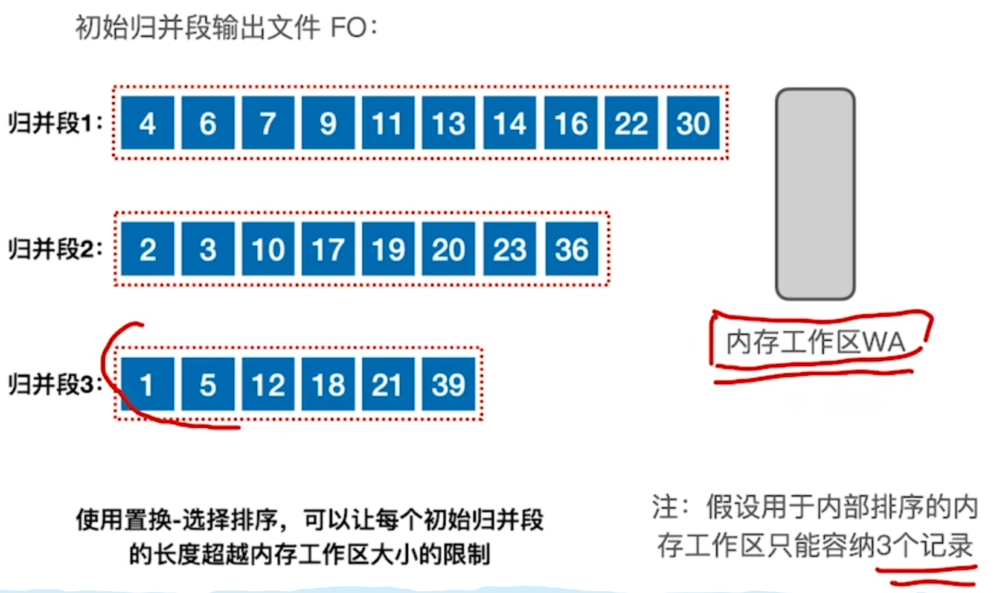
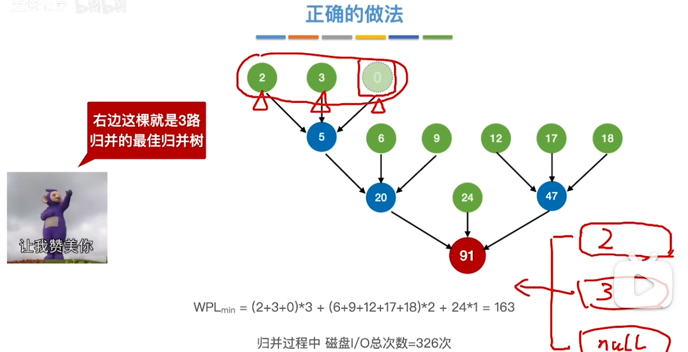

# 排序算法

排序评价指标：稳定性

分类：内部排序、外部排序

## 十大排序（内部排序）

### 插入排序

算法思想：每次将一个待排序的记录按其关键字大小插入到前面已经排好的子序列中，直到全部记录完成

- 直接插入排序
- 折半插入排序（二分查找插入）

空间复杂度O(1),时间复杂度O(n)/O(n^2)

```cpp
void insertionSort(vector<int>& arr) {
    int n = arr.size();
    for (int i = 1; i < n; ++i) {
        int key = arr[i];
        int j = i - 1;
        while (j >= 0 && arr[j] > key) {
            arr[j + 1] = arr[j];
            j = j - 1;
        }
        arr[j + 1] = key;
    }
}
```

### 希尔排序

插入排序的升级版；把一个表按照增量d分成多个子表，对子表进行插入排序，缩小增量d，重复上述过程。

```cpp
void shellSort(vector<int>& arr) {
    int n = arr.size();
    
    // 初始间隔设定为数组长度的一半，逐步减小间隔直至 1
    for (int gap = n / 2; gap > 0; gap /= 2) {
        // 对间隔为 gap 的元素进行插入排序
        for (int i = gap; i < n; ++i) {
            int temp = arr[i];
            int j;
            for (j = i; j >= gap && arr[j - gap] > temp; j -= gap) {
                arr[j] = arr[j - gap];
            }
            arr[j] = temp;
        }
    }
}
```

### 冒泡排序

不停的比较相邻两个元素，弹出最大的元素

```cpp
void bubbleSort(vector<int>& arr) {
    int n = arr.size();
    for (int i = 0; i < n - 1; ++i) {
        // 标记某轮是否发生了交换，如果没有发生交换，则说明数组已经有序，无需再继续排序
        bool swapped = false;
        for (int j = 0; j < n - i - 1; ++j) {
            if (arr[j] > arr[j + 1]) {
                // 如果相邻元素顺序错误，则交换它们
                swap(arr[j], arr[j + 1]);
                swapped = true;
            }
        }
        // 如果这一轮没有发生交换，则数组已经有序，结束排序
        if (!swapped) {
            break;
        }
    }
}
```


### 计数排序

计数排序的核心在于将输入的数据值转化为键存储在额外开辟的数组空间中。作为一种线性时间复杂度的排序，计数排序要求输入的数据必须是有确定范围的整数。

1. 计数排序的特征

当输入的元素是 n 个 0 到 k 之间的整数时，它的运行时间是 Θ(n + k)。计数排序不是比较排序，排序的速度快于任何比较排序算法。

由于用来计数的数组C的长度取决于待排序数组中数据的范围（等于待排序数组的最大值与最小值的差加上1），这使得计数排序对于数据范围很大的数组，需要大量时间和内存。例如：计数排序是用来排序0到100之间的数字的最好的算法，但是它不适合按字母顺序排序人名。但是，计数排序可以用在基数排序中的算法来排序数据范围很大的数组。

通俗地理解，例如有 10 个年龄不同的人，统计出有 8 个人的年龄比 A 小，那 A 的年龄就排在第 9 位,用这个方法可以得到其他每个人的位置,也就排好了序。当然，年龄有重复时需要特殊处理（保证稳定性），这就是为什么最后要反向填充目标数组，以及将每个数字的统计减去 1 的原因。

 算法的步骤如下：

- （1）找出待排序的数组中最大和最小的元素
- （2）统计数组中每个值为i的元素出现的次数，存入数组C的第i项
- （3）对所有的计数累加（从C中的第一个元素开始，每一项和前一项相加）
- （4）反向填充目标数组：将每个元素i放在新数组的第C(i)项，每放一个元素就将C(i)减去1

```cpp
void countingSort(vector<int>& arr) {
    int max_element = *max_element(arr.begin(), arr.end());
    int min_element = *min_element(arr.begin(), arr.end());
    int range = max_element - min_element + 1;
    // 创建计数数组，并将其初始化为 0
    vector<int> count(range, 0);
    vector<int> output(arr.size());
    // 统计每个元素的出现次数
    for (int num : arr) {
        count[num - min_element]++;
    }
    // 将计数数组进行累加，得到每个元素在输出序列中的位置
    for (int i = 1; i < range; ++i) {
        count[i] += count[i - 1];
    }
    // 根据计数数组中的信息，将元素放置到输出序列中的正确位置
    for (int i = arr.size() - 1; i >= 0; --i) {
        output[count[arr[i] - min_element] - 1] = arr[i];
        count[arr[i] - min_element]--;
    }
    // 将排序好的序列复制回原始数组
    for (int i = 0; i < arr.size(); ++i) {
        arr[i] = output[i];
    }
}
```

### 桶排序

桶排序是计数排序的升级版。它利用了函数的映射关系，高效与否的关键就在于这个映射函数的确定。为了使桶排序更加高效，我们需要做到这两点：

1. 在额外空间充足的情况下，尽量增大桶的数量
2. 使用的映射函数能够将输入的 N 个数据均匀的分配到 K 个桶中

同时，对于桶中元素的排序，选择何种比较排序算法对于性能的影响至关重要。

1. ### 什么时候最快

当输入的数据可以均匀的分配到每一个桶中。

2. ### 什么时候最慢

当输入的数据被分配到了同一个桶中。

```cpp
void bucketSort(vector<float>& arr) {
    int n = arr.size();
    // 创建一个 vector 的数组作为桶
    vector<float> buckets[n];
    // 将数据分到桶中
    for (int i = 0; i < n; ++i) {
        int index = n * arr[i];
        buckets[index].push_back(arr[i]);
    }
    // 对每个桶中的数据进行排序（这里使用标准库的排序函数）
    for (int i = 0; i < n; ++i) {
        sort(buckets[i].begin(), buckets[i].end());
    }
    // 将排序好的数据合并到原始数组中
    int index = 0;
    for (int i = 0; i < n; ++i) {
        for (int j = 0; j < buckets[i].size(); ++j) {
            arr[index++] = buckets[i][j];
        }
    }
}
```

### 快速排序

任取一个元素为基准，按照基准把表分为两部分，然后重复上述过程。

```cpp
// 快速排序的辅助函数，用于分割数组并返回分割点的索引
int partition(vector<int>& arr, int low, int high) {
    int pivot = arr[high]; // 选择最后一个元素作为基准值
    int i = low - 1; // 初始化分割点索引
	
    //12, 3, 7
    for (int j = low; j < high; ++j) {
        if (arr[j] < pivot) {
            ++i;
            swap(arr[i], arr[j]);
        }
    }
    swap(arr[i + 1], arr[high]);
    return i + 1;
}

// 快速排序主函数
void quickSort(vector<int>& arr, int low, int high) {
    if (low < high) {
        int pi = partition(arr, low, high); // 分割数组，并获取分割点索引

        // 递归排序分割后的两部分
        quickSort(arr, low, pi - 1);
        quickSort(arr, pi + 1, high);
    }
}
```

### 选择排序

每一趟在待排序序列中选择关键字最小的加入有序子序列

```cpp
void selectionSort(vector<int>& arr) {
    int n = arr.size();
    // 遍历数组，每次找到未排序部分的最小元素并将其放置在已排序部分的末尾
    for (int i = 0; i < n - 1; ++i) {
        // 假设当前索引处的元素为最小元素
        int min_index = i;
        // 在未排序部分找到最小元素的索引
        for (int j = i + 1; j < n; ++j) {
            if (arr[j] < arr[min_index]) {
                min_index = j;
            }
        }
        // 将最小元素与未排序部分的第一个元素进行交换
        swap(arr[i], arr[min_index]);
    }
}
```

### 堆排序

堆：顺序存储的完全二叉树

- 结点i的左孩子是2i，右孩子是2i+1，父节点是i/2。
- 编号小于等于n/2都是分支节点。

算法思想：

- 建堆
  - 编号小于等于n/2的所有结点依次下坠调整（自底向上处理各分支节点）
  - 规则：小元素逐层下坠（与关键字更大的孩子交换）
- 排序
  - 将堆顶元素加入有序子序列（堆底元素和堆顶元素交换）
  - 堆底元素换到堆顶后，需要进行下坠调整，恢复大根堆的特性
  - 上述过程重复n+1躺

- 空间复杂度 O(1)
- 时间复杂度：建堆O（n），排序O（nlogn）；总的时间复杂度O（nlogn）
- 不稳定

插入：

- 新元素放到表尾（堆底）
- 新元素不断上升，直到无法上升为止

删除：

- 被删除元素用表尾（堆底）元素替代
- 替代元素不断下坠，直到无法下坠为止

```cpp
// 下沉操作，用于维护堆的性质
void heapify(vector<int>& arr, int n, int i) {
    int largest = i;    // 初始化根节点为最大值
    int left = 2 * i + 1;    // 左子节点
    int right = 2 * i + 2;   // 右子节点
    // 如果左子节点比根节点大，则更新最大值索引
    if (left < n && arr[left] > arr[largest])
        largest = left;
    // 如果右子节点比根节点大，则更新最大值索引
    if (right < n && arr[right] > arr[largest])
        largest = right;
    // 如果最大值索引不是根节点，则交换根节点和最大值
    if (largest != i) {
        swap(arr[i], arr[largest]);
        // 递归调用heapify函数，确保交换后的子树也是最大堆
        heapify(arr, n, largest);
    }
}

// 堆排序函数
void heapSort(vector<int>& arr) {
    int n = arr.size();
    // 构建最大堆
    for (int i = n / 2 - 1; i >= 0; --i) {
        heapify(arr, n, i);
    }
    // 逐个取出堆顶元素，并进行堆调整
    for (int i = n - 1; i > 0; --i) {
        // 将堆顶元素（最大值）与当前未排序部分的最后一个元素交换
        swap(arr[0], arr[i]);
        // 重新调整堆，维护最大堆性质
        heapify(arr, i, 0);
    }
}
```


### 归并排序

把两个或者多个有序子序列合并成一个

算法思想：

- 若low>high，则将序列从中间mid = （low+high)/2分开
- 对左半部分[low,mid]递归的进行归并排序
- 对右半部分[mid+1,high]递归的进行归并排序
- 将左右两个有序子序列Merge为一个

空间复杂度O（n）

时间复杂度O（nlogn）

稳定的

```cpp
// 合并两个已排序的子数组
void merge(vector<int>& arr, int l, int m, int r) {
    int n1 = m - l + 1;
    int n2 = r - m;

    // 创建临时数组来存放两个子数组
    vector<int> L(n1), R(n2);
    for (int i = 0; i < n1; ++i)
        L[i] = arr[l + i];
    for (int j = 0; j < n2; ++j)
        R[j] = arr[m + 1 + j];

    // 将两个子数组合并到原始数组中
    int i = 0, j = 0, k = l;
    while (i < n1 && j < n2) {
        if (L[i] <= R[j]) {
            arr[k] = L[i];
            ++i;
        } else {
            arr[k] = R[j];
            ++j;
        }
        ++k;
    }

    // 将剩余的元素复制到原始数组中
    while (i < n1) {
        arr[k] = L[i];
        ++i;
        ++k;
    }
    while (j < n2) {
        arr[k] = R[j];
        ++j;
        ++k;
    }
}

// 归并排序的递归函数
void mergeSort(vector<int>& arr, int l, int r) {
    if (l < r) {
        int m = l + (r - l) / 2;

        // 递归地对两个子数组进行排序
        mergeSort(arr, l, m);
        mergeSort(arr, m + 1, r);

        // 合并两个已排序的子数组
        merge(arr, l, m, r);
    }
}

// 归并排序的接口函数
void mergeSort(vector<int>& arr) {
    int n = arr.size();
    mergeSort(arr, 0, n - 1);
}
```


### 基数排序

算法思想：

- 将整个关键字拆分为d位
- 按照各个关键字位的权重递增的次序（如，个十百），做d躺分配和收集，若当前处理的关键字位可能取得r个值，则需要简历r个队列
- 分配：顺序扫描各个元素，根据当前处理的关键字位，将元素插入响应队列，一趟分配耗时O（n）
- 收集：把各个队列的结点依次出队并连接，一趟手机耗时O（r）

时间复杂度O(d(n+r))

空间复杂度O(r)

稳定

擅长处理：

- 数据元素的关键字可以方便的拆成d组，且d较小
- 每组关键字的取值范围不大，即r较小
- 数据元素个数n较大

```cpp
// 获取数字的某一位数上的值
int getDigit(int num, int pos) {
    int divisor = 1;
    for (int i = 0; i < pos; ++i) {
        divisor *= 10;
    }
    return (num / divisor) % 10;
}

// 计数排序函数
void countingSort(vector<int>& arr, int exp) {
    int n = arr.size();
    vector<int> output(n, 0);
    vector<int> count(10, 0); // 10个数字的计数数组，用于统计每个数字出现的次数

    // 统计每个数字出现的次数
    for (int i = 0; i < n; ++i) {
        int digit = getDigit(arr[i], exp);
        count[digit]++;
    }

    // 将计数数组进行累加，得到每个数字在输出序列中的位置
    for (int i = 1; i < 10; ++i) {
        count[i] += count[i - 1];
    }

    // 根据计数数组中的信息，将元素放置到输出序列中的正确位置
    for (int i = n - 1; i >= 0; --i) {
        int digit = getDigit(arr[i], exp);
        output[count[digit] - 1] = arr[i];
        count[digit]--;
    }

    // 将排序好的序列复制回原始数组
    for (int i = 0; i < n; ++i) {
        arr[i] = output[i];
    }
}

// 基数排序函数
void radixSort(vector<int>& arr) {
    int max_element = *max_element(arr.begin(), arr.end());

    // 对每一位进行计数排序
    for (int exp = 1; max_element / exp > 0; exp *= 10) {
        countingSort(arr, exp);
    }
}
```


## 外部排序

若要进行k路归并排序，则需要在内存中分配k个输入缓冲区和一个输出缓冲区

步骤：

- 生成r个初始归并段（对L个记录进行内部排序，组成一个有序的初始归并排序树）
- 进行S趟k路归并，S = [logkr]

如何进行k路归并

- 把k个归并段的块读入k个输入输出缓冲区
- 用归并排序的方法从k个归并段中选出几个最小记录暂存到输出缓冲区
- 当输出缓冲区满时，写出外存

外部排序时间开销：读写外存的时间+内部排序所需时间+内部归并所需时间

优化

- 增加归并路数k，进行多路平衡归并
  	- 需要增加响应的输入缓冲区
  	- 每次从k个归并段中选一个最小元素需要k-1次关键字对比
- 减少初始归并段数量r

### 败者树

解决的问题：使用多路平衡归并可减少归并趟数，原方法对比关键字k-1次，败者树可以到log2k

败者树可视为一棵完全二叉树，多了一个头头，k个叶子节点分别对应k个归并段中当前参加比较的元素，非叶子节点用来记忆左右子树的失败者，让胜者继续往上比较，一直到根节点。

### 置换-选择排序



### 最佳归并树

理论基础：

- 每个初始归并段对应于一个叶子节点，把归并段的块数作为叶子的权值
- 归并树的WPL = 树中所有叶子节点的带权路径长度之和
- 归并过程中的磁盘I/O总次数  = 归并树的WPL*2

k叉归并的最佳归并树一定是严格k叉树，即树中只有度为0和度为k的节点



如何构造：

- 补充虚段
  - 若（初始归并段数量-1）%（k-1）=0，说明刚好可以构成严格k叉树，此时不需要添加虚段
  - 反之则添加（k-1）-u个虚段
- 构造k叉哈夫曼树：每次选择k个根节点权值最小的树合并，并将k个根节点的权值之和作为新的根节点权值

# 八股

**排序算法中了解哪些？有哪些是稳定的？**

1. 冒泡排序（Bubble Sort）：

- 比较相邻的元素，如果顺序错误就交换。每轮循环都会把最大的元素冒泡到最后。
- 时间复杂度：平均 O(n^2)，最坏 O(n^2)，最好 O(n)。
- 稳定性：稳定。

2. 选择排序（Selection Sort）：

- 每次选择未排序部分的最小（或最大）元素，放到已排序部分的末尾。
- 时间复杂度：平均 O(n^2)，最坏 O(n^2)，最好 O(n^2)。
- 稳定性：不稳定。

3. 插入排序（Insertion Sort）：

- 将未排序部分的元素一个个插入到已排序部分的合适位置。
- 时间复杂度：平均 O(n^2)，最坏 O(n^2)，最好 O(n)。
- 稳定性：稳定。

4. 希尔排序（Shell Sort）：

- 是插入排序的改进版，使用不同的间隔序列对元素进行插入排序，最终使整个数组基本有序，最后进行一次插入排序。
- 时间复杂度：平均取决于间隔序列，最坏 O(n^2)，最好 O(n log^2 n)。
- 稳定性：不稳定。

5. 归并排序（Merge Sort）：

- 将数组分成两个子数组，分别进行递归排序，然后将有序的子数组合并成一个有序数组。
- 时间复杂度：平均 O(n log n)，最坏 O(n log n)，最好 O(n log n)。
- 稳定性：稳定。

6. 快速排序（Quick Sort）：

- 选择一个基准元素，将数组分成两部分，小于基准的放左边，大于基准的放右边，递归地对左右部分进行排序。
- 时间复杂度：平均 O(n log n)，最坏 O(n^2)，最好 O(n log n)。
- 稳定性：不稳定。

7. 堆排序（Heap Sort）：

- 将数组构建成最大堆或最小堆，然后依次将堆顶元素与堆底元素交换并重新调整堆。
- 时间复杂度：平均 O(n log n)，最坏 O(n log n)，最好 O(n log n)。
- 稳定性：不稳定。

8. 计数排序（Counting Sort）：

- 统计每个元素的出现次数，然后按照元素值的顺序依次输出。
- 时间复杂度：平均 O(n + k)，最坏 O(n + k)，最好 O(n + k)。
- 稳定性：稳定。

9. 桶排序（Bucket Sort）：

- 将元素分到有限数量的桶中，每个桶再分别排序（可能使用别的排序算法或以递归方式继续使用桶排序）。
- 时间复杂度：平均 O(n + k)，最坏 O(n^2)，最好 O(n)。
- 稳定性：稳定。

10. 基数排序（Radix Sort）：

- 将整数按位数切割成不同的数字，然后按每个位数分别比较。
- 时间复杂度：平均 O(n * k)，最坏 O(n * k)，最好 O(n * k)。
- 稳定性：稳定。

其中，稳定性指的是排序后相同元素的相对位置是否被改变。稳定的排序算法保证了相同元素的顺序在排序后仍然保持不变。稳定的排序算法有：冒泡排序、插入排序、归并排序、计数排序和桶排序。不稳定的排序算法有：选择排序、快速排序、希尔排序、堆排序和基数排序。

# 归并排序/分治

**<font color='Red'>排序数组</font>**：又没写出来，链表要返回值，数组不需要返回值

```cpp
//第一关键：这样递归
sort(nums,left,mid);
sort(nums,mid+1,right);
merge(nums,left,mid,right);
//第二关键：这样合并
void merge(vector<int>&arr,int left,int mid ,int right)
```

**<font color='Red'>合并k个有序数组</font>**

**<font color='Red'>合并k个有序链表</font>**：如果两个链表的排序就超过时间复杂度了，<font color='orange'>唯有手熟才是真的猛我又没写出来，悲伤</font>

```cpp
if(!Node1||!Node2)return Node1?Node1:Node2;//这两段代码不优雅吗
cur->next = (Node1?Node1:Node2);
```

链表就是容易超时，难怪上次我美团笔试那道题没做出来

超时原因：两两合并成了O(NN)，归并应该变成了O(NlogN)

怎么归并：

```cpp
if(left==right)return lists[left];
if(left>right)return nullptr;
int mid = left+(right-left)/2;
return mergetolists(merge(lists,left,mid),merge(lists,mid+1,right));
```

**<font color='red'>合并k个升序链表：</font>**一直一分为二，然后合并，时间复杂度*O*(*kn*×log*k*)，空间复杂度*O*(log*k*)

比较两个链表的写法有点意思

```cpp
class Solution {
public:
    ListNode* mergeTwoLists(ListNode* first,ListNode* second){
        if((!first)||(!second))return first?first:second;
        ListNode* pre = new ListNode(0);
        ListNode* cur = pre;
        while(first&&second){
            if(first->val<second->val){
                cur->next = first;
                first = first->next;
            }
            else{
                cur->next = second;
                second = second->next;
            }
            cur = cur->next;
        }
        cur->next = (first?first:second);
        ListNode* temp = pre->next;
        delete pre;
        return temp;
    }
    ListNode* merge(vector<ListNode*>&lists,int left,int right){
        if(left==right)return lists[left];
        if(left>right)return nullptr;
        int mid = left+(right-left)/2;
        return mergeTwoLists(merge(lists,left,mid),merge(lists,mid+1,right));
    }
    ListNode* mergeKLists(vector<ListNode*>& lists) {
        return merge(lists,0,lists.size()-1);
    }
};
```

**<font color='red'>排序链表：</font>**归并排序来二分查找，和k个链表排序非常的像

- 第一个关键点：给你两个链表，你怎么对他排序
- 你怎么把一个链表分为两个链表  fast = fast->next->next;  slow = slow->next;

**<font color='red'>快速排序</font>**

基本思想是选取一个基准值（pivot），然后将数组分为两部分，一部分比基准值小，一部分比基准值大。接着对这两部分分别进行递归排序，直到整个数组有序

```cpp
void quickSort(vector<int>&nums,int left,int right){
    // 如果左边界大于等于右边界，说明排序区间为空或只有一个元素，直接返回
    if(left>=right)return;
    int pivot = nums[rand()%nums.size()];//随机元素
    int i = left,j =right;
    while(i<=j){
        while(nums[i]<pivot)i++;
        while(nums[j]>pivot)j--;
        if(i<=j){
            swap(nums[i],nums[j]);
            i++;
            j--;
        }
    }
    quickSort(nums,left,j);
    quickSort(nums,i,right);
}
void quickSort(vector<string>&strs,int left,int right){
    if(left>=right)return;
    int i = left,j = right;
    while(i<j){
        //j应该更大
        while(strs[j]+strs[left]>=strs[left]+strs[j]&&i<j)j--;
        //i应该更小
        while(strs[i]+strs[left]<=strs[left]+strs[i]&&i<j)i++;
        swap(strs[i],strs[j]);
    }
    swap(strs[i],strs[left]);
    quickSort(strs,left,i-1);
    quickSort(strs,i+1,right);
}
```

**<font color='red'>数组中的第 K 个最大元素：</font>**分治思想

```cpp
int quickSelect(vector<int>&nums,int k){
    int pivot = nums[rand()%nums.size()];//随机基准
    vector<int>big,equal,small;//大小相等
    for(int num : nums){
        if(num>pivot)big.push_back(num);
        else if(num<pivot)small.push_back(num);
        else equal.push_back(num);
    }
    if(k<=big.size())return quickSelect(big,k);
    if(nums.size()-small.size()<k) return quickSelect(small,k -nums.size()+small.size());
    return pivot;
}
```

