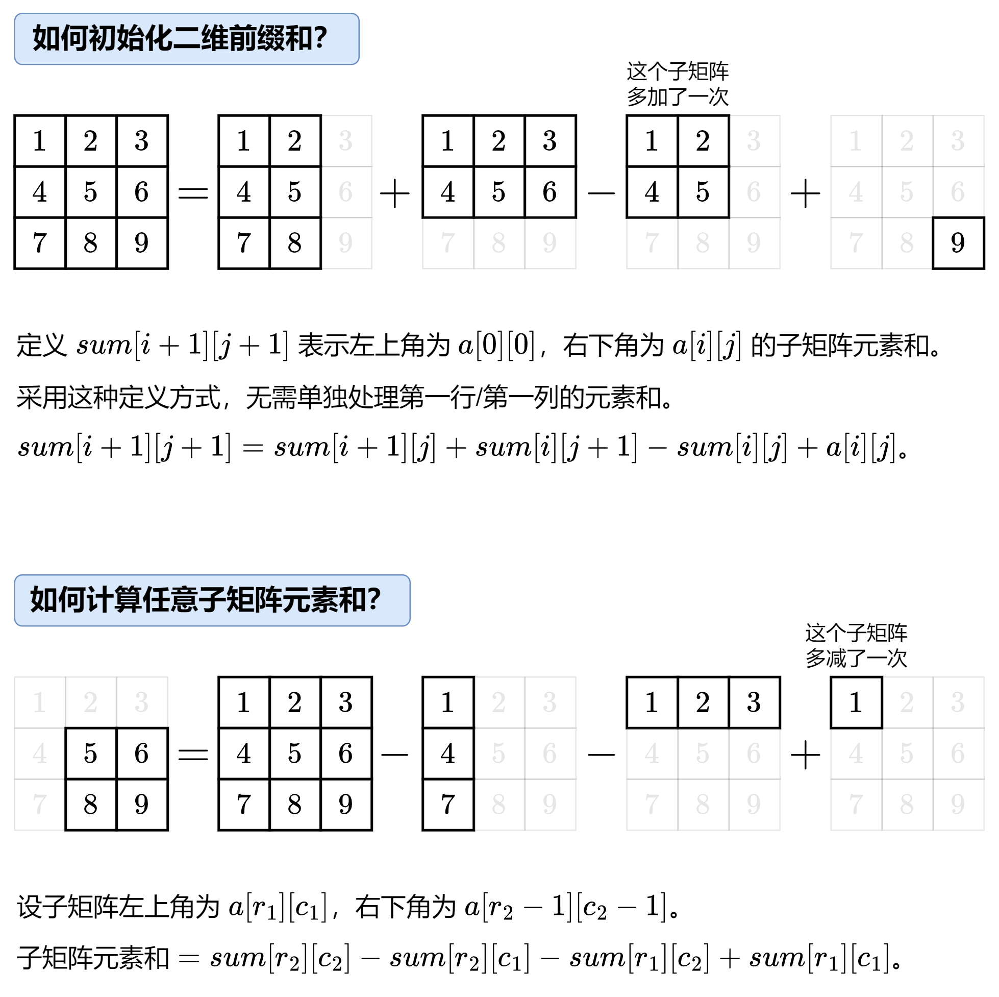

# 前言

==思维不要太局限，开放一点，反转二叉树奇数层/二分查找二叉搜索树==

==把解法框架搭建出来出来做笔记==

模拟和DEBUG

从数据结构和算法两方面来优化解题，常规的数据结构以及暴力搜索无法完成，那么就用算法去优化，去脑子里面

在找算法

 我个人认为准备提升算法能力最重要的是==多刷题与多思考==

==多刷题：==刷题方面我觉得刷题不在于多，而在于要成体系，要边刷题边思考总结，自己刷完一道题，并不是这道题

就结束了，可以多看一些别人的题解，但是看完后不建议直接复制题解完成AC，最好是能做到自己看完题解后可

以自己写出答案，这时候这个答案就是融合了自己的理解的答案，这样才能将这个题目内化为自己的知识。

==多思考：==刷题的时候会经常遇到通过用例不是100的情况，这种情况就要再仔细想一想题目的意思，看看自己漏掉

了哪些情况。如果自己思考之后找出了问题所在，那么这也会有小小的成就感。这种情况总结的多了，自然而然地

算法能力就提升了

# 算法经验

## **基础数据结构的学习方法**

数据结构的学习有三个阶段

**第一个阶段：认识数据结构的基本特点**，比如我们知道栈的后进先出、队列的先进先出的特点

**第二个阶段：会使用编程语言提供的内置数据结构**，比如 Java 中的 Stack、Queue，C++ 中的 stack、queue 等

如果你只是停留在第二个阶段的话，你将很难理解透彻这些数据结构，进而影响你对这些数据结构的灵活运用，从而导致你很难应对稍微难一点的算法笔试或者面试

所以，你必须进入**第三阶段：用你自己熟悉的编程语言，手写代码实现每一个基础且重要的数据结构**，比如双链表、栈、队列、堆、哈希表等

为了降低时间复杂度，提高性能，可以：

1. 基于数组来实现**循环队列**
2. 多用一个指针 tail 指向单向链表的表尾

这样，不管是数组，还是单向链表实现的队列，入队和出队的时间复杂度都是 O(1)

**那么重点来了，用数组或者链表实现队列，具体的代码怎么写呢？如何落地呢？这就是第三个阶段需要做的事情了，这太重要了**

**你还需要考虑的是，什么场景下使用数组实现的队列，什么场景下使用链表实现的队列呢？**

经过这么一折腾，**数据结构你可以吃的透透的，什么场景选择什么数据结构，简直就是手到拈来的事情，如果将这种数据结构选择的思路，上升到架构的高度的话，可以为你做技术选型打好坚实的基础的**

我们可以按照从简单到难的顺序，分成 **5 个系列 22 个类别**：

1. 数组、字符串、整数的基本操作， 5 个类别：一维数组、二维数组、字符串、数学、位运算
2. 经典查找算法，6 个类别：排序、二分查找、哈希查找、栈和队列辅助查找、堆查找、滑动窗口
3. 动态数据结构，4 个类别：链表、二叉树、二叉查找树、DFS 和 BFS
4. 数据结构设计，包括 3 个类别：缓存、并查集、字典树
5. 高级算法，包括 4 个类别：回溯、贪心、动态规划、图论相关算法

## 基础算法的学习方法

在啃基础阶段，你需要掌握的算法包括：排序算法、二分查找、字符串匹配算法、DFS、BFS、哈希查找、堆查找

当然，还有图论相关算法，包括 floodfill 算法、环检测、二分图、拓扑排序、最短路径、最小生成树等

对于其他的算法（比如回溯、贪心、动态规划等），请到刷题阶段学习和练习

**这个阶段，你需要熟悉每种算法的思想以及实现，比如说:**

**几大常用的排序算法你得能用代码实现，**包括冒泡排序、选择排序、插入排序、归并排序、快速排序、计数排序、基数排序、桶排序

**然后适当的找一些相关的算法面试题试试水即可，不要求能熟练的应用**

比如，你学完排序算法，你就可以找【颜色分类】这个高频算法题试试水：

> 给定一个包含红色、白色和蓝色， 一共 n 个元素的数组， 原地对它们进行排序，使得相同颜色的元素相邻， 并按照红色、白色、蓝色顺序排列

这道题目可以使用普通排序、计数排序、快排分区等多种手段解决，可以很好的练习排序算法

再比如，当你学完基本的二分查找算法，并且也熟悉了几种变形的二分查找后，你可以找【搜索插入位置】这道题来练练：

> 给定一个排序数组和一个目标值，在数组中找到目标值，并返回其索引。如果目标值不存在于数组中，返回它将会被按顺序插入的位置。

因为规定数组有序，所以可以使用时间复杂度为 O(logn) 的二分查找来实现

以上每道题知识考察一个知识点，而且相对简单，但在面试或者笔试中，**一道题目可能要考察多个知识点，比如排序算法和二分查找一起考察**，比如【最接近的三数之和】这道题：

> 给定一个包括 n 个整数的数组 nums 和 一个目标值 target。找出 nums 中的三个整数，使得它们的和与 target 最接近。返回这三个数的和。

这个难度就上来了，这里需要先排序，然后再二分，而且这个二分是比较难看出来的，对于这种题目，我么需要在接下来的刷题阶段，做刻意的练习的~

# 九大数据结构

## 数组

### 字符串

#### 常用操作

**<font color='red'>连接字符串</font>**

```cpp
std::string result = str1 + str2; // 使用 + 运算符
str1.append(str2); // 使用 append() 函数
```

**<font color='red'>比较</font>**

==短的在前、ASCII值小的在前==

`std::sort`会对给定的范围进行排序，其中排序的顺序由排序函数的返回值确定**<font color='red'>（true)</font>**

```cpp
//短的在后、ASCII值小的在后面
bool customCompare(const std::string& a, const std::string& b) {
    if (a.length() != b.length()) {
        return a.length() < b.length();  // 长度短的在后面
    }
    return a < b;  // ASCII 值小的在后面
}

```

**<font color='red'>截取字符串</font>**

```cpp
// 从位置5开始截取到末尾的所有字符
std::string substr1 = str.substr(5);
// 从位置7开始截取长度为5的子字符串
std::string substr2 = str.substr(7, 5);
```

**<font color='red'>基本操作</font>**

```cpp
length() / size() //返回字符串的长度
empty()  //检查字符串是否为空
clear()  //清空字符串内容
append() / push_back() //在字符串末尾添加字符或字符串
std::stoi(string);//将字符串转换成int
std::string::c_str() //成员函数
front() 和 back() //访问字符串的第一个和最后一个字符。
```

#### 题型

### 动态数组

#### 常用操作

```cpp
std::vector<int> target(source.begin() + 1, source.end() - 1);
//中间删除：删除位置之后所有迭代失效
vector.erase(position);
vector.erase(startIterator, endIterator);
//容量操作
vec.size();
//交换
vec1.swap(vec2);
```

#### 题型

**二维矩阵**

- 螺旋矩阵 螺旋矩阵Ⅱ
- 旋转图像
- 矩阵置零

二分查找：最简单的场景

移除元素：快慢指针

有序数组的平方：双指针加辅助数组

长度最小的子数组：滑动窗口

- 窗口内容是什么？什么时候扩大窗口？什么时候缩小窗口？

## 链表

## 栈

### 单调栈

## 队列

## 堆(优先队列)

## 集合

## 映射

## 树

## 图

### 并查集

### 链表

反转链表：必须秒杀，核心思想：取出当前节点，重置节点指向

链表内指定区间反转：反转链表把链表写断了：牛客上的题目我做得逻辑一片混乱

**LRU缓存**

- 哈希表<int,listNode*>＋双向链表（虚拟头结点+虚拟尾节点）实现
- 双向链表按照被使用的顺序存储了这些键值对，靠近头部的键值对是最近使用的，而靠近尾部的键值对是最久未使用的
- 怎么移除一个节点+怎么把被移除的节点放在头部+移除尾部节点

**k个一组翻转链表**：代码控制力不够，能想出思路写不出来

你是真小丑，最基本的反转链表都忘光了

- 第一步：while循环来控制整体，在内部用for循环来找到**子链表**的前向和后向，把子链表翻转后再更新链表的起始节点
- 第二部翻转链表函数：用一个pre指针

总结：

- 灵活使用反转
- 链表和其他算法思想结合：链表+哈希表、链表＋DFS
- 链表的双指针：对称切分链表、倒数第几个节点
- 数学：环形入口、相交问题都得数学推导

**<font color='red'>排序链表删除重复元素</font>**

如果不排序

**使用哈希表 (Hash Table) 进行去重**：这种方法的时间复杂度为 𝑂(𝑁)*O*(*N*)，其中 𝑁*N* 是链表中元素的个数。空间复杂度也是 𝑂(𝑁)*O*(*N*)，因为需要使用哈希表存储链表中已出现的元素

**使用双重循环进行去重**：这种方法不需要额外的空间，但时间复杂度为 𝑂(𝑁2)*O*(*N*2)

==简单的模拟即可==

**<font color='red'>排序链表删除重复元素Ⅱ</font>**

当时不知道怎么把去重的全删掉，只需要简单的保存val，然后把val的节点都删掉就可以

```cpp
ListNode* deleteDuplicates(ListNode* head) {
    ListNode* pre = new ListNode();
    pre->next = head;
    ListNode* cur = pre;
    while(cur->next&&cur->next->next){
        int val = cur->next->val;
        //不保留
        if(val==cur->next->next->val){
            while(cur->next&&cur->next->val==val) cur->next = cur->next->next;
        }
        //保留
        else{
            cur = cur->next;
        }
    }
    return pre->next;
}
```

**<font color='red'>合并K个升序链表</font>**

1、暴力先合并前两个链表，再把得到的新链表和第三个链表合并，再和第四个链表合并，依此类推。但是这种做法，平均每个节点会参与到 O(k)次合并中，时间复杂度为O(nk)

2、分治思想：按照一分为二再合并的逻辑，递归像是在后序遍历一棵平衡二叉树。由于平衡树的高度是 O(log⁡k)，所以每个链表节点只会出现在 O(log⁡k)次合并中！这样就做到了更快的 O(nLogk)时间。

```go
func mergeKLists(lists []*ListNode) *ListNode {
    m := len(lists)
    if m==0{
        return nil
    }
    if m==1{
        return lists[0]
    }
    left := mergeKLists(lists[:m/2])
    right := mergeKLists(lists[m/2:])
    return mergeTwoLists(left,right)
}
func mergeTwoLists(list1 ,list2 *ListNode) *ListNode{
    dummy := &ListNode{}
    cur := dummy
    for list1!=nil&&list2!=nil{
        if list1.Val>list2.Val{
            cur.Next = list2
            list2 = list2.Next
        }else{
            cur.Next = list1
            list1 = list1.Next
        }
        cur = cur.Next
    }
    if list1!=nil{
        cur.Next = list1
    }else{
        cur.Next = list2
    }
    return dummy.Next
}
```

3、优先级队列：我们需要一个数据结构，它支持：从数据结构中找到并移除最小节点，插入节点。

```cpp
class Solution {
public:
    ListNode* mergeKLists(vector<ListNode*>& lists) {
        auto cmp = [](const ListNode* a,const ListNode* b){
            return a->val>b->val;
        };
        priority_queue<ListNode*,vector<ListNode*>,decltype(cmp)>pq;
        for(auto head:lists){
            if(head){
                pq.push(head);
            }
        }
        ListNode dummy{};
        auto cur = &dummy;
        while(!pq.empty()){
            auto node = pq.top();
            pq.pop();
            if(node->next){
                pq.push(node->next);
            }
            cur->next = node;
            cur = cur->next;
        }
        return dummy.next;
    }
};
```

### 栈

不一定要用栈来比较 用vector和string的back()都可以的

```cpp
st.isEmpty(): //检查栈是否为空，返回布尔值。
st.size(): //返回栈中元素的数量。
st.clear(): //清空栈中的所有元素。
```

**有效的括号**：总算是光速AC

**二叉树中序遍历**

**402移掉 K 位数字（中等）**：都是删除或者保留若干个字符，使得剩下的数字最小（或最大）或者字典序最小（或最大）。而解决问题的前提是要有一定数学前提。而基于这个数学前提，我们贪心地删除栈中相邻的字符。如果你会了这个套路，那么这四个题目应该都可以轻松解决。数字类型的比较大小，在一个数组中取 k 个数字，并保持其最小（或者最大）

```cpp
string removeKdigits(string num, int k) {
    int n = num.size();
    string vec="";
    int res = n - k;//要留下的位数
    if(res==0) return "0";
    for(char c:num){
        while(k!=0 && !vec.empty() && vec[vec.size()-1]>c){
            vec.pop_back();
            k--;
        }
        vec += c;
    }
    vec = vec.substr(0,res);
    while(*vec.begin()=='0' && vec.size()!=1)
        vec.erase(vec.begin());
    return vec;
}
```

**316：字母类型的大小比较**

```cpp
string removeDuplicateLetters(string s) {
    //和上面一道题不一样的地方在于去重
    string result;
    vector<int> vec(26, 0);
    for (char a : s) vec[a - 'a']++;
    unordered_set<char> visited;
    for (char c : s) {
        if (visited.find(c) == visited.end()) {
            while (!result.empty() && c < result.back() && vec[result.back()-'a'] > 0) {
                visited.erase(result.back());
                result.pop_back();
            }
            result.push_back(c);
            visited.insert(c);
        }
        vec[c-'a']--;
    }
    return result;
}
```

**两个数组拼接最大数**

好像都是这样：先反转链表，然后按k一组反转链表

先比较单个链表，然后比较几个链表

```cpp
class Solution {
public:
    //贪心
    vector<int> maxNumber(vector<int>& nums1, vector<int>& nums2, int k) {
        int m = nums1.size();
        int n = nums2.size();
        vector<int>result;
        for(int i= max(0,k-n);i<=min(k,m);i++){
            //num1取i个
            vector<int>left = maxNumber(nums1,i);
            //num2取k-i  k-i<=m
            vector<int>right = maxNumber(nums2,k-i);
            //合并
            vector<int>merged = merge(left,right);
            result = max(result,merged);
        }
        return result;
    }
    //贪心
    vector<int> maxNumber(vector<int>&nums,int k){
        int n = nums.size();
        int temp = n-k;
        vector<int>result;
        for(int i=0;i<n;i++){
            while(temp>0&&!result.empty()&&result.back()<nums[i]){
                result.pop_back();
                temp--;
            }
            if(result.size()<k)result.push_back(nums[i]);
            else temp--;
        }
        return result;
    }
    //归并
    vector<int> merge(vector<int>&num1,vector<int>&num2){
        vector<int>merged;
        auto iter1 = num1.begin(),iter2 = num2.begin();
        while(iter1!=num1.end()&&iter2!=num2.end()){
            if(*iter2>*iter1){
                merged.push_back(*iter2);
                iter2++;
            }
            else if(*iter2<*iter1){
                merged.push_back(*iter1);
                iter1++;
            }
            else { // 当两个元素相等时，考虑相对顺序
            // 定义两个指针，分别指向当前相等元素的下一个位置
            auto next_iter1 = iter1 + 1, next_iter2 = iter2 + 1;
            // 循环直到找到两个数组中不相等的元素或其中一个数组结束为止
            while (next_iter1 != num1.end() && next_iter2 != num2.end() && *next_iter1 == *next_iter2) {
                next_iter1++;
                next_iter2++;
            }
            // 如果其中一个数组已经遍历完毕，或者下一个不相等的元素在 num1 中比较大
            if (next_iter2 == num2.end() || (next_iter1 != num1.end() && *next_iter1 > *next_iter2)) {
                merged.push_back(*iter1);// 将当前元素添加到合并后的数组中
                iter1++;
            } else {
                merged.push_back(*iter2);// 将当前元素添加到合并后的数组中
                iter2++;
            }
            }
        }
        while(iter2!=num2.end()){
            merged.push_back(*iter2);
            iter2++;
        }
        while(iter1!=num1.end()){
            merged.push_back(*iter1);
            iter1++;
        }
        return merged;
        
    }
};
```

## 高层结构

### 堆和优先队列

对于最小堆，队列的前方是最小值

```cpp
// 默认最大堆，第二个容器元素为vector<int>
priority_queue<int> maxHeap;
//最小堆
auto compare = [](int a, int b) { return a > b; }; // lambda 表达式定义比较函数
priority_queue<int, vector<int>, decltype(compare)> MinHeap(compare);
priority_queue<int,vector<int>,greater<int>>MinHeap;//队列升序排列即是最小堆
auto compare = [](const pair<int,int>& a,const pair<int,int>& b){
    return a.second > b.second;
};
priority_queue<pair<int,int>,vector<pair<int,int>>,decltype(compare)>minHeap(compare);
```

**数组中第k个最大元素**

```cpp
priority_queue<int,vector<int>,greater<int>>MinHeap;//队列升序排列即是最小堆
for(int i = 0;i<k;i++){
	MinHeap.push(nums[i]);
}
for(int i =k;i<nums.size();i++){
    if(nums[i]>MinHeap.top()){
    MinHeap.pop();
    MinHeap.push(nums[i]);
	}
}
return MinHeap.top();
```

**前k个高频元素**

- 用哈希表记录unordered_map<int, int> freq;
- 构建最小堆，一直插入数据，一旦size>k，就弹出一个
- 因为是最小堆，最后再翻转结果

**二叉搜索树中的第小的元素**：中序遍历的数组是有序的

## 单调栈

### 矩形系列

**<font color='red'>直方图中最大矩形面积</font>**

```cpp
#include <iostream>
#include <vector>
#include <stack>
#include <algorithm>

int largestRectangleArea(std::vector<int>& heights) {
    std::stack<int> stk;
    heights.push_back(0); // 添加一个0高度，保证能计算到最后一个柱子
    int max_area = 0;
    
    for (int i = 0; i < heights.size(); ++i) {
        while (!stk.empty() && heights[i] < heights[stk.top()]) {
            int h = heights[stk.top()];
            stk.pop();
            int w = stk.empty() ? i : i - stk.top() - 1;
            max_area = std::max(max_area, h * w);
        }
        stk.push(i);
    }
    
    return max_area;
}

int main() {
    std::vector<int> heights = {2, 1, 5, 6, 2, 3};
    std::cout << "The largest rectangle area is " << largestRectangleArea(heights) << std::endl;
    return 0;
}
```

### 字典序最小

**<font color='red'>去掉 `k` 个字符，使得剩下的字符串字典序最小</font>**

```cpp
#include <iostream>
#include <string>
#include <stack>

std::string removeKdigits(std::string num, int k) {
    std::stack<char> stk;
    for (char digit : num) {
        while (!stk.empty() && k > 0 && stk.top() > digit) {
            stk.pop();
            k--;
        }
        if (!stk.empty() || digit != '0') {
            stk.push(digit);
        }
    }
    
    while (!stk.empty() && k--) {
        stk.pop();
    }
    
    std::string result = "";
    while (!stk.empty()) {
        result = stk.top() + result;
        stk.pop();
    }
    
    return result.empty() ? "0" : result;
}

int main() {
    std::string num = "1432219";
    int k = 3;
    std::cout << "The smallest possible number after removing " << k << " digits is " << removeKdigits(num, k) << std::endl;
    return 0;
}
```

### 贡献法

**<font color='red'>数组中每个元素作为最小值的子数组个数</font>**

```cpp
#include <iostream>
#include <vector>
#include <stack>

long sumOfSubarrayMinimums(std::vector<int>& arr) {
    int n = arr.size();
    std::vector<int> left(n), right(n);
    std::stack<int> s;
    
    for (int i = 0; i < n; ++i) {
        while (!s.empty() && arr[s.top()] > arr[i]) {
            s.pop();
        }
        left[i] = s.empty() ? -1 : s.top();
        s.push(i);
    }
    
    while (!s.empty()) {
        s.pop();
    }
    
    for (int i = n - 1; i >= 0; --i) {
        while (!s.empty() && arr[s.top()] >= arr[i]) {
            s.pop();
        }
        right[i] = s.empty() ? n : s.top();
        s.push(i);
    }
    
    long sum = 0;
    for (int i = 0; i < n; ++i) {
        sum += (long)arr[i] * (i - left[i]) * (right[i] - i);
    }
    
    return sum;
}

int main() {
    std::vector<int> arr = {3, 1, 2, 4};
    std::cout << "Sum of subarray minimums: " << sumOfSubarrayMinimums(arr) << std::endl;
    return 0;
}
```

## 哈希表

```cpp
//对map进行遍历
for(const auto &pair:map){
    if(pair.second>maxCount){
        maxCount = pair.second;
    }
}
```

**128.最长连续序列**：用哈希集合的count来做，count(num+1)/count(num-1)

# 九大算法

## DFS

## BFS

## 拓扑排序

## 最短路

## 最小生成树

## 动态规划

### 入门

### 背包

### 状态机

### 树形

## KMP

# 数学

## 排序

### 快速排序

### 归并排序

## 双指针

## 前缀和

## 分治

## 位运算 

## 差分

## 树状数组

[307. 区域和检索 - 数组可修改 - 力扣（LeetCode）](https://leetcode.cn/problems/range-sum-query-mutable/description/)

# 其他

## 反转操作

**<font color='red'>整数反转</font>**

如何反转一个整数？1、栈；2、把他变成字符串；3、取模

```go
func reverse(x int) int {
    res := 0
    for x!=0{
        temp := x%10
        if res>math.MaxInt32/10||(res==math.MaxInt32/10&&temp>7){
            //在1/10开始判断
            return 0
        }
        if res<math.MinInt32/10||(res==math.MinInt32/10&&temp < -8){
            //在1/10开始判断
            return 0
        }
        res = res*10+temp
        x/=10
    }
    return res
}
```

**<font color='red'>回文数</font>**

转成字符串来做吧，虽然不优雅

**<font color='red'>字符串转整数（atoi）</font>**


## 数学

异或：两个位相同结果为0，不同为1

**<font color='red'>找出第k大的异或坐标值</font>**

ps：异或题目一般都看不懂


**对x求平方根**：根号8等于2   二分查找的思想，在0到x里面二分查找i*i，注意使用long long强转

**数字一的个数**：计算所有小于等于 `num` 的非负整数中数字 `1` 出现的个数；（未做）

**<font color='red'>区分黑球和白球</font>**

等价于把每个0都进行冒泡排序到左边

```cpp
long long minimumSteps(string s) {
    long long ans = 0;
    int cnt1 = 0;
    for(char c:s){
        if(c=='1'){
            cnt1++;
        }else{
            ans+=cnt1;
        }
    }
    return ans;
}
```


## 单调栈

**接雨水**：

```cpp
//栈不为空且在递减，开始处理
//重点在于此时栈内部必须有两个以上的数字
while(!st.empty()&&height[st.top()]<height[i]){
                int cur = st.top();
                st.pop();//只弹出一个数据
                if(st.empty())break;
                int l = st.top();
                int r = i;
                int h = min(height[r],height[l])-height[cur];
                ans+=(r-l-1)*h;
}
//不管怎么都插入数据
st.push(i);
```

**每日温度：**我以为栈来保存num[i],没想到是保存i

```cpp
while(!st.empty()&&temperatures[i]>temperatures[st.top()]){
    int a = st.top();st.pop();
    result[a] = i-a;
}
st.push(i);
```

**柱状图中最大的矩形**

枚举每一根柱子，找到**左右两侧最近的高度小于 h 的柱子** 

- 单调栈左边界：单调递减，这样栈顶的元素才有可能是边界，因为栈里面的元素都是高一点的

```cpp
for(int i=0;i<n;i++){
    while(!st.empty()&&heights[st.top()]>=heights[i]){
        st.pop();
    }   
    left[i] = (st.empty()?-1:st.top());
    st.push(i);
}
```

- 单调栈右边界：单调递减，这样栈顶的元素才有可能是边界，因为栈里面的元素都是高一点的

```cpp
for(int i=n-1;i>=0;i--){
    while(!st.empty()&&heights[st.top()]>=heights[i]){
        st.pop();
    }
    right[i] = (st.empty()?n:st.top());
    st.push(i);
}
```


## 前缀和

前缀和：nums 的第 0 项到 当前项 的和

- 定义 prefixSum 数组，prefixSum[x]：第 0 项到 第 x 项 的和
- nums 的某项 = 两个相邻前缀和的差
- nums 的 第 i 到 j 项 的和：前缀和[j]-前缀和[i]

**和为k的子数组**

等价于pre[j] - k = pre[i];map中存了pre[i]的个数

**前缀树**：**一次建树，多次查询**

- Trie 的形状和单词的插入或删除顺序无关，也就是说对于任意给定的一组单词，Trie 的形状都是唯一的。

- 查找或插入一个长度为 L 的单词，访问 next 数组的次数最多为 L+1，和 Trie 中包含多少个单词无关。

- Trie 的每个结点中都保留着一个字母表，这是很耗费空间的。如果 Trie 的高度为 n，字母表的大小为 m，最坏的情况是 Trie 中还不存在前缀相同的单词，那空间复杂度就为O(m^n)。

除自身外数组乘积：前缀和后缀一下就出来了

剑指offerⅡ的62、63、64题

**路径总和**

```cpp
int pathSum(TreeNode* root,int target){
    unordered_map<int,int>prefix;
    prefix[0]=1;
    return dfs(root,prefix,0,target);
}
int dfs(TreeNode* root,unordered_map<int,int>prefix,int curSum,int target){
    if(root==nullptr)return 0;
    curSum+=root->val;
    int res = prefix[curSum-target];
    prefix[curSum]++;
    res+=dfs(root->left,prefix,curSum,target);
    res+=dfs(root->right,prefix,curSum,target);
    prefix[curSum]--;
    return res;
}
```

### 二维前缀和



**<font color='red'>统计全为1的正方形子矩阵</font>**

不是最优解法，暴力搜索

```go
func countSquares(matrix [][]int) int {
    result := 0
    prematrix := make([][]int,len(matrix)+1)
    for i:=range prematrix{
        prematrix[i] = make([]int,len(matrix[0])+1)
    }
    for i:= range matrix{
        for j:= range matrix[i]{
            if matrix[i][j]==1{
                result++
            }
            prematrix[i+1][j+1] = prematrix[i+1][j]+prematrix[i][j+1]-prematrix[i][j]+matrix[i][j]
        }
    }
    size := 0
    if len(matrix)>len(matrix[0]){
        size = len(matrix[0])
    }else{
        size = len(matrix)
    }
    for k:=2;k<=size;k++{
        for i:=k;i<=len(matrix);i++{
            for j:=k;j<=len(matrix[0]);j++{
                r1,c1 := i-k,j-k
                r2,c2 := i,j
                res := prematrix[r2][c2]-prematrix[r1][c2]-prematrix[r2][c1]+prematrix[r1][c1]
                if res == k*k{
                    result++
                }
            }
        }
    }
    return result 
}
```

**<font color='red'>二维区域和检索-矩阵不可变</font>**

`int sumRegion(int row1, int col1, int row2, int col2)` 返回 **左上角** `(row1, col1)` 、**右下角** `(row2, col2)` 所描述的子矩阵的元素 **总和** 。

==用二维矩阵前缀和来优化==

定义sum[i+1] [j+1]为左上角0、0，右下角i、j，==这样不需要处理第一行和第一列==

```cpp
class NumMatrix {
    vector<vector<int>>sum;
public:
    NumMatrix(vector<vector<int>>& matrix) {
        int m = matrix.size();
        int n = matrix[0].size();
        sum = vector<vector<int>>(m+1,vector<int>(n+1,0));
        for(int i = 0;i<m;i++){
            for(int j = 0;j<n;j++){
                sum[i+1][j+1] = sum[i+1][j]+sum[i][j+1]-sum[i][j]+matrix[i][j];
            }
        }
    }
    
    int sumRegion(int row1, int col1, int row2, int col2) {
        return sum[row2+1][col2+1]-sum[row2+1][col1]-sum[row1][col2+1]+sum[row1][col1];
    }
};
```


# STL

## 增删改查

初始化列表和构造函数

## map和set

**<font color='red'>map</font>**

map中按照主键的大小排序，并非按照插入顺序

```cpp
//增
// 使用insert插入元素
map.insert({"pear", 4});
// 使用emplace插入元素
map.emplace("grape", 5);
//检查元素是否存在
if (map.count("apple") > 0) {
```

**erase()**：删除指定键的元素

**clear()**：清空 map 中的所有元素

**find()**：查找具有指定键的元素，并返回指向该元素的迭代器

**size() / empty()**：返回 map 中元素的数量或检查 map 是否为空

**begin() / end()**：返回指向第一个和最后一个元素的迭代器，用于遍历 map

**operator[]**：通过键访问元素的值，如果键不存在，则会插入一个默认构造的值并返回对应的引用

**<font color='red'>unordered_map</font>**

std::unordered_map可以使用emplace插入元素

```cpp
//查找元素
auto it = umap.find("banana");
if (umap.count(key) > 0) 
//遍历元素
for (const auto& pair : umap) {
     std::cout << pair.first << ": " << pair.second << std::endl;
}
//元素个数
umap.size()
// 删除键值对
myMap.erase("melon");
// 清空 unordered_map
myMap.clear();
```

**<font color='red'>unordered_set</font>**

和unordered_map一样

```cpp
unordered_set<string> words(wordList.begin(), wordList.end());//迭代器初始化
```

**容器操作**

```cpp
std::sort(vec.begin(), vec.end());//排序
//只找到第一个满足条件的
auto it = std::find(vec.begin(), vec.end(), 5);//查找
    // 查找所有等于5的元素
    std::vector<int> positions;
    auto it = vec.begin();
    while ((it = std::find(it, vec.end(), 5)) != vec.end()) {
        positions.push_back(std::distance(vec.begin(), it));
        ++it; // 移动到下一个位置以继续查找
    }
auto max_it = std::max_element(vec.begin(), vec.end());//最大
auto min_it = std::min_element(vec.begin(), vec.end());//最小
    // 查找所有等于最大值的元素
    std::vector<int> positions;
    auto it = vec.begin();
    while ((it = std::find(it, vec.end(), max_value)) != vec.end()) {
        positions.push_back(std::distance(vec.begin(), it));
        ++it; // 移动到下一个位置以继续查找
    }
std::reverse(vec.begin(), vec.end());//反转
std::for_each(vec.begin(), vec.end(), [](int x) { std::cout << x << " "; });//遍历
```

```cpp
//看看flag，太巧妙了
vector<string>row(numRows);
int i =0;
int flag = -1;
for(char c:s){
    row[i].push_back(c);
    if (i == 0 || i == numRows -1)flag = - flag;
    i += flag;
}
```

## List

### 队列

==队列==

**入队（Enqueue）**：向队列的尾部添加一个元素。

**出队（Dequeue）**：从队列的头部移除并返回一个元素。

**查看队首元素（Front）**：返回队列的头部元素，但不移除它。

**查看队尾元素（Back）**：返回队列的尾部元素，但不移除它。

**判空（Empty）**：判断队列是否为空。

**大小（Size）**：返回队列中元素的数量。

==双端队列==

**头部插入（push_front）**：将元素插入到双端队列的头部。

**尾部插入（push_back）**：将元素插入到双端队列的尾部。

**头部删除（pop_front）**：删除双端队列头部的元素。

**尾部删除（pop_back）**：删除双端队列尾部的元素。

**查看头部元素（front）**：返回双端队列头部的元素，但不将其移出队列。

**查看尾部元素（back）**：返回双端队列尾部的元素，但不将其移出队列。

**判空（empty）**：判断双端队列是否为空。

**大小（size）**：返回双端队列中元素的数量。

# ACM

## 输入输出

输入流并不会判断我们输入的时候字符串还是数字，全靠我们解析

==cin把空格和回车视为分隔符==

**<font color='red'>读取一行数字和文本</font>**：这样可以防止给你一个数组，但是不给你数组的大小

**<font color='blue'>第一种情况：</font>**一行输入以逗号隔开，全部字符串，==就算全是数字也可以先字符串再数字==

```cpp
//1627845600,client1,factorA,10
string a[5];
while (n -- )
{
    string s, t;
    cin >> s;
    stringstream ss(s);
    int k = 0;
    while(getline(ss, t, ','))
        a[k ++] = t;
    string ts = a[0] + a[1] + a[2];
    int tt = stoi(a[3]); //全部变成字符串
}
```

**<font color='blue'>第二种情况：</font>**一行输入以逗号隔开，全是数字

```cpp
while(n--){
string line;
getline(cin, line); // 从标准输入读取一行文本
istringstream iss(line);
int num;
vector<int> nums;
while (iss >> num) { // 尝试从 iss 中读取一个数字，如果成功则存入 num
    nums.push_back(num); // 将读取的数字存入 nums 数组
    if (ss.peek() == ',') ss.ignore();//忽视逗号
}
}
```

**<font color='red'>输出精度</font>**

```cpp
int num = 123;
double pi = 3.14159;

// 使用流控制符设置输出的宽度和精度
std::cout << std::setw(10) << num << std::endl; // 设置输出宽度为10
std::cout << std::setprecision(3) << pi << std::endl; // 设置输出精度为3位小数
```

**<font color='red'>快排的流程和时间复杂度</font>**

第一：从数组中选择一个基准元素，通常是中间

第二：将数组分成两部分，小于基准的放左边，大于基准的放右边

第三：递归的对左右进行排序

平均时间复杂度位NlogN，最坏N2（数组基本有序的情况下）

**<font color='red'>既然快排有缺点，那我们为什么还是要用快排？</font>**

平均性能好

原地排序，空间复杂度低

局部性好，缓存友好

**<font color='red'>归并排序的原理</font>**

**分解**：首先将待排序的数组（或链表）递归地分成两个子数组，直到每个子数组只包含一个元素为止。这个过程将数组不断地二分，直到子数组的长度为 1

**合并**：然后将两个已排序的子数组合并成一个新的有序数组。这个过程是归并排序的关键步骤，它将两个有序数组合并成一个更大的有序数组

**递归合并**：重复上述步骤，直到所有的子数组都合并成一个完整的有序数组

