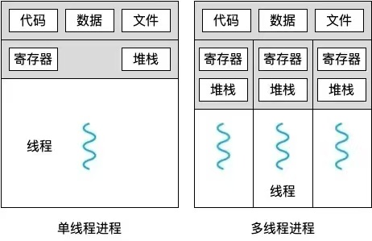
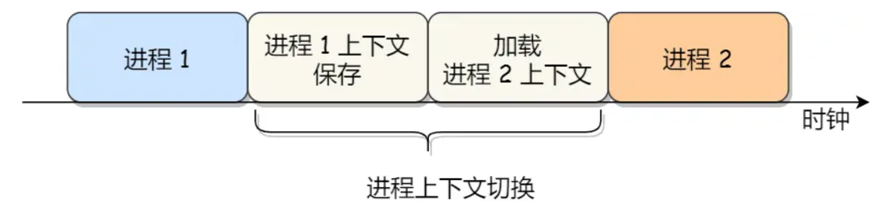
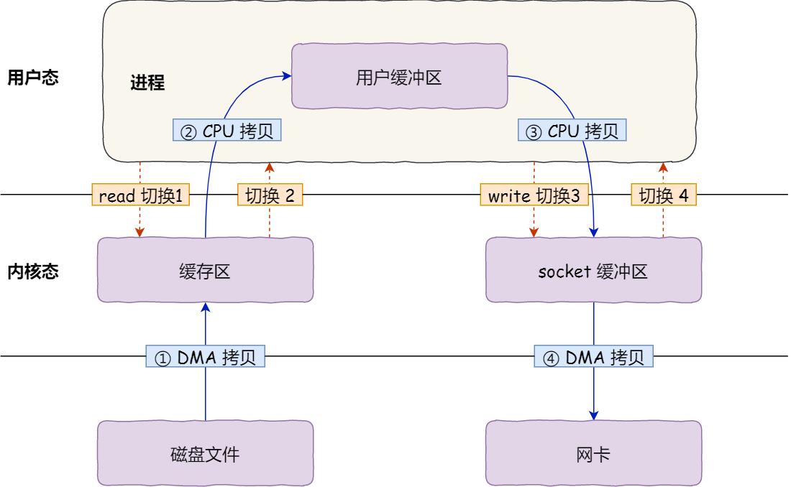
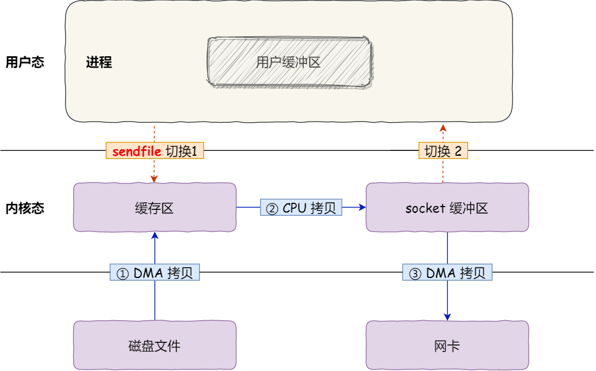
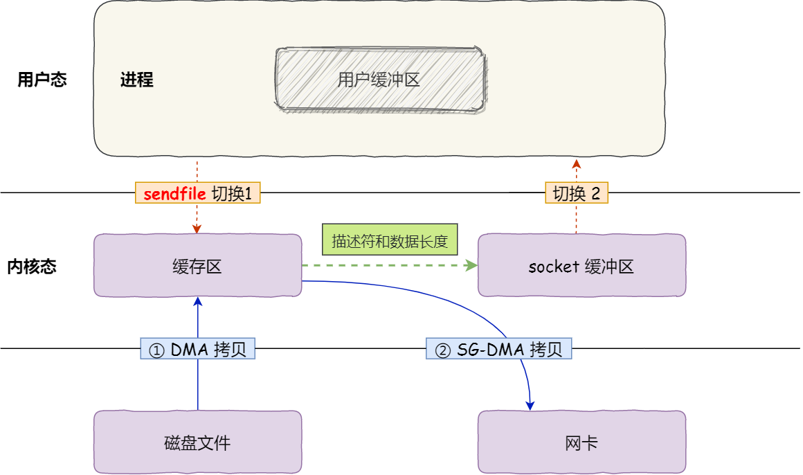
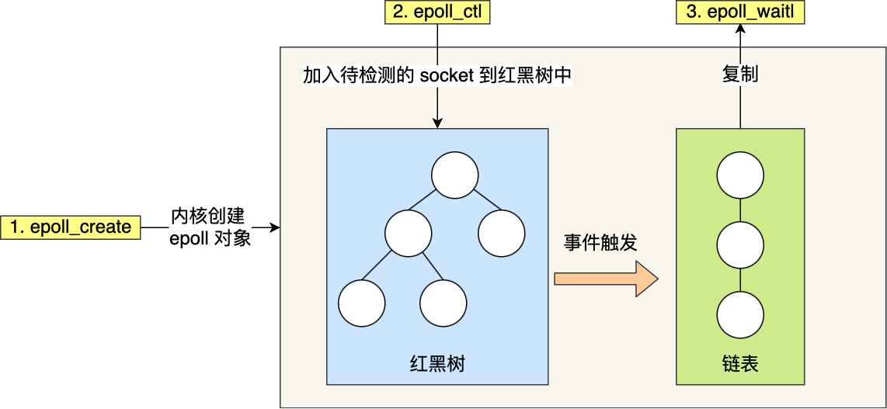
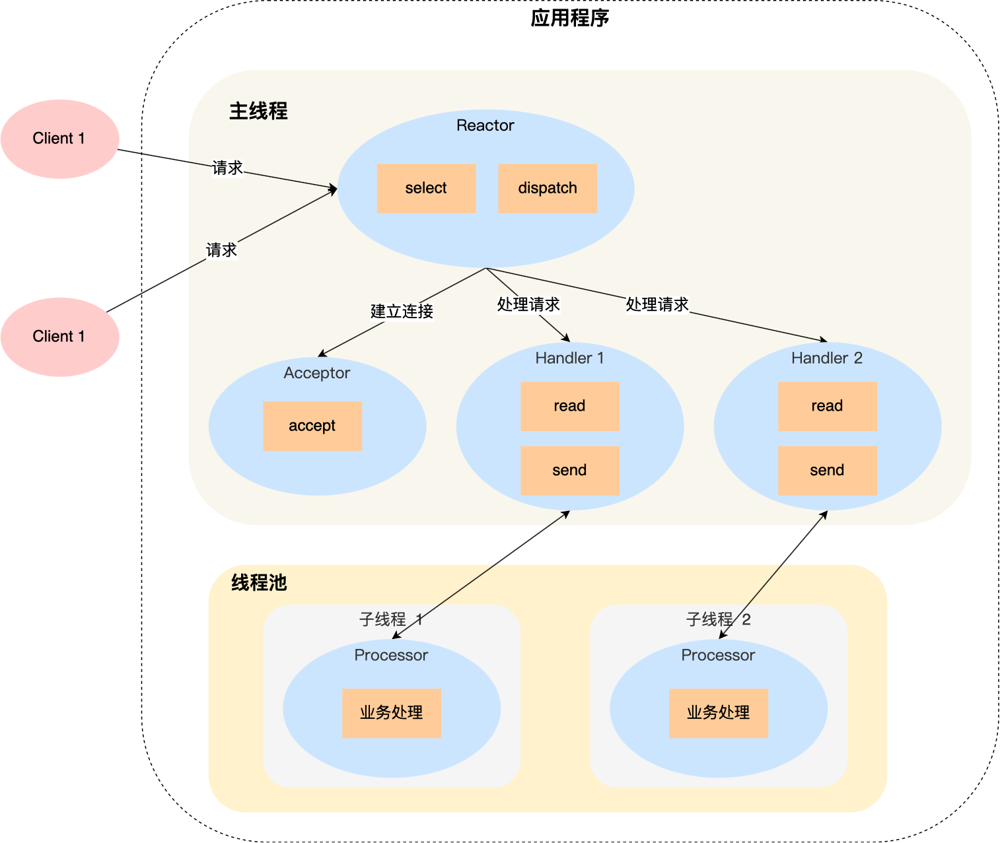
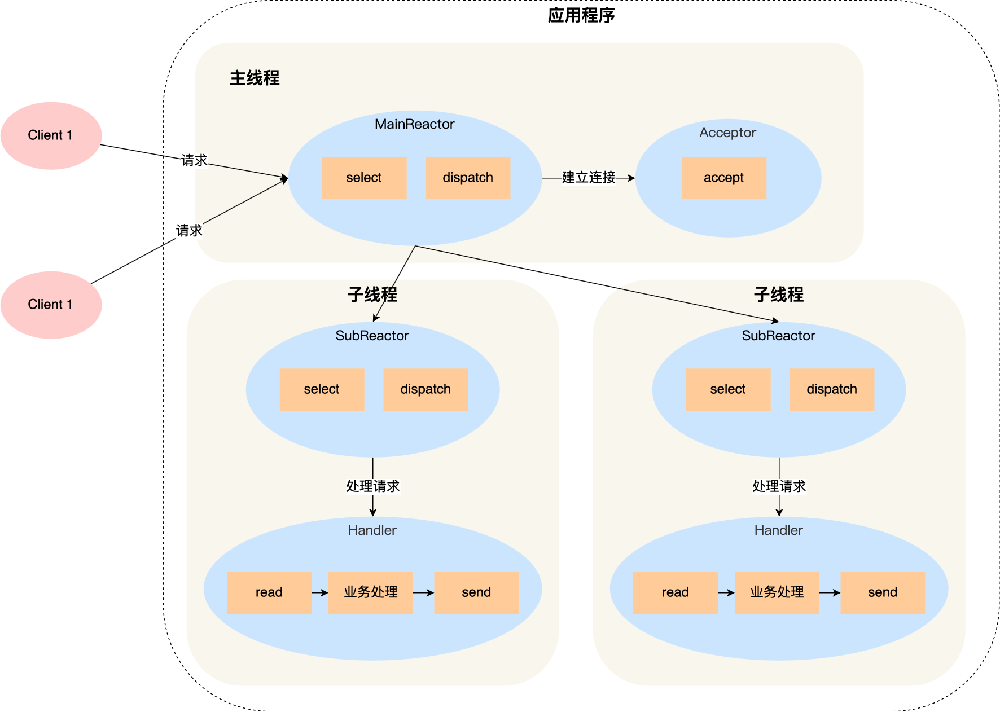
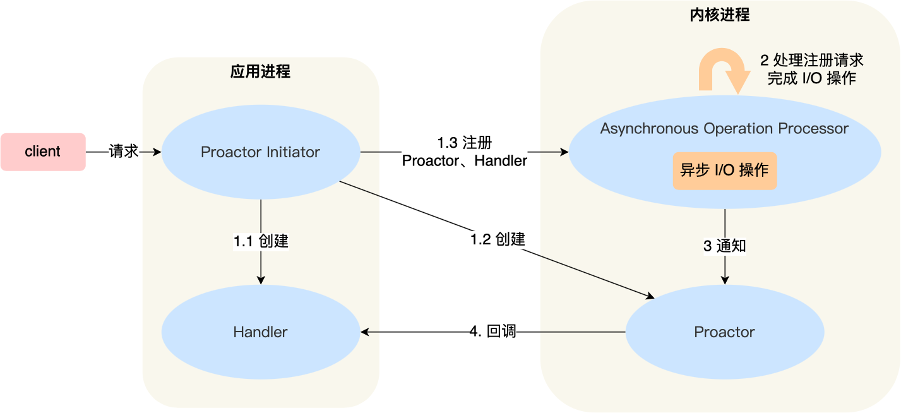

# 基本知识

### **<font color='red'>可执行程序能在不同机器上执行吗</font>**

操作系统（OS）：操作系统之间的文件格式和系统调用接口不同

硬件架构（Architecture）：不同架构之间的指令集不同

依赖库和运行环境：动态库

==怎么解决==

使用不同的平台编译源代码，生成特定平台的可执行文件

使用中间语言或虚拟机

容器化

==那手机上的app为啥能直接运行==

因为这些应用程序是专门为特定的移动操作系统和硬件架构开发的，并且通过统一的应用商店和分发机制进行发布

### **<font color='red'>cpu常见的寄存器有哪些</font>**

通用寄存器：临时数据

指令寄存器：内存地址

段寄存器：段基址

标志寄存器：状态和控制

### **<font color='red'>linux性能调优</font>**

**CPU性能调优**：top查看CPU使用情况、chrt调整CPU调度进程策略、nice和renice调整进程的优先级

**内存性能调优：**free/top检测内存情况、调整虚拟内存大小减少换出

**磁盘I/O调优：**vmstat检查磁盘I/O瓶颈、调整磁盘I/0策略

**网络性能调优：**netstat/ip查看网络瓶颈、调整网络参数(TCP缓冲区大小)

**应用程序调优：**perf分析系统性能、优化程序代码、使用缓存和消息队列的负载

**系统整体调优：**禁用不必要的系统服务、使用性能监控工具

**<font color='red'>用户态和内核态是什么？有什么区别？</font>**

用户态：程序运行的权限受限，无法直接访问硬件资源或操作系统的核心数据结构。

==特点：==受限权限、系统调用、内存隔离

内核态：程序运行的权限较高，可以直接访问硬件资源和内核数据结构。

==特点：==完全权限、中断处理、统一地址空间

==切换：==用户态和内核态之间的切换通常通过系统调用或中断来实现。用户态程序发起系统调用时，CPU从用户态切换到内核态；系统调用完成后，CPU再切换回用户态。

# 内存管理

### **<font color='red'>为什么要有虚拟内存？</font>**

第一，==进程虚拟空间很大、局部性原理、内存Swap换出：==虚拟内存可以使得进程对运行内存超过物理内存大小，因为程序运行符合局部性原理，CPU 访问内存会有很明显的重复访问的倾向性，对于那些没有被经常使用到的内存，我们可以把它换出到物理内存之外，比如硬盘上的 swap 区域。

第二，==解决多地址之间地址冲突：==由于每个进程都有自己的页表，所以每个进程的虚拟内存空间就是相互独立的。进程也没有办法访问其他进程的页表，所以这些页表是私有的，这就解决了多进程之间地址冲突的问题。

第三，==提供了更好的安全性：==页表里的页表项中除了物理地址之外，还有一些标记属性的比特，比如控制一个页的读写权限，标记该页是否存在等。在内存访问方面，操作系统提供了更好的安全性。

### **<font color='red'>介绍一下从虚拟地址到物理地址的转化过程</font>**

虚拟地址到物理地址的转换由**内存管理单元（MMU）**和操作系统的页表机制负责

==转换步骤如下：==

**分离虚拟地址的页号和偏移**：

- 虚拟地址被拆分为两部分：虚拟页号和页内偏移。页内偏移保持不变，因为它在虚拟页和物理页中是相同的。

**查找页表**：

- 根据虚拟页号，从页表中找到对应的页表项，获取物理页帧号。
- 页表项包含了该虚拟页是否已加载到物理内存（即存在位）、页帧号、访问权限等信息。

**生成物理地址**：

- 将物理页帧号和页内偏移拼接起来，得到物理地址。
- 物理地址用于实际访问物理内存中的数据。

==转换过程中的重要机制==

**多级页表**：在现代操作系统中，为了节省内存，页表通常是多级的，例如两级或四级页表。多级页表将虚拟地址空间的页表划分为多个层级，每层级根据不同部分的虚拟页号进行查找。

**转换后备缓冲区（TLB）**：由于每次虚拟地址转换需要访问页表，效率较低，因此 MMU 通常会使用一种缓存机制，称为 **转换后备缓冲区（TLB）**。TLB 存储了最近使用的虚拟地址到物理地址的映射，能加速地址转换过程。

**缺页异常**：当虚拟页在页表中没有对应的物理页（即不存在位为 0）时，会发生缺页异常。操作系统会将需要的页从磁盘加载到内存，更新页表，并重新发起地址转换。

**<font color='red'>段页式内存管理</font>**

段页式内存管理结合了分段和分页的优点，先将程序分为多个逻辑段（如代码段、数据段），然后对每个段进行分页，形成 **段号、段内页号和页内偏移** 的地址结构。这样，内存地址变换需要经过三次访问：

**访问段表**：得到页表的起始地址；

**访问页表**：得到物理页号；

**结合偏移量**：计算最终的物理地址。

这种方式结合了两种机制的优点，但也带来了额外的内存访问和管理开销。

**<font color='red'>分页机制下，虚拟地址和物理地址是如何映射的？</font>**

我们以 Intel Core i7 处理器为例，64 位虚拟地址的格式为：全局页目录项（9位）+ 上层页目录项（9位）+ 中间页目录项（9位）+ 页表项（9位）+ 页内偏移（12位）。共 48 位组成的虚拟内存地址。


多级页表实现虚拟地址到物理地址的映射

对于 64 位系统，虚拟地址空间巨大，单级页表已经无法满足需求，因此采用了 **四级页表** 结构：

- **PGD**：全局页目录项
- **PUD**：上层页目录项
- **PMD**：中间页目录项
- **PTE**：页表项

**<font color='red'>32位的一个CPU，第一页为基础页的话，那么他是怎么把这个32位的虚拟地址找到对应的物理地址呢？</font>**

==虚拟地址的分解==

由于页面大小是 4KB（2的12次方），则 32 位虚拟地址可以分成两部分：

- **高 20 位**：用于表示虚拟页号（Virtual Page Number，VPN）。
- **低 12 位**：用于表示页内偏移（Offset）。

==单极页表结构==

**页表**：页表是一个数组，每个条目保存了一个虚拟页号到物理页帧的映射。每个页表项（Page Table Entry, PTE）对应一个虚拟页，保存该页在物理内存中的页帧号（Physical Frame Number，PFN）。

**页表大小**：每个页表项通常为 4 字节（即 32 位），因此在 4GB 虚拟地址空间中需要2^{20}个页表项。单级页表的大小是4MB

### **<font color='red'>malloc 是如何分配内存的？</font>**

当应用程序通过 `malloc` 申请内存时，实际上是申请虚拟内存，未立即分配物理内存。

访问该虚拟内存时，CPU 可能会产生**缺页中断**，进程会切换到内核态处理此中断。

如果有空闲物理内存，内核会建立映射关系；

如果没有，则进行**内存回收**，分为异步的**后台内存回收**和阻塞的**直接内存回收**。

若仍无法满足内存请求，内核将触发**OOM机制**，杀死占用较多内存的进程以释放资源。

==malloc是函数调用，不是系统调用==

malloc 申请内存的时候，会有两种方式向操作系统申请堆内存。

- 方式一：通过 brk() 系统调用从堆分配内存，通过 brk() 函数将「堆顶」指针向高地址移动，获得新的内存空间。
- 方式二：通过 mmap() 系统调用在文件映射区域分配内存；通过 mmap() 系统调用中「私有匿名映射」的方式，在文件映射区分配一块内存，也就是从文件映射区“偷”了一块内存。

什么场景下 malloc() 会通过 brk() 分配内存？又是什么场景下通过 mmap() 分配内存？

- 如果用户分配的内存小于 128 KB，则通过 brk() 申请内存；
- 如果用户分配的内存大于 128 KB，则通过 mmap() 申请内存；

**<font color='red'>malloc(1) 会分配多大的虚拟内存？</font>**

malloc() 在分配内存的时候，并不是老老实实按用户预期申请的字节数来分配内存空间大小，而是**会预分配更大的空间作为内存池**。

**<font color='red'>free 释放内存，会归还给操作系统吗？</font>**

malloc 通过 **brk()** 方式申请的内存，free 释放内存的时候，**并不会把内存归还给操作系统，而是缓存在 malloc 的内存池中，待下次使用**；

malloc 通过 **mmap()** 方式申请的内存，free 释放内存的时候，**会把内存归还给操作系统，内存得到真正的释放**。

**<font color='red'>为什么不全部使用 mmap 来分配内存？</font>**

频繁通过 mmap 分配的内存话，不仅每次都会发生运行态的切换，还会发生缺页中断（在第一次访问虚拟地址后），这样会导致 CPU 消耗较大

**<font color='red'>既然 brk 那么牛逼，为什么不全部使用 brk 来分配？</font>**

随着系统频繁地 malloc 和 free ，尤其对于小块内存，堆内将产生越来越多不可用的碎片，导致“内存泄露”。而这种“泄露”现象使用 valgrind 是无法检测出来的

所以，malloc 实现中，充分考虑了 brk 和 mmap 行为上的差异及优缺点，默认分配大块内存 (128KB) 才使用 mmap 分配内存空间

**<font color='red'>free() 函数只传入一个内存地址，为什么能知道要释放多大的内存？</font>**

malloc 返回给用户态的内存起始地址比进程的堆空间起始地址多了 16 字节吗

这个多出来的 16 字节就是保存了该内存块的描述信息，比如有该内存块的大小。

这样当执行 free() 函数时，free 会对传入进来的内存地址向左偏移 16 字节，然后从这个 16 字节的分析出当前的内存块的大小，自然就知道要释放多大的内存了

### **<font color='red'>哪些内存可以被回收？</font>**

当系统内存紧张时，会进行内存回收，主要涉及两类可回收内存及其不同的回收方式：

- **文件页**（File-backed Page）：这些页包括内核缓存的磁盘和文件数据。大多数文件页可以直接释放，而对于已经被修改但尚未写入磁盘的 **脏页**，需要先将数据写回磁盘才能释放。因此，回收 **干净页**（未修改的文件页）可以直接释放内存，而回收 **脏页** 则需要先写回后再释放。
- **匿名页**（Anonymous Page）：这些内存页没有实际载体，如堆和栈数据。匿名页通常无法直接释放，因为它们需要再次访问。系统通过 **Swap 机制**，将不常访问的匿名页写入磁盘的交换空间，并释放这些内存供其他进程使用。

文件页和匿名页的回收都基于 **LRU（最近最少使用）算法**，优先回收不常被访问的内存。LRU 机制通过维护两个链表来实现：

- **active_list**：存放活跃内存页，表示最近有访问。
- **inactive_list**：存放不活跃的内存页，表示很久没有访问。

链表尾部的页更不常被访问，系统优先回收 **inactive_list** 中的内存页，尽可能减少对正在使用的内存的影响。

### **<font color='red'>Swap 机制的作用</font>**

1、内核缓存的文件数据可以直接写回到磁盘上的原始文件，因此这类数据不需要 Swap。无法直接写回磁盘的内存数据，例如进程的 **堆和栈**（匿名页），则需要通过 Swap 机制回收。匿名页没有实际的磁盘载体，因此需要 Swap 分区来临时保存这些数据。当系统需要访问这些数据时，它们会被从磁盘重新加载到内存。

2、Swap 允许系统虚拟化更多的内存空间，使应用程序使用的内存超出物理内存的实际容量。不过，由于硬盘的读写速度远慢于内存，频繁使用 Swap 会显著降低系统性能，这也是其主要弊端。

==Swap 机制触发的场景==

- **内存不足**：当系统的物理内存耗尽时，内核会将不常用的内存页交换到磁盘中，为当前进程腾出空间。这种操作属于 **直接内存回收**（Direct Page Reclaim），是一种同步过程，会阻塞当前申请内存的进程
- **内存闲置**：某些应用程序启动时会占用大量内存，但在运行后这些内存可能不会再次使用。Linux 的后台守护进程 **kSwapd** 会将这类闲置内存交换到磁盘中，预留内存给其他需要的进程。这个过程是异步的，不会阻塞内存申请进程

### **<font color='red'>有了 Swap 分区，是不是意味着进程可以使用的内存是无上限的？</font>**

**32 位操作系统**：由于 32 位操作系统的地址空间限制，单个进程 **理论上最多只能申请 3 GB** 的虚拟内存。因此，即便系统有充足的物理内存或 Swap 分区，进程直接申请 8 GB 内存仍会失败，因为超出了 32 位系统的虚拟地址空间限制。

**64 位操作系统**：64 位系统的进程 **理论上最大可以申请 128 TB** 的虚拟内存。因此，哪怕物理内存只有 4 GB，进程也可以申请超过 4 GB 的虚拟内存，因为虚拟内存的大小和物理内存并不直接相关。但是，当进程实际使用这部分虚拟内存时，是否能够正常运行还取决于 Swap 分区的存在：

- **没有 Swap 分区**：如果物理内存不足，而没有 Swap 分区，系统无法为进程提供足够的内存，操作系统可能会触发 **OOM（Out of Memory）**，导致进程被系统终止。
- **有 Swap 分区**：即使物理内存不足，系统可以将不常用的内存页写入 Swap 分区，从而使进程能够继续运行，即便进程实际占用了超过物理内存的内存量（例如 8 GB）。

因此，Swap 分区虽然能够在一定程度上扩展系统可用的内存容量，但并不意味着进程的内存使用是无上限的，仍然受操作系统架构和系统资源的实际限制。

### **<font color='red'>如何避免预读失效和缓存污染的问题？</font>**

==预读：==从磁盘加载页时，会提前把它相邻的页一并加载进来，**减少了 磁盘 I/O 次数，提高系统磁盘 I/O 吞吐量**。

空间局部性原理：靠近当前被访问数据的数据，在未来很大概率会被访问到

**<font color='purple'>预读失效：不会被访问的预读页却占用了 LRU 链表前排的位置，而末尾淘汰的页，可能是热点数据，这样就大大降低了缓存命中率 </font>**

- Linux 操作系统实现两个了 LRU 链表：**活跃 LRU 链表和非活跃 LRU 链表**；
- MySQL 的 Innodb 存储引擎是在一个 LRU 链表上划分来 2 个区域：**young 区域 和 old 区域**。

**<font color='red'>Linux 是如何避免预读失效带来的影响？</font>**

有了这两个 LRU 链表后，**预读页就只需要加入到 inactive list 区域的头部，当页被真正访问的时候，才将页插入 active list 的头部**。如果预读的页一直没有被访问，就会从 inactive list 移除，这样就不会影响 active list 中的热点数据。

**<font color='red'>MySQL 是如何避免预读失效带来的影响？</font>**

划分这两个区域后，预读的页就只需要加入到 old 区域的头部，当页被真正访问的时候，才将页插入 young 区域的头部

==缓存污染：==当我们在批量读取数据的时候，由于数据被访问了一次，这些大量数据都会被加入到「活跃 LRU 链表」里，然后之前缓存在活跃 LRU 链表（或者 young 区域）里的热点数据全部都被淘汰了，**如果这些大量的数据在很长一段时间都不会被访问的话，那么整个活跃 LRU 链表（或者 young 区域）就被污染了**

==以 MySQL 举例子==

当某一个 SQL 语句**扫描了大量的数据**时，在 Buffer Pool 空间比较有限的情况下，可能会将 **Buffer Pool 里的所有页都替换出去，导致大量热数据被淘汰了**，等这些热数据又被再次访问的时候，由于缓存未命中，就会产生大量的磁盘 I/O，MySQL 性能就会急剧下降

**<font color='red'>怎么避免缓存污染造成的影响？</font>**

只要我们提高进入到活跃 LRU 链表（或者 young 区域）的门槛，就能有效地保证活跃 LRU 链表（或者 young 区域）里的热点数据不会被轻易替换掉

- Linux 操作系统：在内存页被访问**第二次**的时候，才将页从 inactive list 升级到 active list 里。
- MySQL Innodb：在内存页被访问第二次的时候，并不会马上将该页从 old 区域升级到 young 区域，因为还要进行停留在 old 区域的时间判断：
  - 如果第二次的访问时间与第一次访问的时间**在 1 秒内**（默认值），那么该页就**不会**被从 old 区域升级到 young 区域；
  - 如果第二次的访问时间与第一次访问的时间**超过 1 秒**，那么该页就**会**从 old 区域升级到 young 区域；

### **<font color='red'>进程虚拟内存空间</font>**

当一个进程运行时，CPU 执行的是事先编写好的二进制文件。程序的不同部分在虚拟内存中有各自的区域：

- **代码段**：存放已编译好的机器码

- **数据段**：存放初始化的全局变量和静态变量

- **BSS段**：存放未初始化的全局和静态变量，加载后初始化为0

- **堆**：存放运行时动态申请的内存

- **文件映射与匿名映射区**：我们的程序在运行过程中还需要依赖动态链接库，这些动态链接库以 .so 文件的形式存放在磁盘中，比如 C 程序中的 glibc，里边对系统调用进行了封装。glibc 库里提供的用于动态申请堆内存的 malloc 函数就是对系统调用 sbrk 和 mmap 的封装。这些动态链接库也有自己的对应的代码段，数据段，BSS 段，也需要一起被加载进内存中。还有用于内存文件映射的系统调用 mmap，会将文件与内存进行映射，那么映射的这块内存（虚拟内存）也需要在虚拟地址空间中有一块区域存储

  这些动态链接库中的代码段，数据段，BSS 段，以及通过 mmap 系统调用映射的共享内存区，在虚拟内存空间的存储区域叫做文件映射与匿名映射区。

  **文件映射**：

  - 文件映射是将文件的内容映射到进程的虚拟地址空间的一部分的过程。
  - 当你在程序中使用`mmap()`系统调用时，可以将一个文件直接映射到内存中，这样你就可以像访问内存一样访问文件中的内容，而不需要使用标准的文件I/O操作。
  - 文件映射区可以用于提高文件I/O的性能，特别是对于大型文件，因为它允许操作系统在需要时延迟加载文件内容，或者在内存中缓存文件内容，以便更快地访问。
  - 文件映射区也可以用于在多个进程之间共享数据，因为它们可以映射到相同的文件内容。

  **匿名映射区**：

  - 匿名映射区是一种将匿名数据（即不与任何文件关联的数据）映射到进程的虚拟地址空间的方式。
  - 当你在程序中使用`mmap()`系统调用时，可以不指定文件描述符，而是直接映射一个虚拟内存区域，这个区域没有对应的文件，被称为匿名映射区。
  - 匿名映射区常用于进程间通信（IPC）机制，如共享内存，因为它们允许多个进程共享相同的内存区域，而不需要使用临时文件或其他IPC机制。
  - 匿名映射区也可用于动态分配大块内存，特别是当需要大量的临时内存时，而不希望通过标准的内存分配函数（如`malloc()`）进行动态分配。

- **栈**：用于存放函数调用时的局部变量和参数

### **<font color='red'>如何排查内存泄露</font>**

**<font color='purple'>进程级别内存泄露排查</font>**

**监控进程的内存使用**：

- 使用 top、htop、ps命令观察进程的内存增长情况：

  ```shell
  ps aux | grep <process_name>
  ```

  关注 RSS（常驻内存集） 和 VSZ（虚拟内存大小）两个指标

**分析内存泄露**：

- 使用 pmap或 smem查看进程的内存映射情况：

   ```shell
pmap <pid>
  ```

**检查内存泄露工具**：

- **Valgrind**：适用于检测 C/C++ 等程序的内存泄露问题。
- **GDB**：可用于调试程序并查看内存的分配情况。

------

**<font color='purple'>C++ 内存泄露排查</font>**

C++ 没有自动的垃圾回收机制，内存泄露通常发生在 `new` 和 `delete` 没有匹配时

**使用 Valgrind**：Valgrind是检测 C/C++ 程序内存泄露的常用工具，能检测出内存的分配和释放情况

```shell
valgrind --leak-check=full ./your_program
```

- 它会报告出内存泄露的位置，并提供详细的泄露信息，包括泄露的字节数和调用栈。

**代码审查**：

- 检查是否所有 `new` 操作都有对应的 `delete`
- 检查是否在异常处理或提前返回时，跳过了 `delete` 操作

**智能指针**：

- 在 C++11 及之后的版本中，建议使用 **智能指针**（如 `std::unique_ptr`、`std::shared_ptr`）代替手动内存管理，避免内存泄露。

------

**<font color='purple'>Go 语言内存泄露排查</font>**

Go 语言有自动垃圾回收机制，但内存泄露仍可能发生，例如 Goroutine 泄露或未正确释放的内存

**使用 `pprof` 工具**：

- Go 提供了 pprof，一个内存分析工具，能生成内存快照，分析内存泄露问题。在代码中引入：

  ```shell
  import _ "net/http/pprof"
  ```

- 启动 HTTP 服务后，使用以下命令获取内存快照：

  ```shell
  go tool pprof http://localhost:6060/debug/pprof/heap
  ```

**分析内存快照**：

- 使用 pprof的交互式命令行工具分析内存快照。常用命令：

  ```shell
  top 10  # 查看占用最多内存的 10 个函数
  list <function_name>  # 查看特定函数的内存使用详情
  ```

**检查 Goroutine 泄露**：

- 如果 Goroutine 没有正确退出，可能导致内存泄露。通过 `runtime.NumGoroutine()` 检查 Goroutine 的数量变化，或者使用 `pprof` 的 `goroutine` 分析。

### **<font color='red'>堆和栈的操作系统底层实现</font>**

==栈的操作系统实现==

- **分配**：栈在进程或线程启动时由操作系统分配一块连续的内存区域，一般从**高地址向低地址**增长。
- **栈指针**：CPU 的栈指针（`SP`）用于指示当前栈顶的位置。每次调用函数时，栈指针会调整到新的位置以压入新的数据（如局部变量、返回地址等）。
- **压栈和弹栈**：每次函数调用时，局部变量和返回地址会被压入栈中。当函数执行完毕时，这些数据被弹出，恢复之前的栈状态。
- **栈帧**：每次函数调用都会创建一个新的栈帧，栈帧中包含函数的局部变量、参数和返回地址。函数返回时栈帧被销毁，栈指针指向上一个栈帧。

==堆的操作系统实现==

**初始化**：堆通常位于进程地址空间的中间区域。堆的起始地址在进程启动时确定。

**分配策略**：操作系统或运行时库会使用**内存分配算法**（如 `first-fit`、`best-fit` 或 `buddy system`）在堆中找到一块合适的空闲空间，并将其分配给程序。

**堆的扩展**：当堆空间不够时，操作系统可以通过 `sbrk` 或 `mmap` 系统调用将更多的物理内存映射到堆区域，扩展堆的可用空间。

**碎片管理**：堆内存容易产生碎片（多个小的空闲空间），操作系统或运行时库通过垃圾回收或内存合并等方式管理碎片。

# 进程管理

### **<font color='red'>协程，线程，进程的区别</font>**

进程和线程的区别：

- ==本质区别：==资源分配的基本单位，调度的基本单位
- ==开销方面：==线上下文切换开销大（==堆、栈、寄存器==、虚拟内存、文件句柄，代码段，数据段）
- 通信方式：进程间通信，共享内存通信

- 稳定性：多进程比多线程稳定

协程和线程：

- **定义：**用户态的轻量级线程，协程不是被操作系统内核所管理，而是由程序所控制
- **栈空间：**goroutine的栈不是固定大小，它可以按需增大和缩小，最大限制可以到 1GB
- **创建和销毁成本低**：创建一个 Goroutine 的成本远低于创建一个线程
- **并发能力更强**： Goroutine 的资源消耗低，可以支持大量的并发执行
- 协程调试和监控较为困难，因为协程的调度完全由程序控制




### **<font color='red'>什么是进程？怎么创建的？</font>**

==进程：==当我们运行硬盘中的可执行文件时，它会被装载到内存中，接着CPU会执行它的每一条指令，这个运行中的程序就是进程

==fork()系统调用==

第一：操作系统将当前进程的所有内容（包括内存、寄存器、文件描述符等）复制到新的副本中

第二：`fork()`函数在父进程中返回新进程的PID（进程ID），在子进程中返回0。这样可以通过返回值来判断当前

是在父进程还是子进程中

对于线程和进程，我们可以这么理解：

- 当进程只有一个线程时，可以认为进程就等于线程；
- 当进程拥有多个线程时，这些线程会共享相同的虚拟内存和全局变量等资源，这些资源在上下文切换时是不需要修改的；

另外，线程也有自己的私有数据，比如栈和寄存器等，这些在上下文切换时也是需要保存的。

> 线程上下文切换的是什么？

这还得看线程是不是属于同一个进程：

- 当两个线程不是属于同一个进程，则切换的过程就跟进程上下文切换一样；
- **当两个线程是属于同一个进程，因为虚拟内存是共享的，所以在切换时，虚拟内存这些资源就保持不动，只需要切换线程的私有数据、寄存器等不共享的数据**；

所以，线程的上下文切换相比进程，开销要小很多

**<font color='red'>fork()的原理，写时复制</font>**

第一：把父进程的页表复制给子进程，这个页表记录着虚拟地址和物理内存的映射关系，不会复制物理内存

第二：子进程的页表属性会标记为只读

第三：违反权限发生写保护中断，然后就发生物理内存的复制，父子进程的权限都调整为可读写

### **<font color='red'>进程的状态</font>**

创建、就绪、运行、阻塞、结束

就绪挂起、阻塞挂起

### **<font color='red'>线程有哪些自己的数据结构？</font>**

线程控制块(TCB)：线程 ID、状态、寄存器上下文等

线程栈、线程本地存储、上下文信息

**调度信息**、**信号处理信息**、以及**同步和互斥信息*

### **<font color='red'>除了I/O的时候可能属于阻塞，还有哪些常见的操作让线程阻塞？</font>**

锁竞争、条件变量、信号量、线程间通信

线程休眠、等待子线程或子进程

### **<font color='red'>PCB 具体包含什么信息呢？</font>**

**进程描述信息：**进程标识符、用户标识符

**进程控制和管理信息：**进程当前状态、进程优先级

**资源分配清单：**内存地址空间信息，所打开文件的列表、所使用的 I/O 设备

**CPU 相关信息：**CPU 中各个寄存器的值

### **<font color='red'>CPU 上下文切换</font>**

CPU 寄存器和程序计数是 CPU 在运行任何任务前，所必须依赖的环境，这些环境就叫做 **CPU 上下文**。

- **进程上下文切换**
- **线程上下文切换和**
- **中断上下文切换**。

既然知道了什么是 CPU 上下文，那理解 CPU 上下文切换就不难了。

CPU 上下文切换就是先把前一个任务的 CPU 上下文（CPU 寄存器和程序计数器）保存起来，然后加载新任务的上下文到这些寄存器和程序计数器，最后再跳转到程序计数器所指的新位置，运行新任务。

进程的上下文切换到底是切换什么呢？

进程是由内核管理和调度的，所以进程的切换只能发生在内核态。



### **<font color='red'>单核 CPU 系统调度算法</font>**

先来先服务

最短作业优先调度算法

高响应比优先调度算法

时间片轮转调度算法

最高优先级调度算法

多级反馈队列调度算法

**<font color='red'>时间片的话它是分配在什么维度的？比如一个时间片切换的时候，它是有进程的切换还是线程的切换？</font>**

在操作系统中，时间片的分配维度可以是**进程**或者**线程**，视操作系统的调度机制而定。

在进程级调度系统中，时间片主要分配给进程；在多线程调度系统中，时间片可以分配给线程。

时间片到期时，可以发生进程切换或线程切换，具体取决于操作系统调度策略。

### **<font color='red'>进程通信方式？进程同步方式？调度策略？</font>**

由于每个进程的用户空间都是独立的，不能相互访问，这时就需要借助内核空间来实现进程间通信，原因很简单，每个进程都是共享一个内核空间

==通信方式：==命名/匿名管道、消息队列、共享内存、信号量、信号、套接字

==同步方式：==互斥、信号量、读写锁、条件变量、自旋锁

==调度策略：==先来先服务、最短作业、优先级调度、时间片轮转、多级反馈队列

**<font color='red'>信号量和锁有啥区别</font>**

如果需要控制对**多个共享资源**的并发访问或**复杂同步操作**，信号量更合适；生产者消费者问题(10个客户端连接)

如果需要实现简单的**互斥操作**，锁（如互斥锁）是更好的选择；临界区访问

**<font color='red'>进程间异步的通信方式</font>**

异步：消息队列、管道、信号、共享内存

同步：信号量

==消息队列：==使用消息队列实现同步通信通常涉及到发送进程发送消息后等待接收进程的响应。这可以通过在消息中

包含一个标识符来实现，当接收进程处理完消息后，向发送进程发送带有响应标识符的消息

==管道：==在管道中实现同步通信通常涉及到使用阻塞式 I/O。例如，在 POSIX 系统上，可以使用 `read()` 和 `write()` 函数进行阻塞式读写。

==信号：==轮询信号

==共享内存（Shared Memory）：==信号和信号量

### **<font color='red'>共享内存</font>**

可以解决消息队列通信中用户态与内核态之间数据拷贝过程带来的开销

**创建共享内存区域**：使用 `shmget()` 函数创建共享内存区域

**映射共享内存**：一旦共享内存区域被创建，进程需要将其映射到自己的地址空间中，shmat()函数

**访问共享内存**：一旦共享内存被映射到进程的地址空间中，进程就可以像访问普通内存一样访问共享数据。可以使用指针或者数组索引等方式进行读写操作

**同步访问**：由于多个进程可以同时访问共享内存，因此需要使用同步机制来确保对共享数据的安全访问。

**解除映射和删除共享内存**：`shmdt()` 函数和 `shmctl()` 函数

**<font color='red'>什么情况下会用到共享内存</font>**

1、**高效数据传输**：当需要在进程之间==传输大量数据时==，使用共享内存比通过管道或消息队列更高效

2、**实时性要求高**：==实时数据处理==或监控系统，共享内存提供了快速访问数据的能力，**减少了延迟**

3、**多进程并行计算**：避免每个进程都需要维护一份==数据副本==

4、**协同工作**：并发服务器中不同的工作线程需要访问==共享的配置信息==或缓存数据

5、**操作系统内核或驱动开发**：共享内存机制常被用于==内核空间和用户空间==之间的数据交换

### **<font color='red'>多线程中有哪些锁？</font>**

互斥锁：**`std::mutex`**: 标准的互斥锁

读写锁：**`std::shared_mutex`**: 支持多个读者和单个写者的锁

条件变量：**`std::condition_variable`**: 基本的条件变量

锁守护：**`std::lock_guard`**: 基本的锁守护、**`std::unique_lock`**: 更灵活的锁守护

**<font color='red'>讲解一下锁的可重入性</font>**

**锁的可重入性**（Reentrant Locking）是指同一个线程在已持有某个锁的情况下，可以再次获取该锁而不会引发死锁

==实现机制==

**第一次加锁**：当一个线程第一次请求锁时，计数器会被初始化为 1，并将该线程设置为当前持有锁的线程。

**重复加锁**：当同一线程再次请求相同的锁时，锁不会阻塞，而是将计数器加 1。

**解锁**：每次线程释放锁时，计数器会减 1，只有当计数器为 0 时，锁才真正释放，并允许其他线程获取该锁。

**C++**：`std::recursive_mutex` 是一种可重入的互斥锁，允许同一线程多次加锁

### **<font color='red'>死锁</font>**

**<font color='purple'>条件：</font>**互斥、等待、不可剥夺、环路

**<font color='purple'>情况：</font>**同一个线程先后两次调用lock，两个线程相互等待对方

**<font color='purple'>预防死锁：</font>**资源一次性分配，阻塞时释放已有资源，有序分配资源

**<font color='red'>如何排查和避免死锁</font>**

**使用超时（Use Timeouts）**：在尝试获取锁时使用超时机制，避免无限期等待。

**GDB**：GNU 调试器可以帮助调试多线程程序，并查看每个线程的状态和调用栈。

**Valgrind**：使用 Valgrind 的 Helgrind 工具可以检测死锁和其他并发问题。

**<font color='red'>常见的几种锁，及其底层实现</font>**

1、互斥锁

底层实现通常是利用操作系统的 **原子操作**，例如 `Test-and-Set` 或 `Compare-and-Swap`，来保证加锁和解锁的原

子性；因为其会涉及线程的阻塞和唤醒，操作系统可能会发生上下文切换

2、自旋锁

自旋锁的实现依赖于 CPU 的原子操作指令，例如 `Test-and-Set` 或 `Compare-and-Swap`。自旋锁通常不调用操

作系统的阻塞 API，而是在用户态自旋一段时间等待锁释放；为了优化效率，通常会结合休眠策略（如 `pause` 指

令）来降低自旋消耗。

3、读写锁

操作系统级别的读写锁如 POSIX 的 `pthread_rwlock` 可以通过原子操作和条件变量实现

4、乐观锁

乐观锁通常借助**版本号**或**时间戳**来检测冲突。

- 每次读操作时记录版本号，写操作时检查版本号是否发生变化，若无变化则提交，否则重试。
- 在多线程环境下，`std::atomic` 变量可以实现版本控制

**<font color='red'>C++里面超时事件的锁</font>**

1、`std::unique_lock` 是一个灵活的锁管理器，它可以管理多种类型的锁，包括支持超时的锁。利用 `unique_lock` 管理锁的优势是可以将锁作为独占对象，控制锁的生命周期并自动解锁。

使用 `std::unique_lock` 的超时方法

- `bool try_lock_for(const std::chrono::duration&)`
- `bool try_lock_until(const std::chrono::time_point&)`

2、`std::timed_mutex` 是 `std::mutex` 的增强版本，提供了**基于时间的锁定操作**。除了支持普通的 `lock()`、`unlock()` 操作外，还支持在超时后返回的锁操作。

常用方法

- `bool try_lock_for(const std::chrono::duration&)`
- `bool try_lock_until(const std::chrono::time_point&)`

### **<font color='red'>为什么要用线程池，底层实现原理，惊群条件</font>**

==为什么要用==

**减少线程创建和销毁的开销**：线程的创建和销毁涉及系统调用，开销较大。线程池复用固定数量的线程，减少频繁的创建和销毁操作，从而提高性能。

**提高资源利用率**：通过限定线程数量来避免线程过多占用系统资源，从而控制 CPU 和内存的使用，防止资源竞争引发性能问题或内存耗尽。

**更高的响应速度**：线程池中的线程可以随时处理任务，无需等待创建新线程，因而可以更快地响应请求。

**便于并发任务管理**：线程池通常自带任务队列、线程状态管理和负载均衡等功能，简化并发编程的复杂性。

==底层实现原理==

任务队列、工作线程、线程管理器、同步和通信机制

==惊群条件==

**细粒度唤醒**：使用 `condition_variable` 的 `notify_one`，而非 `notify_all`，来通知单个线程获取任务，减少多线程竞争。

**任务分发机制**：通过任务轮询或任务负载均衡，减少所有线程等待同一个条件变量的情况。

**改进条件变量策略**：通过自旋锁或其他策略减少频繁唤醒线程的数量。

### **<font color='red'>互斥锁与自旋锁</font>**

最底层的两种就是会「互斥锁和自旋锁」，有很多高级的锁都是基于它们实现的，你可以认为它们是各种锁的地基，所以我们必须清楚它俩之间的区别和应用。

- **互斥锁**加锁失败后，线程会**释放 CPU** ，给其他线程；
- **自旋锁**加锁失败后，线程会**忙等待**，直到它拿到锁；

A获得了锁，B加锁失败，**对于互斥锁加锁失败而阻塞的现象，是由操作系统内核实现的**。互斥锁加锁失败时，会从用户态陷入到内核态，让内核帮我们切换线程，虽然简化了使用锁的难度，但是存在一定的性能开销成本。

那这个开销成本是什么呢？会有**两次线程上下文切换的成本**：

- 当线程加锁失败时，内核会把线程的状态从「运行」状态设置为「睡眠」状态，然后把 CPU 切换给其他线程运行；
- 接着，当锁被释放时，之前「睡眠」状态的线程会变为「就绪」状态，然后内核会在合适的时间，把 CPU 切换给该线程运行。

自旋锁与互斥锁使用层面比较相似，但实现层面上完全不同：**当加锁失败时，互斥锁用「线程切换」来应对，自旋锁则用「忙等待」来应对**。它俩是锁的最基本处理方式，更高级的锁都会选择其中一个来实现

**<font color='purple'>如果你能确定被锁住的代码执行时间很短，就不应该用互斥锁，而应该选用自旋锁，否则使用互斥锁</font>**

### **<font color='red'>乐观锁和悲观锁</font>**

悲观锁访问共享资源前，先要上锁

乐观锁：在线文档、SVN、Git->先让用户编辑代码，然后提交的时候，通过版本号来判断是否产生了冲突，发生了冲突的地方，需要我们自己修改后，再重新提交。

**<font color='purple'>只有在冲突概率非常低，且加锁成本非常高的场景时，才考虑使用乐观锁</font>**

CAS 不是乐观锁吗，为什么基于 CAS 实现的自旋锁是悲观锁？

CAS 是乐观锁没错，但是 CAS 和自旋锁不同之处，自旋锁基于 CAS 加了while 或者睡眠 CPU 的操作而产生自旋的

效果，加锁失败会忙等待直到拿到锁，自旋锁是要需要事先拿到锁才能修改数据的，所以算悲观锁。

### **<font color='red'>一个进程最多可以创建多少个线程?</font>**

**进程的虚拟内存空间上限**，因为创建一个线程，操作系统需要为其分配一个栈空间，如果线程数量越多，所需的栈空间就要越大，那么虚拟内存就会占用的越多。

- 假设创建一个线程需要占用 10M 虚拟内存，总共有 3G 虚拟内存可以使用。于是我们可以算出，最多可以创建差不多 300 个（3G/10M）左右的线程。

**系统参数限制**，虽然 Linux 并没有内核参数来控制单个进程创建的最大线程个数，但是有系统级别的参数来控制整个系统的最大线程个数。

- 比如下面这三个内核参数的大小，都会影响创建线程的上限：

  ***/proc/sys/kernel/threads-max***，表示系统支持的最大线程数，默认值是 `14553`；

  ***/proc/sys/kernel/pid_max***，表示系统全局的 PID 号数值的限制，每一个进程或线程都有 ID，ID 的值超过这个数，进程或线程就会创建失败，默认值是 `32768`；

  ***/proc/sys/vm/max_map_count***，表示限制一个进程可以拥有的VMA(虚拟内存区域)的数量，具体什么意思我也没搞清楚，反正如果它的值很小，也会导致创建线程失败，默认值是 `65530`。

**<font color='purple'>简单总结下：</font>**

- 32 位系统，用户态的虚拟空间只有 3G，如果创建线程时分配的栈空间是 10M，那么一个进程最多只能创建 300 个左右的线程
- 64 位系统，用户态的虚拟空间大到有 128T，理论上不会受虚拟内存大小的限制，而会受系统的参数或性能限制

### **<font color='red'>线程崩溃，进程一定会崩溃吗</font>**

**操作系统层面：**线程崩了是不安全的行为，一般进程也会挂掉

**C++：**如果一个线程抛出了一个未捕获的异常，且没有全局异常处理器来捕获这个异常，那么整个进程可能会崩溃（访问非法地址）

**Go：**如果一个 goroutine 发生了 `panic`，可以通过适当的错误处理机制来捕获并恢复，从而避免整个进程崩溃

### **<font color='red'>什么叫页面置换算法？</font>**

**页面置换算法：**选择一个物理页面换出到磁盘，然后把需要访问的页面换入到物理页

**缺页异常（缺页中断）**：当 CPU 访问的页面不在物理内存时，便会产生一个缺页中断，请求操作系统将所缺页调入到物理内存。那它与一般中断的主要区别在于：

- 缺页中断在指令执行「期间」产生和处理中断信号，而一般中断在一条指令执行「完成」后检查和处理中断信号
- 缺页中断返回到该指令的开始重新执行「该指令」，而一般中断返回回到该指令的「下一个指令」执行

最佳页面置换算法（OPT）：置换在「未来」最长时间不访问的页面，这是目标

先进先出置换算法（FIFO）

最近最久未使用的置换算法（LRU）

时钟页面置换算法（Lock）

最不常用置换算法（LFU）

### **<font color='red'>什么叫磁盘调度算法？</font>**

磁盘调度算法的目的很简单，就是为了提高磁盘的访问性能，一般是通过优化磁盘的访问请求顺序来做到的

先来先服务算法：先到来的请求，先被服务

最短寻道时间优先算法：优先选择从当前磁头位置所需寻道时间最短的请求

扫描算法：磁头在一个方向上移动，访问所有未完成的请求

循环扫描算法：磁道只响应一个方向上的请求

LOOK：反向移动的途中会响应请求

C-LOOK 算法：反向移动的途中不会响应请求

# 文件系统

### **<font color='red'>什么叫缓冲IO和非缓冲IO?</font>**

==是否利用标准库的缓冲==

==缓冲 I/O：==利用的是标准库的缓存实现文件的加速访问，而标准库再通过系统调用访问文件

==非缓冲 I/O：==直接通过系统调用访问文件，不经过标准库缓存

比方说，很多程序遇到换行时才真正输出，而换行前的内容，其实就是被标准库暂时缓存了起来，这样做的目的是，减少系统调用的次数，毕竟系统调用是有 CPU 上下文切换的开销的

### **<font color='red'>什么叫直接I/0和非直接I/0？</font>**

是否利用操作系统的缓存

==直接 I/O：==不会发生内核缓存和用户程序之间数据复制，而是直接经过文件系统访问磁盘

==非直接 I/O：==读操作时，数据从内核缓存中拷贝给用户程序，写操作时，数据从用户程序拷贝给内核缓存，再由内核决定什么时候写入数据到磁盘

如果你在使用文件操作类的系统调用函数时，指定了 `O_DIRECT` 标志，则表示使用直接 I/O。如果没有设置过，默认使用的是非直接 I/O。

### **<font color='red'>如果用了非直接 I/O 进行写数据操作，内核什么情况下才会把缓存数据写入到磁盘？</font>**

在调用 `write` 的最后，当发现内核缓存的数据太多的时候，内核会把数据写到磁盘上；

用户主动调用 `sync`，内核缓存会刷到磁盘上；

当内存十分紧张，无法再分配页面时，也会把内核缓存的数据刷到磁盘上；

内核缓存的数据的缓存时间超过某个时间时，也会把数据刷到磁盘上；

### **<font color='red'>什么叫阻塞IO和非阻塞IO?</font>**

==阻塞 I/O：==当用户程序执行 `read` ，线程会被阻塞，一直等到内核数据准备好，并把数据从内核缓冲区拷贝到应用程序的缓冲区中，当拷贝过程完成，`read` 才会返回

==非阻塞I/O：== read 请求在数据未准备好的情况下立即返回，可以继续往下执行，此时应用程序不断轮询内核，直到数据准备好，内核将数据拷贝到应用程序缓冲区，`read` 调用才可以获取到结果

这里最后一次 read 调用，获取数据的过程，是一个同步的过程，是需要等待的过程。这里的同步指的是内核态的数据拷贝到用户程序的缓存区这个过程

应用程序每次轮询内核的 I/O 是否准备好，感觉有点傻乎乎，因为轮询的过程中，应用程序啥也做不了，只是在循环

为了解决这种傻乎乎轮询方式，于是基于==非阻塞 I/O的 多路复用==技术就出来了，如 select、poll，它是通过 I/O 事件分发，当内核数据准备好时，再以事件通知应用程序进行操作

I/O 多路复用接口最大的优势在于：==用户可以在一个线程内同时处理多个 socket 的 IO 请求==

实际上，无论是阻塞 I/O、非阻塞 I/O，还是基于非阻塞 I/O 的多路复用==都是同步调用==

### **<font color='red'>什么叫同步/O和异步I/O？</font>**

==同步I/O：==应用程序发起一个 I/O 操作时，它会阻塞当前线程（或进程），直到该 I/O 操作完成并返回结果

==异步 I/O：==是「内核数据准备好」和「数据从内核态拷贝到用户态」这两个过程都不用等待

当我们发起 `aio_read` 之后，就立即返回，内核自动将数据从内核空间拷贝到应用程序空间，这个拷贝过程同样是异步的，内核自动完成的，和前面的同步操作不一样，应用程序并不需要主动发起拷贝动作

### **<font color='red'>进程写文件时，进程发生了崩溃，已写入的数据会丢失吗？</font>**

答案是不会的

因为进程在执行 write （使用缓冲 IO）系统调用的时候，实际上是将文件数据写到了内核的 page cache，它是文件系统中用于缓存文件数据的缓冲，所以即使进程崩溃了，文件数据还是保留在内核的 page cache，我们读数据的时候，也是从内核的 page cache 读取，因此还是依然读的进程崩溃前写入的数据

内核会找个合适的时机，将 page cache 中的数据持久化到磁盘。但是如果 page cache 里的文件数据，在持久化到磁盘化到磁盘之前，系统发生了崩溃，那这部分数据就会丢失了

当然， 我们也可以在程序里调用 fsync 函数，在写文文件的时候，立刻将文件数据持久化到磁盘，这样就可以解决系统崩溃导致的文件数据丢失的问题

###  **<font color='red'>Swap 与缺页中断</font>**

==Swap 机制：==当物理内存不够用，内存管理单元（MMU）需要提供调度算法来回收相关内存空间，然后将清理出来的内存空间给当前内存申请方

==Swap 机制存在的本质原因是：== Linux 系统提供了虚拟内存管理机制，每一个进程认为其独占内存空间，因此所有进程的内存空间之和远远大于物理内存。所有进程的内存空间之和超过物理内存的部分就需要交换到磁盘上

==缺页中断：==操作系统以 page 为单位管理内存，当进程发现需要访问的数据不在内存时，操作系统可能会将数据以页的方式加载到内存中，当操作系统发生缺页中断时，就会通过系统调用将 page 再次读到内存中

==页面替换：==但主内存的空间是有限的，当主内存中不包含可以使用的空间时，操作系统会从选择合适的物理内存页驱逐回磁盘，为新的内存页让出位置，替换操作又会触发 swap 机制

### **<font color='red'>Page Cache 的优劣势</font>**

优点：

==加快数据访问：==如果数据能够在内存中进行缓存，那么下一次访问就不需要通过磁盘 I/O 了，直接命中内存缓存即可

==减少 I/O 次数：==得益于 Page Cache 的==缓存==以及==预读==能力，而程序又往往符合==局部性原理==，因此通过一次 I/O 将多个 page 装入 Page Cache 能够减少磁盘 I/O 次数， 进而提高系统磁盘 I/O 吞吐量

缺点：

==最直接的缺点是：==需要占用额外物理内存空间，物理内存在比较紧俏的时候可能会导致频繁的 swap 操作，最终导致系统的磁盘 I/O 负载的上升

==另一个缺陷是：==对应用层并没有提供很好的管理 API，几乎是透明管理。应用层即使想优化 Page Cache 的使用策略也很难进行。因此一些应用选择在用户空间实现自己的 page 管理，而不使用 page cache，例如 MySQL InnoDB 存储引擎以 16KB 的页进行管理

==最后一个缺陷是：==在某些应用场景下比 ==Direct I/O== 多一次磁盘读 I/O 以及磁盘写 I/O

### **<font color='red'>有哪些优化磁盘访问技术？</font>**

磁盘可以说是计算机系统最慢的硬件之一，读写速度相差内存 10 倍以上，所以针对优化磁盘的技术非常的多，比如**零拷贝、直接 I/O、异步 I/O** 等等，这些优化的目的就是为了提高系统的吞吐量，另外**操作系统内核中的磁盘高速缓存区**，可以有效的减少磁盘的访问次数

==直接I/O：==绕过内核缓存直接将数据从用户空间传输到设备或从设备传输到用户空间的 I/O 操作方式

特点：适用于大规模数据传输的场景，可以避免数据在内核空间和用户空间之间的复制，减少了系统调用的次数，提高了数据传输的效率

==异步I/0：==在进行 I/O 操作时不会阻塞应用程序执行的操作方式

特点：通常使用操作系统提供的事件驱动机制（如 epoll、kqueue 等）来实现，可以有效地提高系统的并发能力和响应速度，特别适用于高并发、高吞吐量的网络应用场景

==零拷贝：==一种优化技术，用于减少数据在系统内存和应用程序之间的复制次数，从而提高数据传输的效率和性能

特点：通过使用操作系统提供的一些高级技术和系统调用来实现数据在不同缓冲区之间的传输，而不需要中间的数据拷贝

### **<font color='red'>什么是 DMA 技术？</font>**

简单理解就是，**在进行 I/O 设备和内存的数据传输的时候，数据搬运的工作全部交给 DMA 控制器，而 CPU 不再参与任何与数据搬运相关的事情，这样 CPU 就可以去处理别的事务**


### **<font color='red'>传统的文件传输有多糟糕？</font>**



期间共**发生了 4 次用户态与内核态的上下文切换**，还**发生了 4 次数据拷贝**

**<font color='red'>如何减少「用户态与内核态的上下文切换」的次数呢？</font>**

要想减少上下文切换到次数，就要减少系统调用的次数

**<font color='red'>如何减少「数据拷贝」的次数？</font>**

用户的缓冲区是没有必要存在的

### **<font color='red'>如何实现零拷贝？</font>**

==第一：mmap + write==

在前面我们知道，`read()` 系统调用的过程中会把内核缓冲区的数据拷贝到用户的缓冲区里，于是为了减少这一步开销，我们可以用 `mmap()` 替换 `read()` 系统调用函数，可以减少一次数据拷贝的过程。但这还不是最理想的零拷贝，因为仍然需要通过 CPU 把内核缓冲区的数据拷贝到 socket 缓冲区里，而且仍然需要 4 次上下文切换，因为系统调用还是 2 次

```c
buf = mmap(file, len);
write(sockfd, buf, len);
```

==第二：sendfile==

```c
#include <sys/socket.h>
ssize_t sendfile(int out_fd, int in_fd, off_t *offset, size_t count);
```

它的前两个参数分别是目的端和源端的文件描述符，后面两个参数是源端的偏移量和复制数据的长度，返回值是实际复制数据的长度。

首先，它可以替代前面的 `read()` 和 `write()` 这两个系统调用，这样就可以减少一次系统调用，也就减少了 2 次上下文切换的开销。

其次，该系统调用，可以直接把内核缓冲区里的数据拷贝到 socket 缓冲区里，不再拷贝到用户态，这样就只有 2 次上下文切换，和 3 次数据拷贝。如下图：



==第三： SG-DMA==

但是这还不是真正的零拷贝技术如果网卡支持 SG-DMA技术（和普通的 DMA 有所不同），我们可以进一步减少通过 CPU 把内核缓冲区里的数据拷贝到 socket 缓冲区的过程



这就是所谓的零拷贝（Zero-copy）技术，因为我们没有在内存层面去拷贝数据，也就是说全程没有通过 CPU 来搬运数据，所有的数据都是通过 DMA 来进行传输的

零拷贝技术的文件传输方式相比传统文件传输的方式，==减少了 2 次上下文切换和数据拷贝次数，只需要 2 次上下文切换和数据拷贝次数==，就可以完成文件的传输，而且 2 次的数据拷贝过程，==都不需要通过 CPU，2 次都是由 DMA 来搬运==

所以，总体来看，零拷贝技术可以把文件传输的性能提高至少一倍以上

### **<font color='red'>epoll</font>**

epoll 通过两个方面，很好解决了 select/poll 的问题：

*第一点*，epoll 在内核里使用**红黑树来跟踪进程所有待检测的文件描述字**，把需要监控的 socket 通过 `epoll_ctl()` 函数加入内核中的红黑树里，红黑树是个高效的数据结构，增删改一般时间复杂度是 `O(logn)`。

*第二点*， epoll 使用**事件驱动**的机制，内核里**维护了一个链表来记录就绪事件**，当某个 socket 有事件发生时，通过**回调函数**内核会将其加入到这个就绪事件列表中，当用户调用 `epoll_wait()` 函数时，只会返回有事件发生的文件描述符的个数，不需要像 select/poll 那样轮询扫描整个 socket 集合，大大提高了检测的效率。



3、epoll 的方式即使监听的 Socket 数量越多的时候，效率不会大幅度降低，能够同时监听的 Socket 的数目也非常的多了，上限就为系统定义的进程打开的最大文件描述符个数。因而，**epoll 被称为解决 C10K 问题的利器**。

**<font color='red'>select和epoll分别支持的并发级别</font>**

select：文件描述符限制1024

epoll：`epoll` 没有 `select` 那样严格的文件描述符数量限制，理论上可以支持系统允许的最大文件描述符数量（通常是数十万）。

使用 `epoll` 可以轻松处理成千上万个并发连接，适用于大规模高并发服务器

### **<font color='red'>边缘触发和水平触发</font>**

==边缘触发：==I/O 事件发生时只会通知一次，而且我们不知道到底能读写多少数据，所以在收到通知后应尽可能地读写数据，以免错失读写的机会。

因此，我们会==循环==从文件描述符读写数据，那么如果文件描述符是阻塞的，没有数据可读写时，进程会阻塞在读写函数那里，程序就没办法继续往下执行

所以，边缘触发模式一般和非阻塞 I/O 搭配使用，程序会一直执行 I/O 操作，直到系统调用（如 `read` 和 `write`）返回错误，错误类型为 `EAGAIN` 或 `EWOULDBLOCK`

==水平触发：==只要没读完就会一直通知

epoll 支持边缘触发和水平触发的方式，而 select/poll 只支持水平触发，一般而言，边缘触发的方式会比水平触发的效率高

## 高性能网络模式：Reactor 和 Proactor

### Reactor

先来看看「单 Reactor 多线程」方案的示意图如下：



详细说一下这个方案：

- Reactor 对象通过 select （IO 多路复用接口） 监听事件，收到事件后通过 dispatch 进行分发，具体分发给 Acceptor 对象还是 Handler 对象，还要看收到的事件类型；
- 如果是连接建立的事件，则交由 Acceptor 对象进行处理，Acceptor 对象会通过 accept 方法 获取连接，并创建一个 Handler 对象来处理后续的响应事件；
- 如果不是连接建立事件， 则交由当前连接对应的 Handler 对象来进行响应；

上面的三个步骤和单 Reactor 单线程方案是一样的，接下来的步骤就开始不一样了：

- Handler 对象不再负责业务处理，只负责数据的接收和发送，Handler 对象通过 read 读取到数据后，会将数据发给子线程里的 Processor 对象进行业务处理；
- 子线程里的 Processor 对象就进行业务处理，处理完后，将结果发给主线程中的 Handler 对象，接着由 Handler 通过 send 方法将响应结果发送给 client；

单 Reator 多线程的方案优势在于**能够充分利用多核 CPU 的能**，那既然引入多线程，那么自然就带来了多线程竞争资源的问题。

---------

聊完单 Reactor 多线程的方案，接着来看看单 Reactor 多进程的方案。

事实上，单 Reactor 多进程相比单 Reactor 多线程实现起来很麻烦，主要因为要考虑子进程 <-> 父进程的双向通信，并且父进程还得知道子进程要将数据发送给哪个客户端。

而多线程间可以共享数据，虽然要额外考虑并发问题，但是这远比进程间通信的复杂度低得多，因此实际应用中也看不到单 Reactor 多进程的模式。

另外，「单 Reactor」的模式还有个问题，**因为一个 Reactor 对象承担所有事件的监听和响应，而且只在主线程中运行，在面对瞬间高并发的场景时，容易成为性能的瓶颈的地方**。



方案详细说明如下：

- 主线程中的 MainReactor 对象通过 select 监控连接建立事件，收到事件后通过 Acceptor 对象中的 accept 获取连接，将新的连接分配给某个子线程；
- 子线程中的 SubReactor 对象将 MainReactor 对象分配的连接加入 select 继续进行监听，并创建一个 Handler 用于处理连接的响应事件。
- 如果有新的事件发生时，SubReactor 对象会调用当前连接对应的 Handler 对象来进行响应。
- Handler 对象通过 read -> 业务处理 -> send 的流程来完成完整的业务流程。

多 Reactor 多线程的方案虽然看起来复杂的，但是实际实现时比单 Reactor 多线程的方案要简单的多，原因如下：

- 主线程和子线程分工明确，主线程只负责接收新连接，子线程负责完成后续的业务处理。
- 主线程和子线程的交互很简单，主线程只需要把新连接传给子线程，子线程无须返回数据，直接就可以在子线程将处理结果发送给客户端。

大名鼎鼎的两个开源软件 Netty 和 Memcache 都采用了「多 Reactor 多线程」的方案。

采用了「多 Reactor 多进程」方案的开源软件是 Nginx，不过方案与标准的多 Reactor 多进程有些差异。

具体差异表现在主进程中仅仅用来初始化 socket，并没有创建 mainReactor 来 accept 连接，而是由子进程的 Reactor 来 accept 连接，通过锁来控制一次只有一个子进程进行 accept（防止出现惊群现象），子进程 accept 新连接后就放到自己的 Reactor 进行处理，不会再分配给其他子进程。

### Proactor

前面提到的 Reactor 是非阻塞同步网络模式，而 **Proactor 是异步网络模式**。

当我们发起 `aio_read` （异步 I/O） 之后，就立即返回，内核自动将数据从内核空间拷贝到用户空间，这个拷贝过程同样是异步的，内核自动完成的，和前面的同步操作不一样，**应用程序并不需要主动发起拷贝动作**。

异步 I/O 比同步 I/O 性能更好，因为异步 I/O 在「内核数据准备好」和「数据从内核空间拷贝到用户空间」这两个过程都不用等待。

Proactor 正是采用了异步 I/O 技术，所以被称为异步网络模型。

现在我们再来理解 Reactor 和 Proactor 的区别，就比较清晰了。

- **Reactor 是非阻塞同步网络模式，感知的是就绪可读写事件**。在每次感知到有事件发生（比如可读就绪事件）后，就需要应用进程主动调用 read 方法来完成数据的读取，也就是要应用进程主动将 socket 接收缓存中的数据读到应用进程内存中，这个过程是同步的，读取完数据后应用进程才能处理数据。
- **Proactor 是异步网络模式， 感知的是已完成的读写事件**。在发起异步读写请求时，需要传入数据缓冲区的地址（用来存放结果数据）等信息，这样系统内核才可以自动帮我们把数据的读写工作完成，这里的读写工作全程由操作系统来做，并不需要像 Reactor 那样还需要应用进程主动发起 read/write 来读写数据，操作系统完成读写工作后，就会通知应用进程直接处理数据。

因此，**Reactor 可以理解为「来了事件操作系统通知应用进程，让应用进程来处理」**，而 **Proactor 可以理解为「来了事件操作系统来处理，处理完再通知应用进程」**。这里的「事件」就是有新连接、有数据可读、有数据可写的这些 I/O 事件这里的「处理」包含从驱动读取到内核以及从内核读取到用户空间。

无论是 Reactor，还是 Proactor，都是一种基于「事件分发」的网络编程模式，区别在于 **Reactor 模式是基于「待完成」的 I/O 事件，而 Proactor 模式则是基于「已完成」的 I/O 事件**。



介绍一下 Proactor 模式的工作流程：

- Proactor Initiator 负责创建 Proactor 和 Handler 对象，并将 Proactor 和 Handler 都通过 Asynchronous Operation Processor 注册到内核；
- Asynchronous Operation Processor 负责处理注册请求，并处理 I/O 操作；
- Asynchronous Operation Processor 完成 I/O 操作后通知 Proactor；
- Proactor 根据不同的事件类型回调不同的 Handler 进行业务处理；
- Handler 完成业务处理；

在 Linux 下的异步 I/O 是不完善的， `aio` 系列函数是由 POSIX 定义的异步操作接口，不是真正的操作系统级别支持的，而是在用户空间模拟出来的异步，并且仅仅支持基于本地文件的 aio 异步操作，网络编程中的 socket 是不支持的，这也使得基于 Linux 的高性能网络程序都是使用 Reactor 方案。

而 Windows 里实现了一套完整的支持 socket 的异步编程接口，这套接口就是 `IOCP`，是由操作系统级别实现的异步 I/O，真正意义上异步 I/O，因此在 Windows 里实现高性能网络程序可以使用效率更高的 Proactor 方案。

**<font color='red'>无锁队列怎么实现</font>**

**<font color='red'>内存池实现</font>**


