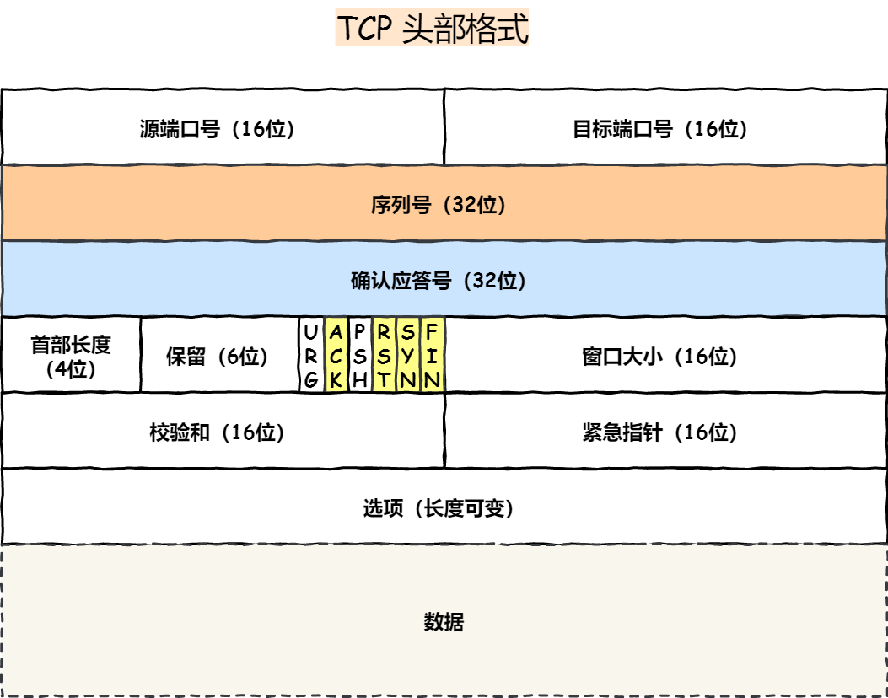

## 基础篇

### **<font color='red'>cookie 和 session区别</font>**

**会话管理**

- **Session ID**：服务器通常会生成一个唯一的会话标识符（Session ID）并将其存储在Cookie中。例如，当用户登录时，服务器生成一个Session ID并通过`Set-Cookie`头将其发送给客户端。客户端在后续请求中会将这个Session ID包含在Cookie中发送给服务器。
- **服务器存储会话数据**：服务器会将Session ID与用户的会话数据（如登录状态、购物车内容等）关联存储在服务器端的会话存储（如内存、数据库、分布式缓存等）中。
- `Cookie` 和 `Session` 可以结合使用，如将 `session ID` 存储在 `Cookie` 中，以在客户端和服务器之间维护会话。

**简单类比**：`Cookie` 就像是在用户口袋里的一张身份证，用户每次访问都会展示这张身份证，而 `Session` 则像是服务器端的档案室，服务器通过身份证号码找到用户的档案来处理请求。

**<font color='red'>万一别的客户端也发送了同样的cookie呢</font>**

**加密通信**：确保所有的通信都是加密的，使用HTTPS协议可以防止Cookie在传输过程中被拦截

**HttpOnly**：设置Cookie为HttpOnly，以防止客户端脚本（如JavaScript）访问Cookie

**使用短会话和定期刷新Session ID**

**IP地址绑定**

**<font color='red'>cookie 和 session区别</font>**

| 特性         | **Cookie**                                 | **Session**                                |
| ------------ | ------------------------------------------ | ------------------------------------------ |
| **存储位置** | 存储在客户端浏览器                         | 存储在服务器端                             |
| **大小限制** | 每个 Cookie 通常限制 4KB                   | 没有固定大小限制                           |
| **生命周期** | 可以设置过期时间（会话/长期）              | 默认在浏览器关闭时过期，或由服务器设置超时 |
| **安全性**   | 易受 XSS 和 CSRF 攻击，存储在客户端        | 安全性较高，但需保护 Session ID            |
| **性能**     | 每次请求都带 Cookie，可能增加带宽消耗      | 仅传递 Session ID，不影响性能              |
| **跨域支持** | 需要特殊配置，支持跨域 Cookie              | 支持跨域，但需要共享 Session ID            |
| **应用场景** | 适合存储用户偏好设置、登录信息等非敏感数据 | 适合存储敏感数据、用户会话信息等           |

**<font color='red'>ping命令用的什么协议，在哪一层？</font>**

**ICMP 协议**：`ping` 命令通过 ICMP 协议来发送 **Echo Request**（回显请求）消息，并接收 **Echo Reply**（回显应答）消息，用于测试网络连接的连通性和延迟。ICMP 是一种控制消息协议，主要用于网络诊断和错误报告。

**网络层协议**：ICMP 协议直接在 **IP 层**上运行，不依赖于传输层协议（如 TCP 或 UDP）。它和 IP 一样，属于网络层协议，因此不涉及端口号，直接在 IP 层承载数据包。

### **<font color='red'>TCP/IP 网络模型有哪几层？</font>**

应用层：有HTTP、FTP、Telnet、DNS等协议，工作在用户态，==消息==

传输层：UDP,TCP,报文中会携带端口号，==段==

网络层：IP 报文大小超过 MTU（以太网中一般为 1500 字节）就被被分片，==包==

链路层：链路层的网卡将数据包封装成数据帧，添加链路层头部和帧校验序列，网卡通过物理介质发送数据帧

==七层模型：==应用层、表示层、会话层、传输层、网络层、数据链路层、物理层

**<font color='purple'>以太网就是一种在「局域网」内，把附近的设备连接起来，使它们之间可以进行通讯的技术</font>**

### **<font color='red'>键入网址到网页显示，期间发生了什么？</font>**

网络通信实际上是两个进程之间进行通信，TCP是四元组，UDP也是需要端口的

通过的路径：HTTP、DNS、协议栈、TCP、IP、MAC、网卡、交换机、路由器、服务端和客户端

==HTTP：==浏览器会解析URL解析出协议、主机、端⼝、路径等信息，并构造⼀个HTTP请求

1、这里面可能用到HTTP缓存技术

2、HTTP包头格式：方法、URL、版本、首部字段名、字段值

==DNS：==解析服务器域名对应的 IP 地址

那是不是每次解析域名都要经过那么多的步骤呢？浏览器缓存、操作系统缓存、hosts 缓存、本地 DNS 服务器

==TCP：==三次握手建立连接

1、TCP 包头格式：源端口号和目标端口、序号、确认号、状态位、窗口大小

2、客户端：CLOSED->SYN-SENT->ESTABLISHED；服务器：CLOSED、LISTEN、SYN-RCVD、ESTABLISHED

==IP ：==将数据封装成网络包发送给通信对象

==MAC：==在以太网中传递消息

1、MAC 包头格式：接收方和发送方的 MAC 地址、协议类型IP/ARP

==网卡：==机器收发网络包的地方

==交换机：==

==路由器：==

- 因为路由器是基于 IP 设计的，俗称三层网络设备，路由器的各个端口都具有 MAC 地址和 IP 地址
- 而交换机是基于以太网设计的，俗称二层网络设备，交换机的端口不具有 MAC 地址

- 基本原理：和网卡类似
- 接收操作：只接收与自身地址匹配的包，遇到不匹配的包则直接丢弃
- 查询路由表确定输出端口

在网络包传输的过程中，源 IP 和目标 IP 始终是不会变的，一直变化的是 MAC 地址

- 需要 MAC 地址在以太网内进行两个设备之间的包传输
- 前提：没有使用 NAT 网络的


### **<font color='red'>Linux 系统是如何收发网络包的？</font>**

七层网络模型：应用层、表示层、会话层、传输层、网络层、数据链路层以及物理层

- Linux 接收网络包的流程

  - 通过 DMA 技术，将网络包写入到指定的内存地址Ring Buffer
  - 那应该怎么告诉操作系统这个网络包已经到达了呢？前半部分硬件中断、后半部分软中断

- Linux 发送网络包的流程

  - 应用程序会调用 Socket 发送数据包的接口

    - 申请一个内核态的 sk_buff 内存，将用户待发送的数据拷贝到 sk_buff 内存：将其加入到发送缓冲区

    - 网络协议栈从 Socket 发送缓冲区中取出 sk_buff，并按照 TCP/IP 协议栈从上到下逐层处理
    - 如果使用的是 TCP 传输协议发送数据，那么先拷贝一个新的 sk_buff 副本 

  - 发送网络数据的时候，涉及几次内存拷贝操作？

    - 用户待发送的数据拷贝到 sk_buff 内存，并将其加入到发送缓冲区
    - 在使用 TCP 传输协议的情况下，从传输层进入网络层的时候，每一个 sk_buff 都会被克隆一个新的副本出来

**<font color='red'>创建socket需要哪些函数</font>**

```cpp
int sockfd = socket(AF_INET, SOCK_STREAM, 0);//创建一个套接字
if (bind(sockfd, (struct sockaddr*)&addr, sizeof(addr)) == -1) //绑定到一个特定的IP地址和端口号
if (listen(sockfd, 10) == -1)//服务器监听
int client_sockfd = accept(sockfd, (struct sockaddr*)&client_addr, &client_addr_len);//接受

if (connect(sockfd, (struct sockaddr*)&addr, sizeof(addr)) == -1)//客户端连接
if (send(sockfd, msg, strlen(msg), 0) == -1)；//发送
int bytes_received = recv(sockfd, buffer, sizeof(buffer) - 1, 0);//接收
if (close(sockfd) == -1) //关闭套接字
```

## HTTP篇

### **<font color='red'>HTTP 是什么？</font>**

在==两点==之间==传输==文字、图片、音频、视频等==超文本==数据的==协议==

### **<font color='red'>HTTP头部格式？</font>**

请求行：==方法== 空格 ==URL== 空格 ==版本== 回车换行

消息头：==字段名== 空格 ==字段值== 回车换行

回车换行

==消息体==

### **<font color='red'>HTTP 常见的状态码有哪些？</font>**

1xx 类状态码属于提示信息：websocket切换

2xx 类状态码

「200 OK」是最常见的成功状态码

「204 No Content」也是常见的成功状态码、没有 body 数据

「206 Partial Content」是应用于 HTTP 分块下载或断点续传

3xx 类状态码

「301 Moved Permanently」表示永久重定向

「302 Found」表示临时重定向

「304 Not Modified」告诉客户端可以继续使用缓存资源，用于缓存控制

4xx 类状态码

「400 Bad Request」表示客户端请求的报文有错误

「403 Forbidden」表示服务器禁止访问资源

「404 Not Found」表示请求的资源在服务器上不存在或未找到

5xx 类状态码服务器处理时内部发生了错误

「502 Bad Gateway」服务器自身工作正常，访问后端服务器发生了错误：出现在反向代理服务器或负载均衡器

与其后端服务器之间的通信中

### **<font color='red'>HTTP 常见字段有哪些？</font>**

Host 字段：指定服务器的域名

Content-Length 字段：本次回应的数据长度

Connection 字段：最常用于客户端要求服务器使用「HTTP 长连接」机制

Content-Type 字段：告诉客户端，本次数据是什么格式

Content-Encoding 字段：数据的压缩方法

### **<font color='red'>HTTP怎么解决“粘包”的问题</font>**

设置回车符、换行符作为 HTTP header 的边界

Content-Length 字段作为 HTTP body 的边界

### **<font color='red'>GET 和 POST 有什么区别？</font>**

GET 的语义是从服务器获取指定的资源

POST 的语义是根据报文body对指定的资源做出处理

### **<font color='red'>GET 和 POST 方法都是安全和幂等的吗？</font>**

在 HTTP 协议里，所谓的「安全」是指请求方法不会「破坏」服务器上的资源

所谓的「幂等」，意思是多次执行相同的操作，结果都是「相同」的

GET 方法就是安全且幂等的、可被缓存的

POST 不安全，不幂等，（大部分实现）不可缓存

### **<font color='red'>HTTP 缓存技术</font>**

作用：避免发送 HTTP 请求

强制缓存：相对时间和绝对时间

协商缓存：与服务端协商之后，通过协商结果来判断是否使用本地缓存

响应 HTTP 304 走缓存

返回 200 状态码、返回资源

### **<font color='red'>HTTP/1.1 的优点有哪些？</font>**

==三点==

1、简单：header + body、头部信息也是 key-value

2、灵活和易于扩展

- HTTP 协议组成要求允许开发人员自定义和扩充
- HTTPS 就是在 HTTP 与 TCP 层之间增加了 SSL/TLS 安全传输层
-  HTTP/3.0 传输协议改用了 UDP 协议

3、应用广泛和跨平台

### **<font color='red'>HTTP/1.1 的缺点有哪些？</font>**

==三点==

1、无状态

- 优：服务器不会去记忆 HTTP 的状态、减轻服务器的负担
- 缺：在完成有关联性的操作时会非常麻烦
-  Cookie 技术

	- 在客户端第一次请求后，服务器会下发一个装有客户信息的「小贴纸」
	- 后续客户端请求服务器的时候，带上「小贴纸」，服务器就能认得了

2、明文传输

- 缺：Wireshark 抓包都可以直接肉眼查看
- 优：方便阅读

3、不安全

- 内容可能会被窃听
- 有可能遭遇伪装
- 有可能已遭篡改

在本地抓包并查看HTTPS流量的方法。使用私钥或中间人代理的方法可以查看加密的HTTPS流量，而浏览器开发工

具则可以直接查看已解密的HTTPS流量

### **<font color='red'>HTTP/1.1 的性能如何？</font>**

==三点==

1、长连接：只要任意一端没有明确提出断开连接，则保持 TCP 连接状态

2、管道网络传输：解决了请求的队头阻塞，但是没有解决响应的队头阻塞

3、队头阻塞：客户端一直请求不到数据，服务端在处理 A 请求时耗时⽐较⻓，那么后续的请求的处理都会被阻塞住，这称为「队头堵塞」

4、并发连接有限：并发连接数是 6 个、经过 TCP 和 TLS 握手耗时、TCP 慢启动过程

### **<font color='red'>HTTP 与 HTTPS 有哪些区别？</font>**

1、SSL/TLS 安全协议

2、SSL/TLS 的握手过程

3、80/443端口

4、申请数字证书

### **<font color='red'>HTTPS 解决了 HTTP 的哪些问题？</font>**

==窃听风险：==混合加密

在通信建立前采用非对称加密的方式交换「会话秘钥」

在通信过程中全部使用对称加密的「会话秘钥」的方式加密明文数据

==篡改风险：==摘要算法 + 数字签名

通过哈希算法来保证消息的完整性

通过数字签名来保证消息的来源可靠性：CA

==冒充风险：==数字证书

保证服务器公钥的身份

### **<font color='red'>HTTPS 是如何建立连接的？其间交互了什么？</font>**

SSL/TLS 协议基本流程

**客户端Hello**：客户端发起连接，发送支持的SSL/TLS版本、加密算法和一个随机数

**服务器Hello**：服务器响应，选择SSL/TLS版本、加密算法，并发送一个随机数和服务器证书

**证书验证**：客户端验证服务器证书的合法性。如果证书有效，继续握手过程

**会话密钥生成**：前向保密，==使用ECDHE等密钥交换算法==，客户端和服务器生成共享会话密钥。

**服务器的最后回应：**预主密钥和之前的随机数生成会话密钥

**<font color='red'>为什么需要证书链这么麻烦的流程？Root CA 为什么不直接颁发证书，而是要搞那么多中间层级呢？</font>**

确保根证书的绝对安全性，将根证书隔离地越严格越好

常用的密钥交换算法：RSA 算法，ECDHE 算法

### **<font color='red'>RSA和ECDHE 算法比较</font>**

==RSA 算法：==

不支持前向保密

一个大整数分解为两个素数的乘积的难度

==ECDHE 算法：==

椭圆曲线算法而不是大整数分解算法

ECDHE 相比 RSA 握手过程省去了一个消息往返的时间

TLS 第三次握手 = 客户端随机数 + 服务端随机数 + x（ECDHE 算法算出的共享密钥）  = 会话密钥

TLS 第四次握手 = 发「Change Cipher Spec」和「Encrypted Handshake Message」消息

### **<font color='red'>HTTPS 一定安全可靠吗？</font>**

==第一==：客户端通过浏览器向服务端发起 HTTPS 请求时，被「假基站」转发到了一个「中间人服务器」，于是客户端是和「中间人服务器」完成了 TLS 握手，然后这个「中间人服务器」再与真正的服务端完成 TLS 握手

前提是用户点击接受了中间人服务器的证书

==第二：==HTTPS 协议本身到目前为止还是没有任何漏洞的

利用了客户端的漏洞：用户点击继续访问、被恶意导入伪造的根证书

==第三：==为什么抓包工具能截取 HTTPS 数据？

工作原理与中间人一致的

==第四==：如何避免被中间人抓取数据？

HTTPS 双向认证

### **<font color='red'>怎么防止中间人攻击？</font>**

**证书验证**：当中间人将服务器证书转交给客户端时，客户端会使用服务器的公钥进行验证，并且任何篡改都会导致

验证失败

**加密通信**：客户端生成一个随机的预主密钥（pre-master secret），并使用服务器的公钥进行加密，然后发送给服务器，==中间人怎么知道这个预主密钥？==

**前向保密**：确保每次会话使用独立的会话密钥，即使长期密钥泄露也不影响之前的会话，中间人不能破解之前的通信

**握手消息的验证**：在TLS握手完成时，客户端和服务器都会生成和交换“Finished”消息，这些消息包含了之前所有握手消息的加密哈希值。如果中间人篡改了任何握手消息，最终的“Finished”消息验证将失败，握手过程将被终止。

### **<font color='red'>HTTP/1.1、HTTP/2、HTTP/3 演变</font>**

==HTTP/1.1做了什么优化？==

- 使用长连接的方式改善了 HTTP/1.0 短连接造成的性能开销
- 支持管道（pipeline）网络传输，只要第一个请求发出去了，不必等其回来，就可以发第二个请求出去，可以减少整体的响应时间

==HTTP/1.1 性能瓶颈==

- 请求 / 响应头部（Header）未经压缩就发送
- 队头阻塞：请求在服务器端被阻塞

- 服务器只能被动响应

==HTTP/2 做了什么优化？==

- 头部压缩：HPACK 算法在客户端和服务器同时维护一张头信息表
  - 静态字典
  - 动态字典
  - Huffman 编码（压缩算法）
- 二进制格式：分为头信息帧和数据帧
- 并发传输：引出了 Stream 概念，多个 Stream 复⽤在⼀条 TCP 连接，针对不同的 HTTP 请求⽤独⼀⽆⼆的 Stream ID 来区分
- 服务器主动推送资源：双方都可以建立 Stream，客户端建立的 Stream 必须是奇数号，服务器建立的 Stream 必须是偶数号

==HTTP/2 性能瓶颈==

- HTTP/2 队头阻塞在TCP层
- TCP 与 TLS 的握手时延迟：发出HTTP请求时，共计3RTT的时延才能发出请求数据
- 网络迁移需要重新连接

==HTTP/3 做了什么优化？==

- 基于 UDP 的 QUIC 协议 可以实现类似 TCP 的可靠性传输

- 无队头阻塞
- 更快的连接建立
- 连接迁移：没有用四元组的方式来“绑定”连接，而是通过「连接 ID 」来标记通信的两个端点

### **<font color='red'>头部压缩中的HPACK 算法</font>**

静态字典：⽤⻓度较⼩的索引号表示重复的字符串

动态字典：⽤⻓度较⼩的索引号表示重复的字符串

什么叫Huffman 编码（压缩算法）？

1、统计字符出现的频率

2、根据字符的频率构建哈夫曼树，其中每个叶子节点表示一个字符，其权重为字符的频率

3、从根节点到每个叶子节点的路径上，用0表示左分支，用1表示右分支，构建编码表

4、使用编码表对原始数据进行编码

5、对编码后的数据进行解码时，根据哈夫曼树，沿着树从根节点开始根据0和1逐步移动，直到达到叶子节点，即可得到原始数据

### **<font color='red'>HTTP/1.1 如何优化？</font>**

==不发请求：==缓存

==少发请求：==减少重定向、合并请求、延迟发送

==缩小请求：==有损和无损压缩、小图变大图

### **<font color='red'>UDP可以实现可靠传输吗？</font>**

HTTP3就是采用UDP实现可靠传输

第一：应用层自定义的协议，在数据包中==添加序号、确认号、重传机制==等字段，实现类似于 TCP 的可靠传输

第二：超时重传

第三：发送方在发送数据包时添加校验和字段，接收方在接收数据包时验证校验和

第四：滑动窗口

### **<font color='red'>HTTPS 如何优化？</font>**

硬件优化、协议优化、证书优化

HTTPS目的是为了通过非对称加密握手协商或者交换出对称加密密钥，最长可以花费掉 2 RTT，也就是两次来回

分析性能损耗

- TLS 协议握手过程

	- ==客户端和服务端都需要临时生成椭圆曲线公私钥==
	- 客户端验证证书时，会访问 CA 获取 CRL 或者 OCSP
	- 双方计算 Pre-Master

- 握手后的对称加密报文传输，性能消耗可以说非常地小


### **<font color='red'>既然有 HTTP 协议，为什么还要有 RPC？</font>**

 TCP ：有粘包问题，需要自定义的规则，用于区分消息边界

用途：web和远程调用

RPC，定制化程度更高，可以采用体积更小的 Protobuf 或其他序列化协议去保存结构体数据

也不需要像 HTTP 那样考虑各种浏览器行为，比如 302 重定向跳转啥的

### **<font color='red'>为什么TCP会有粘包问题？</font>**

**发送方的发送缓冲区**：如果应用程序发送数据的速率快于网络传输的速率，TCP可能会合并多个小的写操作成一个较大的TCP段一起发送，从而导致多个数据包粘在一起发送到接收方。

**接收方的接收缓冲区**：如果接收方应用程序的读取速度慢于TCP接收数据的速度，TCP可能会将多个TCP段合并成一个数据块交给应用程序，从而产生数据粘包现象。

**网络因素**：TCP段可能会因为路由不同、延迟、拥塞等因素而在发送和接收端之间以不同的顺序或时间到达。

### **<font color='red'>为什么UDP不会有粘包问题，在服务端和客户端是怎么体现的</font>**

UDP不会出现“粘包”问题，主要是因为它是面向报文的协议，传输的是一个个独立的数据报（Datagram），而不是像TCP那样的流式传输。

**发送方**（客户端或服务端）：每次调用`sendto()`或`send()`函数发送的数据即为一个完整的数据报，系统会保留该数据的边界，作为一个独立的包发送出去。

**接收方**（客户端或服务端）：每次调用`recvfrom()`或`recv()`函数时，接收的都是一个完整的UDP数据报，若接收缓冲区不足以容纳数据报，剩余部分会被丢弃，而不会分割或拼接到下一个数据报中。

流量控制、拥塞控制

### **<font color='red'>那TCP为什么要设计成基于字节流</font>**

**传输控制和流量控制**：通过字节流模式，TCP能够更精确地管理和调整数据的传输速率，避免过度发送导致网络拥塞和丢包问题。

**灵活性和通用性**：TCP能够处理各种不同大小和类型的数据

**效率和性能**：字节流模式可以利用操作系统提供的优化技术，如零拷贝（zero-copy）技术和缓冲区重用，从而显著提升数据传输的性能和效率。

**解决办法：**

消息边界标记、固定长度消息、消息长度字段

### **<font color='red'>既然有 HTTP 协议，为什么还要有 WebSocket？</font>**

点一下网页上的某个按钮，前端发一次 HTTP请求，网站返回一次 HTTP 响应

==使用 HTTP 不断轮询==

- 痛点：怎么样才能在用户不做任何操作的情况下，网页能收到消息并发生变更

- 网页的前端代码里不断定时发 HTTP 请求到服务器，服务器收到请求后给客户端响应消息

- 「伪」服务器推的形式

- 应用场景：扫码登录

==长轮询==

- 如果我们的 HTTP 请求将超时设置的很大

- 在这 30 秒内只要服务器收到了扫码请求，就立马返回给客户端网页。如果超时，那就立马发起下一次请求

- 应用场景：百度网盘

- 发起一个请求，在较长时间内等待服务器响应的机制，就是所谓的长训轮机制

==怎么建立WebSocket连接==

浏览器在 TCP 三次握手建立连接之后，都统一使用 HTTP 协议先进行一次通信

如果此时是普通的 HTTP 请求，那后续双方就还是老样子继续用普通 HTTP 协议进行交互，这点没啥疑问

如果这时候是想建立 WebSocket 连接，就会在 HTTP 请求里带上一些特殊的header 头

==WebSocket的消息格式==

因为 TCP 协议本身就是全双工，但直接使用纯裸TCP去传输数据，会有粘包的"问题"

上层协议一般会用消息头+消息体的格式去重新包装要发的数据

**<font color='blue'>消息头里一般含有消息体的长度，通过这个长度可以去截取真正的消息体</font>**

HTTP 协议和大部分 RPC 协议，以及我们今天介绍的WebSocket协议，都是这样设计的

### **<font color='red'>HTTP进行TCP连接后什么情况下会断开连接？</font>**

第一：客户端或服务端执行close函数

第二：发送方重传次数达到上限

第三：HTTP长连接到期

### **<font color='red'>HTTP、Socket、TCP区别？</font>**

第一：应用层协议，规定了服务器和客户端通信规则

第二：提供了网络通信的接口，连接建立后往文件描述符写

第三：传输层协议，实现可靠传输

## IP篇

### **<font color='red'>什么叫IP？</font>**

网络层：实现主机与主机之间的通信

### **<font color='red'>网络层与数据链路层有什么关系呢？</font>**

MAC 的作用则是实现「直连」的两个设备之间通信，而 IP 则负责在「没有直连」的两个网络之间进行通信传输

源IP地址和目标IP地址在传输过程中是不会变化的（前提：没有使用 NAT 网络），只有源 MAC 地址和目标 MAC 一直在变化

### **<font color='red'>什么是 A、B、C 类地址？</font>**

通过前几位是0和1来判断是哪类地址

### **<font color='red'>IP 分片与重组</font>**

以太网的 MTU 是 1500 字节

TCP 引入了 MSS 也就是在 TCP 层进行分片不由 IP 层分片，提高重传效率

对于 UDP 我们尽量不要发送一个大于 MTU 的数据报文

### **<font color='red'>DNS 域名解析</font>**

递归查询和迭代查询，弱一致性

### **<font color='red'>ARP和RARP</font>**

确定了源 IP 地址和目标 IP 地址后，就会通过主机「路由表」确定 IP 数据包下一跳

允许主机在不知道目标主机的MAC地址时，通过广播请求来获取目标主机的MAC地址

### **<font color='red'>DHCP</font>**

DHCP使得设备能够快速、自动地获取到IP地址和其他网络配置信息

### **<font color='red'>NAT</font>**

把私有 IP 地址转换成公有 IP 地址

### **<font color='red'>NAT 那么牛逼，难道就没缺点了吗？</font>**

- 外部无法主动与 NAT 内部服务器建立连接，因为 NAPT 转换表没有转换记录

- 转换表的生成与转换操作都会产生性能开销

- 通信过程中，如果 NAT 路由器重启了，所有的 TCP 连接都将被重置

### **<font color='red'>如何解决 NAT 潜在的问题呢？</font>**

改用 IPv6

NAT 穿透技术

### **<font color='red'>ICMP</font>**

- 互联网控制报文协议
- ICMP 功能都有啥？

	- 确认 IP 包是否成功送达目标地址
	- 报告发送过程中 IP 包被废弃的原因
	- 改善网络设置

- ICMP 类型

	- 用于诊断的查询消息，也就是「查询报文类型」
	- 通知出错原因的错误消息，也就是「差错报文类型」

### **<font color='red'>断网了，还能 ping 通 127.0.0.1 吗？</font>**

ping：某个IP某个IP地址发个消息

拔了网线：ping 127.0.0.1 是能ping通的

为什么当你发现怀疑网络有问题的时候，别人第一时间是问你能ping通吗？

- 因为可以简单理解为ping就是自己组了个数据包，让系统按着其他软件发送数据的路径往外发一遍，能通的话说明其他软件发的数据也能通

为什么断网了还能 ping 通 127.0.0.1

- 当发现目标IP是外网IP时，会从"真网卡"发出
- 当发现目标IP是回环地址时，就会选择本地网卡

## TCP篇

### TCP基本知识

#### **<font color='red'>TCP 头格式有哪些？</font>** 

**固定20字节你算算**：端口号、序列号/确认应答32位、4个控制位 



**<font color='red'>没有 accept，listen，能建立 TCP 连接吗？</font>**

可以的。TCP协议的连接建立通常需要服务端调用`listen`和`accept`来监听和接受连接请求。但在一些特殊情况下，如服务端作为客户端的一部分主动发起连接，或者服务端不需要持久的连接状态，这时候就不需要调用`listen`和`accept`函数来建立TCP连接。

**<font color='red'>accept 发生在三次握手的哪一步？</font>**

客户端 connect 成功返回是在第二次握手，服务端 accept 成功返回是在三次握手成功之后

**<font color='red'>TCP 快速建立连接</font>**

- 发起 HTTP GET 请求时，一个完整的交互过程，需要 2.5 个 RTT 的时延，如果在第三次握手发起 HTTP GET 请求，需要 2 个 RTT 的时延
- 解决方案：服务端在第二次握手产生一个 Cookie （已加密）并通过 SYN、ACK 包一起发给客户端

#### **<font color='red'>TCP Keepalive 和 HTTP Keep-Alive 是一个东西吗？</font>**

HTTP 的 Keep-Alive

- 由应用层（用户态） 实现的，称为 HTTP 长连接
- HTTP 流水线：客户端可以先一次性发送多个请求，而在发送过程中不需先等待服务器的回应，收不到服务器响应会发生队头阻塞

- web 服务软件一般都会提供 keepalive_timeout 参数：定时器的时间一到，就会触发回调函数来释放该连接


TCP 的 Keepalive

- 由 TCP 层（内核态） 实现的，称为 TCP 保活机制
- 应用程序若想使用 TCP 保活机制需要通过 socket 接口设置 SO_KEEPALIVE 选项才能够生效

####  **<font color='red'>HTTPS 中 TLS 和 TCP 能同时握手吗？</font>**

- 一般情况下，不管 TLS 握手次数如何，都得先经过 TCP 三次握手后才能进行
- HTTPS 中的 TLS 握手过程可以同时进行三次握手

  - 客户端和服务端都开启了 TCP Fast Open 功能，且 TLS 版本是 1.3
  - 客户端和服务端已经完成过一次通信

- TCP Fast Open

  - 在完成首次通信过程后，后续客户端与服务端 的通信则可以绕过三次握手发送数据，这就减少了握手带来的 1 个 RTT 的时间消耗

- TLSv1.3：TLS 过程只需要 1-RTT


#### **<font color='red'>TCP 协议有什么缺陷？</font>**

- 升级 TCP 的工作很困难
- TCP 建立连接的延迟

  - 被 TCP Fast Open （快速打开）这个特性解决了
  - TLS 是无法对 TCP 头部加密的，这意味着 TCP 的序列号都是明文传输，所以就存安全的问题：攻击者伪造一个的 RST 报文强制关闭一条 TCP 连接，而攻击成功的关键则是 TCP 字段里的序列号位于接收方的滑动窗口内

- TCP 存在队头阻塞问题：TCP 层必须保证收到的字节数据是完整且有序的

- 网络迁移需要重新建立 TCP 连接：网络从 4G 切换到 WIFI 时


#### **<font color='red'>用了 TCP 协议，数据一定不会丢吗？</font>**

TCP只保证传输层的消息可靠性，并不保证应用层的消息可靠性。如果我们还想保证应用层的消息可靠性，就需要应用层自己去实现逻辑做保证。

#### **<font color='red'>TCP怎么保证每次收到的包是完整的</font>**

==序列号，确认序列号，超时重传，流量控制，拥塞控制，校验和==、三次握手四次挥手

**校验和**：每个TCP段都包含一个校验和字段，发送方在发送数据前计算校验和，接收方在接收到数据后进行校验。

如果校验和不匹配，说明数据在传输过程中出现错误，接收方会丢弃该数据段，发送方将重传。

**<font color='red'>TCP三次握手中第几次可以带数据？</font>**

第一次和第二次是不可以携带数据的，但是第三次是可以携带数据的

假如第一次握手可以携带数据的话，那对于服务器是不是太危险了，有人如果恶意攻击服务器，每次都在第一次握手中的SYN报文中放入大量数据。而且频繁重复发SYN报文，服务器会花费很多的时间和内存空间去接收这些报文。 第三次握手，此时客户端已经处于ESTABLISHED状态。对于客户端来说，他已经建立起连接了，并且已经知道服务器的接收和发送能力是正常的。所以也就可以携带数据了。

#### **<font color='red'>什么是 TCP ？</font>**

面向连接的：一定是「一对一」才能连接

可靠的：一个报文一定能够到达接收端

基于字节流：没有边界

#### **<font color='red'>UDP 和 TCP 有什么区别呢？分别的应用场景是？</font>**

TCP 和 UDP 区别

- 面向连接，可靠，字节流

- 拥塞控制、流量控制
- 首部开销： TCP最少20 个字节，UDP8个字节固定
- 分片不同：TCP 的数据大小如果大于 MSS 大小，传输层分片；UDP 的数据大小如果大于 MTU 大小，IP层分片
-  应用场景：
  - UDP：视频、音频等多媒体通信，广播通信，DNS
  - TCP：文件传输

#### **<font color='red'>如何理解是 TCP 面向字节流协议？</font>**

为什么 UDP 是面向报文的协议？操作系统不会拆分它，到接收端也能组成唯一的一个UDP报文：IP层拆分

为什么 TCP 是面向字节流的协议？

- 数据被视为连续的字节流，而不是分割成消息或数据包
- 当我们调用 send 函数完成数据“发送”以后，数据并没有被真正从网络上发送出去，只是从应用程序拷贝到了操作系统内核协议栈中
- 什么时候真正被发送，取决于发送窗口、拥塞窗口以及当前发送缓冲区的大小等条件

#### **<font color='red'>三次握手和四次握手会处于哪些状态</font>**

三次握手：syn-sent，listen，syn-received
四次挥手：fin-wait-1，fin-wait-2，time-wait，close-wait，last-ack

### **<font color='red'>UDP为什么可以一对多，TCP为什么只能一对一</font>**

**UDP**由于是无连接的，数据传输时不需要建立连接，可以轻松地发送数据到多个目标，因此可以实现**一对多**的通信，如广播和组播

**TCP**需要建立一个面向连接的双向通信管道，通信双方有固定的连接状态，因此只能实现**一对一**的可靠通信

### TCP 连接建立

**<font color='red'>TCP 三次握手过程是怎样的？</font>**

确保双方都能进行==可靠的消息传递==和==同步序列号==

SYN

SYN+ACK

ACK

第三次握手是可以携带数据的，前两次握手是不可以携带数据的

**<font color='red'>为什么是三次握手？不是两次、四次？</font>**

重要的是为什么三次握手才可以==初始化 Socket、序列号和窗口大小==并建立 TCP 连接

==原因一：==避免历史连接

三次握手的首要原因是为了防止旧的重复连接初始化造成混乱

那为什么 TCP 两次握手为什么无法阻止历史连接呢？

在两次握手的情况下，服务端没有中间状态给客户端来阻止历史连接，导致服务端可能建立一个历史连接，造成资源浪费

下述中的「旧 SYN 报文」称为历史连接：

- 一个「旧 SYN 报文」比「最新的 SYN」 报文早到达了服务端，那么此时服务端就会回一个 `SYN + ACK` 报文给客户端，此报文中的确认号是 91（90+1）。
- 客户端收到后，发现自己期望收到的确认号应该是 100 + 1，而不是 90 + 1，于是就会回 RST 报文。
- 服务端收到 RST 报文后，就会释放连接。
- 后续最新的 SYN 抵达了服务端后，客户端与服务端就可以正常的完成三次握手了。

==原因二：==同步双方初始序列号

两次握手只保证了一方的初始序列号能被对方成功接收，没办法保证双方的初始序列号都能被确认接收。

四次握手可以优化成三次握手

==原因三：==避免资源浪费

两次握手会造成消息滞留情况下，服务端重复接受无用的连接请求 SYN 报文，而造成重复分配资源

**<font color='blue'>不可靠就会导致历史连接和资源浪费</font>**

**<font color='red'>第三次握手的ack丢了，但是客户端数据已经发出去了？</font>**

数据报文中是有第三次握手的 ACK标识位

**<font color='red'>为什么每次建立 TCP 连接时，初始化的序列号都要求不一样呢？</font>**

很容易出现历史报文被下一个相同四元组的连接接收的问题

TCP 四次挥手中的 TIME_WAIT 状态不是会持续 2 MSL 时长，历史报文不是早就在网络中消失了吗？

我们并不能保证每次连接都能通过四次挥手来正常关闭连接

**<font color='purple'>解决办法：</font>**随机初始序列+时间戳

**<font color='red'>既然 IP 层会分片，为什么 TCP 层还需要 MSS 呢？</font>**

如果一个 TCP 分片丢失后，进行重发时也是以 MSS 为单位，而不用重传所有的分片，大大增加了重传的效率

#### **<font color='red'>TCP连接的约束</font>**

源地址、源端口、目的地址、目的端口

文件描述符限制：系统级别，用户级别，进程级别

内存限制

#### **<font color='red'>没有 accept，能建立 TCP 连接吗？</font>**

- 就算不执行accept()方法，三次握手照常进行，并顺利建立连接。
- 在服务端执行accept()前，如果客户端发送消息给服务端，服务端是能够正常回复ack确认包的。
- 服务端正常执行accept()，客户端前面发送的消息，还是能正常收到的。


### **<font color='red'>全连接队列满了会怎么样？</font>**

- tcp_abort_on_overflow设置为 0

  - 全连接队列满了之后，会丢弃这个第三次握手ACK包，并且开启定时器，重传第二次握手的SYN+ACK，如果重传超过一定限制次数，还会把对应的半连接队列里的连接给删掉。

- tcp_abort_on_overflow设置为 1

  - 全连接队列满了之后，就直接发RST给客户端，效果上看就是连接断了。
  - 客户端这时候收到RST之后，其实无法区分到底是端口未监听，还是全连接队列满了

### **<font color='red'>半连接队列要是满了会怎么样</font>**

- 一般是丢弃，但这个行为可以通过 tcp_syncookies 参数去控制
- tcp_syncookies

  - cookies并不会有一个专门的队列保存
  - 保存在TCP报头的seq里


#### **<font color='red'>服务端没有 listen，客户端发起连接建立，会发生什么？</font>**

- 服务端如果只 bind 了 IP 地址和端口，而没有调用 listen 的话，然后客户端对服务端发起了连接建立，服务端会回 RST 报文
- 不使用 listen ，可以建立 TCP 连接吗？

  - 是可以的，客户端是可以自己连自己的形成连接（TCP自连接），也可以两个客户端同时向对方发出请求建立连接（TCP同时打开），这两个情况都有个共同点，就是没有服务端参与，也就是没有listen，就能建立连接。

- 那没有listen，为什么还能建立连接？

  - 在 TCP 自连接的情况中，客户端在 connect 方法时，最后会将自己的连接信息放入到这个全局 hash 表中，然后将信息发出，消息在经过回环地址重新回到 TCP 传输层的时候，就会根据 IP + 端口信息，再一次从这个全局 hash 中取出信息。于是握手包一来一回，最后成功建立连接。

#### **<font color='red'>什么是 SYN 攻击？如何避免 SYN 攻击？</font>**

在 TCP 三次握手的时候，Linux 内核会维护两个队列，分别是：

- 全连接队列，也称 accept 队列
- 半连接队列，也称 SYN 队列

避免 SYN 攻击方式

- 增大 TCP 半连接队列和全连接队列
- 减少 SYN+ACK 重传次数
- 开启 tcp_syncookies

### TCP连接传输 

#### **<font color='red'>重传机制</font>**

可以分为超时重传和快速重传

- 超时重传：没有收到对方的 ACK 确认应答报文，就会重发该数据；通过测量数据包往返的时间来估计网络延迟，并根据历史观察值计算超时时间

- 快速重传：
  - 当收到三个相同的 ACK 报文时，立马重传
  - 问题：重传一个，还是重传所有的问题
- SACK 方法：可以将已收到的数据的信息发送给「发送方」

- Duplicate SACK：使用了 SACK 来告诉「发送方」有哪些数据被重复接收

#### **<font color='red'>滑动窗口</font>**

- 窗口大小就是指无需等待确认应答，而可以继续发送数据的最大值
- 窗口大小由哪一方决定？

  - 接收方的窗口大小来决定的

- 接收窗口和发送窗口的大小是相等的吗？

  - 约等于

#### **<font color='red'>流量控制</font>**

- 目的：TCP 提供一种机制可以让「发送方」根据「接收方」的实际接收能力控制发送的数据量
- 窗口变小

  - 应用程序没有及时读取缓存时，发送窗口和接收窗口的变化
  - 当服务端系统资源非常紧张的时候，操作系统可能会直接减少了接收缓冲区大小：丢包
- 窗口关闭

  - 如果窗口大小为 0 时，就会阻止发送方给接收方传递数据
  - TCP 是如何解决窗口关闭时，潜在的死锁现象呢？

    - 只要 TCP 连接一方收到对方的零窗口通知，就启动持续计时器
- 糊涂窗口综合症

  - 怎么让接收方不通告小窗口呢？「窗口大小」小于 min( MSS，缓存空间/2 ) 

- 怎么让发送方避免发送小数据呢？

  - Nagle 算法

    - 要等到窗口大小 >= MSS 并且 数据大小 >= MSS
    - 收到之前发送数据的 ack 回包
  - telnet 或 ssh 这样的交互性比较强的程序，则需要关闭 Nagle 算法

**<font color='red'>TCP 延迟确认与 Nagle 算法</font>**

- Nagle 算法是如何避免大量 TCP 小数据报文的传输？

  - 要等到窗口大小 >= MSS 并且 数据大小 >= MSS
  - 收到之前发送数据的 ack 回包
  - Nagle 算法一定会有一个小报文，也就是在最开始的时候

- 那延迟确认又是什么？

  - 当有响应数据要发送时，ACK 会随着响应数据一起立刻发送给对方
  - 当没有响应数据要发送时，ACK 将会延迟一段时间，以等待是否有响应数据可以一起发送
  - 如果在延迟等待发送 ACK 期间，对方的第二个数据报文又到达了，这时就会立刻发送 ACK

#### **<font color='red'>拥塞控制</font>**

- 什么是拥塞窗口？和发送窗口有什么关系呢？

  - 拥塞窗口 cwnd是发送方维护的一个的状态变量，它会根据网络的拥塞程度动态变化的
  - 发送窗口的值是swnd = min(cwnd, rwnd)

- 那么怎么知道当前网络是否出现了拥塞呢？发生了超时重传，就会认为网络出现了拥塞

- 拥塞控制有哪些控制算法？

  - 慢启动

    - 当发送方每收到一个 ACK，拥塞窗口 cwnd 的大小就会加 1

  - 拥塞避免算法

    - 当拥塞窗口 cwnd 「超过」慢启动门限 ssthresh 

      - ssthresh 的大小是 65535 字节
      - 每当收到一个 ACK 时，cwnd 增加 1/cwnd

  - 拥塞发生

    - 发生超时重传的拥塞发生算法

      - ssthresh 设为 cwnd/2
      - cwnd 重置为 初始值
- 发生快速重传的拥塞发生算法
  
  - cwnd = cwnd/2 ，也就是设置为原来的一半
      - ssthresh = cwnd
      - 进入快速恢复算法
    - 快速恢复
      - cwnd = ssthresh + 3
      - 重传丢失的数据包

### TCP连接断开

#### **<font color='red'>TCP 四次挥手，可以变成三次吗？</font>**

- 为什么 TCP 挥手需要四次呢？

  - 服务端应用程序可能还有数据要发送，所以并不能马上发送 FIN 报文，而是将发送 FIN 报文的控制权交给服务端应用程序
  - FIN 报文一定得调用关闭连接的函数，才会发送吗？

    - 如果进程退出了，不管是不是正常退出，还是异常退出（如进程崩溃），内核都会发送 FIN 报文，与对方完成四次挥手。

  - 粗暴关闭 vs 优雅关闭

    - close 函数：socket 关闭发送方向和读取方向

    - shutdown 函数

      - 只关闭发送方向而不关闭读取方向

        - 如果有多进程/多线程共享同一个 socket，shutdown 则不管引用计数，直接使得该 socket 不可用

  - 当服务端收到 RST 后，内核就会释放连接，当服务端应用程序再次发起读操作或者写操作时，就能感知到连接已经被释放了

    - 如果是读操作，则会返回 RST 的报错，也就是我们常见的Connection reset by peer。
    - 如果是写操作，那么程序会产生 SIGPIPE 信号，应用层代码可以捕获并处理信号，如果不处理，则默认情况下进程会终止，异常退出。


**<font color='red'>什么情况会出现三次挥手？</font>**

- 「没有数据要发送」并且「开启了 TCP 延迟确认机制」，那么第二和第三次挥手就会合并传输，这样就出现了三次挥手。

**<font color='red'>TCP 四次挥手过程是怎样的？</font>**

每个方向都需要一个 FIN 和一个 ACK，因此通常被称为四次挥手

需要注意是：主动关闭连接的，才有 TIME_WAIT 状态

**<font color='red'>为什么挥手需要四次？</font>**

主动挥手的说自己不发了，但还能收

被动挥手需要等待完成数据的发送和处理

#### **<font color='red'>为什么 TIME_WAIT 等待的时间是 2MSL？</font>**

- MSL 是 Maximum Segment Lifetime，报文最大生存时间
- IP 头的 TTL 字段：当此值为 0 则数据报将被丢弃，同时发送 ICMP 报文通知源主机

- MSL 的单位是时间、TTL 是经过路由跳数
- 一来一回需要等待 2 倍的时间：网络中可能存在来自发送方的数据包，当这些发送方的数据包被接收方处理后又会向对方发送响应

- 2MSL 的时间是从客户端接收到 FIN 后发送 ACK 开始计时的
- Linux 系统停留在 TIME_WAIT 的时间为固定的 60 秒

**<font color='red'>为什么需要 TIME_WAIT 状态？</font>**

- 防止历史连接中的数据，被后面相同四元组的连接错误的接收

- 保证「被动关闭连接」的一方，能被正确的关闭：客户端必须等待足够长的时间，确保服务端能够收到 ACK


**<font color='red'>TIME_WAIT 过多有什么危害？</font>**

- 客户端（主动发起关闭连接方）的 TIME_WAIT 状态过多

	- 端口资源限制
	- 无法对「目的 IP+ 目的 PORT」都一样的服务端发起连接

- 服务端（主动发起关闭连接方）的 TIME_WAIT 状态过多

	- 占用系统资源，比如文件描述符、内存资源、CPU 资源、线程资源等

**<font color='red'>如何优化 TIME_WAIT？</font>**

- net.ipv4.tcp_tw_reuse 和 tcp_timestamps
- net.ipv4.tcp_max_tw_buckets
- 程序中使用 SO_LINGER
- TIME_WAIT 是我们的朋友，它是有助于我们的
- 服务端要避免过多的 TIME_WAIT 状态的连接，就永远不要主动断开连接，让客户端去断开，由分布在各处的客户端去承受 TIME_WAIT

**<font color='red'>服务器出现大量 TIME_WAIT 状态的原因有哪些？</font>**

- HTTP 没有使用长连接

	- 排查下是否客户端和服务端都开启了 HTTP Keep-Alive
	- 只要一方不开，服务端主动关闭连接

- HTTP 长连接超时

	- nginx 提供的 keepalive_timeout 参数

- HTTP 长连接的请求数量达到上限

	- 一条 HTTP 长连接上最大能处理的请求数量
	- 调大 nginx 的 keepalive_requests 参数

### **<font color='red'>time_wait和close_wait的区别是什么</font>**

**`TIME_WAIT` 状态**

- **出现时机**：当 **主动关闭** TCP 连接的一方（通常是客户端）发送了最后一个 `FIN` 报文后，进入 `TIME_WAIT` 状态。
- 作用：
  - 确保对方收到了最后的 `ACK`，防止对方没有收到 `ACK` 而重新发送 `FIN`。
  - 允许旧的 TCP 连接中的延迟数据包在网络中完全消失，防止与新连接的数据混淆。
- **持续时间**：通常会持续 2 倍的最大报文生存时间（**2MSL**，一般约为 1-4 分钟）。
- **特征**：此状态由 **主动关闭连接** 的一方进入，表示正在等待所有分段包完全消失并保证连接安全关闭。

------

**`CLOSE_WAIT` 状态**

- **出现时机**：当 **被动关闭** 的一方（通常是服务器）接收到对方的 `FIN` 报文后，进入 `CLOSE_WAIT` 状态。
- 作用：
  - 表示被动方已经收到连接关闭的请求，正在准备关闭连接。
  - 系统等待应用程序调用 `close()`，以便继续完成连接的关闭。
- **持续时间**：依赖于应用程序何时调用 `close()` 来关闭连接，如果应用程序迟迟不调用，`CLOSE_WAIT` 可能会持续很长时间，甚至导致资源耗尽。
- **特征**：此状态由 **被动关闭连接** 的一方进入，表示正在等待应用层程序完成关闭操作。

**<font color='red'>服务器出现大量 CLOSE_WAIT 状态的原因有哪些？</font>**

- CLOSE_WAIT 状态是「被动关闭方」才会有的状态
- 说明服务端的程序没有调用 close 函数关闭连接
- 通常都是代码的问题，这时候我们需要针对具体的代码一步一步的进行排查和定位，主要分析的方向就是服务端为什么没有调用 close

**<font color='red'>如果已经建立了连接，但是客户端突然出现故障了怎么办？</font>**

- 保活机制

	- 最少需要经过 2 小时 11 分 15 秒才可以发现一个「死亡」连接

- 如果已经建立了连接，但是服务端的进程崩溃会发生什么？

	- 即使服务端的进程退出了，还是能与客户端完成 TCP 四次挥手的过程

**<font color='red'>那如果客户端不发送数据，什么时候才会断开处于 ESTABLISHED 状态的连接？</font>**

TCP 的 保活机制：最少需要经过 2 小时 11 分 15 秒才可以发现一个「死亡」连接

### TCP异常处理

#### **<font color='red'>第一次握手丢失了，会发生什么？</font>**

客户端的 SYN 报文最大重传次数一般是5，每次超时的时间是上一次的 2 倍

#### **<font color='red'>第二次握手丢失了，会发生什么？</font>**

客户端会重传 SYN 报文，也就是第一次握手；服务端会重传 SYN-ACK 报文，也就是第二次握手

#### **<font color='red'>第三次握手丢失了，会发生什么？</font>**

ACK 报文是不会有重传的，当 ACK 丢失了，就由对方重传对应的报文

**<font color='red'>客户端发送三次握手（ack 报文）后就可以发送数据了，而被动方此时还是 syn_received 状态，如果 ack 丢了，那客户端发的数据是不是也白白浪费了？</font>**

因为数据报文中是有 ack 标识位，也有确认号，这个确认号就是确认收到了第二次握手

**<font color='red'>第一次挥手丢失了，会发生什么？</font>**

- 客户端：超过重传次数、直接关闭连接

**<font color='red'>第二次挥手丢失了，会发生什么？</font>**

- 客户端：超过重传次数、直接关闭连接

- 服务端：确认、CLOSE_WAIT

**<font color='red'>第三次挥手丢失了，会发生什么？</font>**

- 客户端：FIN_WAIT_2 时间一到就close
- 服务端：确认、CLOSE_WAIT、LAST_ACK(重传)、close

**<font color='red'>第四次挥手丢失了，会发生什么？</font>**

- 客户端：确认、FIN_WAIT_1、FIN_WAIT_2、TIME_WAIT(不停的重置为2MSL)

- 服务端：确认、CLOSE_WAIT、LAST_ACK(重传)、close

#### SYN 报文什么时候情况下会被丢弃？

==坑爹的 tcp_tw_recycle==

快速回收TIME_WAIT 状态

- net.ipv4.tcp_tw_reuse：TIME_WAIT 状态持续的时间超过了 1 秒，重用连接

- net.ipv4.tcp_tw_recycle：允许处于 TIME_WAIT 状态的连接被快速回收


tcp_tw_recycle 在使用了 NAT 的网络下是存在问题的

- per-host 是对「对端 IP 做 PAWS 检查」，导致时间戳不满足的syn被丢弃

==accpet 队列满了==

- 半连接队列满了：开启了syncookies 功能、增大半连接队列、减少 SYN+ACK 重传次数

- 全连接队列满了、调大 accpet 队列的最大长度（backlog 、somaxconn)、检查系统或者代码为什么调用 accept() 不及时


#### 已建立连接的TCP，收到SYN会发生什么？

==客户端的 SYN 报文里的端口号与历史连接不相同==：通过三次握手来建立新的连接

==客户端的 SYN 报文里的端口号与历史连接相同==

- 服务端会回复一个携带了正确序列号和确认号的 ACK 报文，这个 ACK 被称之为 Challenge ACK
- 客户端就会回 RST 报文，服务端收到后，就会释放掉该连接

==如何关闭一个 TCP 连接？==

- 伪造一个能关闭 TCP 连接的 RST 报文：满足「四元组相同」、「序列号是对方期望的」

- killcx 的工具

  - 可以伪造一个四元组相同的 SYN 报文，来拿到“合法”的序列号，无论 TCP 连接是否活跃，都可以关闭

- tcpkill 的工具

  - 在双方进行 TCP 通信时，拿到对方下一次期望收到的序列号，无法关闭非活跃的 TCP 连接

#### 四次挥手中收到乱序的 FIN 包会如何处理？

- 在 FIN_WAIT_2 状态时，如果收到乱序的 FIN 报文，那么就被会加入到「乱序队列」，并不会进入到 TIME_WAIT 状态
- 等再次收到前面被网络延迟的数据包时，会判断乱序队列有没有数据，然后会检测乱序队列中是否有可用的数据
- 如果能在乱序队列中找到与当前报文的序列号保持的顺序的报文，就会看该报文是否有 FIN 标志，如果发现有 FIN 标志，这时才会进入 TIME_WAIT 状态

#### 在 TIME_WAIT 状态的 TCP 连接，收到 SYN 后会发生什么？

- 关键是要看 SYN 的「序列号和时间戳」是否合法
- 什么是「合法」的 SYN？

  - 序列号和时间戳递增

- 收到合法 SYN

  - 就会重用此四元组连接，跳过 2MSL 而转变为 SYN_RECV 状态，接着就能进行建立连接过程

- 收到非法的 SYN

  - 再回复一个第四次挥手的 ACK 报文
  - 客户端收到后，发现并不是自己期望收到确认号（ack num），就回 RST 报文给服务端

- 在 TIME_WAIT 状态，收到 RST 会断开连接吗？

  - 关键看 net.ipv4.tcp_rfc1337 这个内核参数

#### TCP 连接，一端断电和进程崩溃有什么区别？

无数据传输

- 一端断电

	- 客户端主机崩溃了，服务端是无法感知到的
	- 在加上服务端没有开启 TCP keepalive，又没有数据交互的情况下，服务端的 TCP 连接将会一直处于 ESTABLISHED 连接状态，直到服务端重启进程

- 进程崩溃

  - 当客户端进程崩溃时，通常不会发生完整的四次挥手。连接关闭过程要么通过客户端发送FIN包开始，但

    无法完整进行；要么通过服务器检测到连接超时或Keep-Alive探测失败来强制关闭。


有数据传输

- 客户端主机宕机，又迅速重启

  - 只要有一方重启完成后，收到之前 TCP 连接的报文，都会回复 RST 报文，以断开连接，客户端主机重启后，之前的 TCP 连接的数据结构已经丢失了

- 客户端主机宕机，一直没有重启

	- 服务端的 TCP 连接就会断开

#### 拔掉网线后， 原本的 TCP 连接还存在吗？

拔掉网线这个动作并不会影响 TCP 连接的状态

拔掉网线后，有数据传输

- 如果在服务端重传报文的过程中，客户端刚好把网线插回去了

	- 什么事情都没发生

- 如果如果在服务端重传报文的过程中，客户端一直没有将网线插回去

	- 断开连接
	- 那 TCP 的数据报文具体重传几次呢？

		-  tcp_retries2 15次
		-  timeout

拔掉网线后，没有数据传输

- 没有开启 TCP keepalive 机制

	- TCP 连接将会一直保持存在

- 开启了 TCP keepalive 机制

	- 确定对方的 TCP 连接是否存活

- TCP keepalive 机制

	- net.ipv4.tcp_keepalive_time=7200（2小时）
	- net.ipv4.tcp_keepalive_intvl=75  
	- net.ipv4.tcp_keepalive_probes=9

- TCP keepalive 机制探测的时间也太长了吧？

	- 我们应用层可以自己实现一套探测机制，可以在较短的时间内，探测到对方是否存活

#### tcp_tw_reuse 为什么默认是关闭的？

==其实这题在变相问「如果 TIME_WAIT 状态持续时间过短或者没有，会有什么问题？」==

- 什么是 TIME_WAIT 状态？

	- TIME_WAIT 是「主动关闭方」断开连接时的最后一个状态，该状态会持续 *2MSL(Maximum Segment Lifetime)* 时长，之后进入CLOSED 状态。

- 为什么要设计 TIME_WAIT 状态？

	- 防止历史连接中的数据，被后面相同四元组的连接错误的接收；
	- 保证「被动关闭连接」的一方，能被正确的关闭；

- tcp_tw_reuse 是什么？

	- 如果客户端（主动关闭连接方）的 TIME_WAIT 状态过多，占满了所有端口资源，那么就无法对「目的 IP+ 目的 PORT」都一样的服务器发起连接了
	- 快速回收处于 TIME_WAIT 状态

		- net.ipv4.tcp_tw_reuse
		- net.ipv4.tcp_tw_recycle

- 为什么 tcp_tw_reuse 默认是关闭的？

	- 第一个问题

		- 因为快速复用 TIME_WAIT 状态的端口，导致新连接可能被回绕序列号的 RST 报文断开了，
		- 而如果不跳过 TIME_WAIT 状态，而是停留 2MSL 时长，那么这个 RST 报文就不会出现下一个新的连接。

	- 第二个问题

		- 如果第四次挥手的 ACK 报文丢失了，有可能被动关闭连接的一方不能被正常的关闭;

### UDP

#### TCP一定比UDP慢吗

==可靠：==TCP 为了实现可靠性，引入了重传机制、流量控制、滑动窗口、拥塞控制、分段以及乱序重排机制。而 UDP 则没有实现，因此一般来说 TCP 比 UDP 慢。

==面向连接：==TCP 是面向连接的协议，而 UDP 是无连接的协议。这里的”**连接**“其实是，操作系统内核在两端代码里维护的一套复杂状态机。

==字节流：==大部分项目，会在基于 UDP 的基础上，模仿 TCP，实现不同程度的可靠性机制。比如王者农药用的 KCP 其实就在基于 UDP 在应用层里实现了一套**重传**机制。

对于 UDP+重传的场景，如果要传**超大数据包**，并且没有实现**分段机制**的话，那数据就会在 IP 层分片，一旦丢包，那就需要重传整个超大数据包。而 TCP 则不需要考虑这个，内部会自动分段，丢包重传分段就行了。这种场景下，其实 TCP 更快。

#### KCP如何实现可靠传输

==基础协议：==KCP 通过在 UDP 之上增加可靠性和流控制机制，实现类似于 TCP 的可靠数据传输。

==连接管理：==应用层需要自己管理连接的建立、维护和终止

==可靠性：==KCP 在 UDP 的基础上通过重传机制、滑动窗口和确认机制来实现可靠传输。KCP 的快速重传和重组算法可以在不稳定的网络条件下提供更好的性能。

#### 如何基于 UDP 协议实现可靠传输

UDP可靠传输：应用层重传，序列号，确认和应答，超时机制，流量控制和拥塞控制

- QUIC 是如何实现可靠传输的？

	- Packet Number单调递增

		- 可以更加精确计算 RTT，没有 TCP 重传的歧义性问题
		- 可以支持乱序确认，因为丢包重传将当前窗口阻塞在原地，而 TCP 必须是顺序确认的，丢包时会导致窗口不滑动

	- QUIC Frame Header

		- QUIC 通过单向递增的 Packet Number，配合 Stream ID 与 Offset 字段信息，可以支持乱序确认而不影响数据包的正确组装

- QUIC 是如何解决 TCP 队头阻塞问题的？

	- 什么是 TCP 队头阻塞问题？

		- 接收方收到的数据范围必须在接收窗口范围内，如果收到超过接收窗口范围的数据，就会丢弃该数据

	- HTTP/2 的队头阻塞

		- HTTP/2 多个 Stream 请求都是在一条 TCP 连接上传输，这意味着多个 Stream 共用同一个 TCP 滑动窗口
		- 那么当发生数据丢失，滑动窗口是无法往前移动的，此时就会阻塞住所有的 HTTP 请求

	- 没有队头阻塞的 QUIC

		- 每一个 Stream 都分配了一个独立的滑动窗口，这样使得一个连接上的多个 Stream 之间没有依赖关系

- QUIC 是如何做流量控制的？

	- QUIC 实现流量控制的方式

		- 通过 BlockFrame 告诉对端由于流量控制被阻塞了，无法发送数据。
		- 通过 window_update 帧告诉对端自己可以接收的字节数，这样发送方就不会发送超过这个数量的数据。

	- 实现了两种级别的流量控制

		- Stream 级别的流量控制

			- Stream 可以认为就是一条 HTTP 请求，每个 Stream 都有独立的滑动窗口，所以每个 Stream 都可以做流量控制，防止单个 Stream 消耗连接（Connection）的全部接收缓冲

		- Connection 流量控制

			- 限制连接中所有 Stream 相加起来的总字节数，防止发送方超过连接的缓冲容量。

- QUIC 对拥塞控制改进

	- QUIC 可以随浏览器更新，QUIC 的拥塞控制算法就可以有较快的迭代速度

- QUIC 更快的连接建立
- QUIC 是如何迁移连接的？

	- QUIC 协议没有用四元组的方式来“绑定”连接，而是通过连接 ID来标记通信的两个端点

#### **<font color='red'>TCP 和 UDP 可以使用同一个端口吗？</font>**

TCP 和 UDP 可以同时绑定相同的端口吗？

- 传输层的「端口号」的作用，是为了区分同一个主机上不同应用程序的数据包

多个 TCP 服务进程可以绑定同一个端口吗？

- 如果两个 TCP 服务进程同时绑定的 IP 地址和端口都相同，那么执行 bind() 时候就会出错，错误是“Address already in use”。
- 绑定了 0.0.0.0 地址，相当于把主机上的所有 IP 地址都绑定了。
- 如果两个 TCP 服务进程绑定的端口都相同，而 IP 地址不同，那么执行 bind() 不会出错。

重启 TCP 服务进程时，为什么会有“Address in use”的报错信息？

- 等 TIME_WAIT 状态的连接结束后，重启 TCP 服务进程就能成功

重启 TCP 服务进程时，如何避免“Address in use”的报错信息？

- 对 socket 设置 SO_REUSEADDR 属性

客户端 TCP 连接 TIME_WAIT 状态过多，会导致端口资源耗尽而无法建立新的连接吗？

- 只要客户端连接的服务器不同，端口资源可以重复使用的

如何解决客户端 TCP 连接 TIME_WAIT 过多，导致无法与同一个服务器建立连接的问题？

-  重用：net.ipv4.tcp_tw_reuse


### TCP性能优化

**<font color='red'>TCP 三次握手的性能提升</font>**

==客户端优化：==修改 SYN 的重传次数

==服务端优化：==想增大半连接队列必须同时增大accept队列，SYN_RCV 状态的优化（修改重传次数）

==如果 SYN 半连接队列已满，只能丢弃连接吗？==

开启 syncookies 功能就可以在不使用 SYN 半连接队列的情况下成功建立连接

==accept 队列已满，只能丢弃连接吗？==

如果 accept 队列已满，新到达的连接请求将不能被加入队列：丢弃连接请求或者SYN拒绝

==如何绕过三次握手？==打开 TCP Fast Open 

**<font color='red'>TCP 四次挥手的性能提升</font>**

**主动方的优化**

==关闭连接的方式：==RST 报文关闭（不需要走四次挥手流程，不建议），FIN报文关闭

==调用 close 函数和 shutdown 函数有什么区别？==

- 调用了 close 函数意味着完全断开连接：孤儿连接、不发不读
- shutdown 函数，它可以控制只关闭一个方向的连接

  - SHUT_RD(0)：关闭连接的「读」这个方向：只发ACK不读

  - SHUT_WR(1)：关闭连接的「写」这个方向：发完数据发FIN

  - SHUT_RDWR(2)：关闭套接字的读和写两个方向


==FIN_WAIT1 状态的优化==

- 一：内核会定时重发 FIN 报文，其中重发次数由 tcp_orphan_retries 参数控制
- 二：调整 tcp_max_orphans 参数，它定义了「孤儿连接」的最大数量

==FIN_WAIT2 状态的优化==

-  tcp_fin_timeout：孤儿连接FIN_WAIT2 状态的持续时间
-  持续 60 秒

==TIME_WAIT 状态的优化==

- 防止历史连接中的数据，被后面相同四元组的连接错误的接收：以前数据报文的序列号刚好在新的客户端接收窗口内

- 保证「被动关闭连接」的一方，能被正确的关闭

==为什么 TIME_WAIT 状态要保持 60 秒呢？==

MSL 全称是 Maximum Segment Lifetime，定义了一个报文在网络中的最长生存时间，TIME_WAIT 和 FIN_WAIT2 状态的最大时长都是 2 MSL

==tcp_max_tw_buckets 参数：==调整time_wait等待个数

==被动方的优化==

如果被动方迅速调用 close 函数，那么被动方的 ACK 和 FIN 有可能在一个报文中发送，这样看起来，四次挥手会变成三次挥手

调整FIN报文重传次数：tcp_orphan_retries

调整FIN_WAIT2状态的持续时间（只适用于close函数关闭的连接）：tcp_fin_timeout

调整孤儿连接的上限个数（只适用于close函数关闭的连接）：tcp_max_orphans

调整time_wait状态的上限个数：tcp_max_tw_buckets

复用time_wait（只适用于客户端）：tcp_tw_reuse,tcp_timestamps

**<font color='red'>TCP 传输数据的性能提升</font>**

==滑动窗口是如何影响传输速度的？==

- TCP 的传输速度，受制于发送窗口与接收窗口，以及网络设备传输能力
- 默认的滑动窗口最大值只有 64 KB
- 设置 tcp_window_scaling：最大值可高达 1GB

==怎样调整缓冲区大小？==setsockopt

